# Architecture Design

You are tasked with creating comprehensive system architecture for greenfield projects, defining component boundaries, data flow, and technical specifications that guide implementation.

## Initial Response

When this command is invoked:

1. **Check if tech stack and requirements are available**:
   - Look for tech stack decision document in `thoughts/shared/decisions/`
   - Look for requirements document in `thoughts/shared/requirements/`
   - If found, read them immediately and completely
   - If not found, ask user to provide them or run prerequisite commands first

2. **If prerequisites are met**, respond with:
```
I'll help you design the system architecture for your greenfield MVP. I've reviewed your tech stack decisions and requirements.

I'll create comprehensive architecture covering:
- System architecture diagram
- Component interaction patterns
- Data flow and state management
- API contracts and interfaces
- Database schema design
- Deployment architecture
- Security considerations

Let me start by understanding any architectural preferences or constraints you have.
```

3. **If prerequisites are missing**, respond with:
```
To design the architecture effectively, I need:
1. Tech stack decisions (run /select_tech_stack first)
2. Requirements document (run /gather_requirements first)

Or you can provide these details now, and I'll proceed.
```

## Process Steps

### Step 1: Context Analysis

1. **Read prerequisite documents completely**:
   - Tech stack decision document
   - Requirements document
   - Any existing research or related projects

2. **Understand constraints**:
   - Technical constraints from tech stack
   - Business constraints from requirements
   - Team constraints (size, expertise)
   - Timeline and budget constraints

3. **Identify architectural drivers**:
   - Key quality attributes (performance, scalability, security, maintainability)
   - Critical features requiring special consideration
   - Integration points with external systems
   - Data volume and access patterns

### Step 2: Architecture Pattern Selection

Use **greenfield-architecture-designer** agent to determine appropriate patterns.

**For MVPs, recommend patterns based on scale and complexity**:

#### Pattern 1: Monolith (Recommended for most MVPs)
```
Frontend (React) → API Gateway/Router → Backend Service → Database
                                              ↓
                                         Cache (Redis)
```

**When to use**:
- Team < 5 developers
- Single domain/bounded context
- MVP or early stage
- Need rapid iteration

**Advantages**:
- Simple deployment
- Easy debugging
- Shared code and types
- Lower operational complexity

#### Pattern 2: Modular Monolith (for known scaling needs)
```
Frontend → API Layer → [Auth Module | User Module | Core Module] → Database
                              ↓              ↓            ↓
                         Shared Services & Infrastructure
```

**When to use**:
- Clear module boundaries
- Planning to scale team
- Want flexibility to split later
- Need organizational clarity

#### Pattern 3: Microservices (only if truly needed)
```
Frontend → API Gateway → [Service A | Service B | Service C]
                              ↓           ↓           ↓
                            DB-A        DB-B      Shared-DB
```

**When to use**:
- Large team (> 10 developers)
- Multiple independent domains
- Different scaling requirements per service
- Existing microservices expertise

**For most greenfield MVPs**: Start with Pattern 1 (Monolith) or Pattern 2 (Modular Monolith).

Use **AskUserQuestion** to confirm pattern selection with clear trade-offs.

### Step 3: System Architecture Design

Create high-level system architecture diagram using **Mermaid**.

#### 3.1 System Components
Identify all major components:
- Frontend application(s)
- Backend API services
- Databases and data stores
- Caching layers
- Message queues (if needed)
- External integrations
- Infrastructure services (auth, storage, monitoring)

#### 3.2 System Architecture Diagram

Example structure:


### Step 4: Component Interaction Design

Define how components interact with each other.

#### 4.1 Request Flow Diagrams
For each major feature, document the request flow:

Example:


#### 4.2 Communication Protocols
Define how components communicate:
- **Synchronous**: REST API, GraphQL
- **Asynchronous**: Message queues, pub/sub
- **Real-time**: WebSockets, Server-Sent Events

### Step 5: Data Flow and State Management

#### 5.1 Data Flow Architecture
Document how data flows through the system:
- User input → validation → processing → storage → response
- External events → processing → state updates → notifications
- Background jobs → data processing → updates

#### 5.2 State Management
Define state management approach:
- **Frontend**: React Context, Redux, Zustand, or Jotai
- **Backend**: Database as source of truth
- **Caching**: Redis for frequently accessed data
- **Real-time**: WebSocket connections, event streams

### Step 6: API Contract Specification

Use **greenfield-api-designer** agent to define API contracts.

Create OpenAPI/Swagger specification or GraphQL schema:

#### 6.1 REST API Example Structure
```yaml
/api/v1/users:
  GET:
    summary: List users
    parameters:
      - page: integer
      - limit: integer
    responses:
      200:
        schema: UserList
  POST:
    summary: Create user
    requestBody:
      schema: CreateUserRequest
    responses:
      201:
        schema: User

/api/v1/users/{id}:
  GET:
    summary: Get user by ID
    responses:
      200:
        schema: User
      404:
        schema: Error
```

Document all endpoints before implementation begins.

### Step 7: Database Schema Design

Use **greenfield-data-model-designer** agent to create schema.

#### 7.1 Entity Design
For each major entity:
- Identify attributes
- Define relationships
- Plan indexes
- Consider constraints

#### 7.2 Schema Diagram
Create entity-relationship diagram:

```mermaid
erDiagram
    User ||--o{ Project : owns
    User ||--o{ Task : assigned
    Project ||--o{ Task : contains

    User {
        uuid id PK
        string email UK
        string name
        datetime created_at
        datetime updated_at
    }

    Project {
        uuid id PK
        uuid owner_id FK
        string name
        string description
        datetime created_at
    }

    Task {
        uuid id PK
        uuid project_id FK
        uuid assignee_id FK
        string title
        text description
        enum status
        datetime due_date
    }
```



#### 7.3 Migration Strategy
Plan database migration approach:
- Use migration tools (Prisma Migrate, Alembic, etc.)
- Version control all schema changes
- Test migrations in development first
- Plan rollback strategy

### Step 8: Deployment Architecture

Use **greenfield-deployment-planner** agent to design deployment strategy.

#### 8.1 Environment Design
Define environments:
- **Development**: Local development with Docker Compose
- **Staging**: Pre-production environment
- **Production**: Live production environment

#### 8.2 Infrastructure Diagram


#### 8.3 Deployment Strategy
- CI/CD pipeline design
- Container orchestration (if applicable)
- Scaling strategy
- Backup and disaster recovery
- Monitoring and observability

### Step 9: Security Architecture

Reference `.claude/utils/security-auth-selector.md` (if available) for:

#### 9.1 Authentication & Authorization
- Authentication method (JWT, sessions, OAuth)
- Authorization model (RBAC, ABAC, ACL)
- Token/session management
- Password policies

#### 9.2 Security Layers
- **Network Security**: HTTPS, firewall rules, VPC
- **Application Security**: Input validation, CSRF protection, rate limiting
- **Data Security**: Encryption at rest and in transit
- **Infrastructure Security**: Secrets management, least privilege access

#### 9.3 Security Checklist
- [ ] HTTPS enforced
- [ ] Authentication implemented
- [ ] Authorization checks on all endpoints
- [ ] Input validation and sanitization
- [ ] SQL injection prevention
- [ ] XSS prevention
- [ ] CSRF protection
- [ ] Rate limiting
- [ ] Secrets in environment variables
- [ ] Security headers configured
- [ ] Dependencies regularly updated
- [ ] Security audit trail/logging

### Step 10: Create Architecture Documentation

Create comprehensive architecture document:

**File**: `thoughts/shared/architecture/[project-name]-architecture.md`

**Template**:
```markdown
# [Project Name] System Architecture

**Date**: [Date]
**Version**: 1.0
**Status**: Draft/Approved

## Overview
[2-3 paragraph overview of the system architecture]

## Architecture Drivers
### Functional Requirements
[Key features driving architecture decisions]

### Quality Attributes
- **Performance**: [Targets and requirements]
- **Scalability**: [Expected growth and scaling strategy]
- **Security**: [Security requirements and constraints]
- **Maintainability**: [Code quality and maintenance considerations]
- **Availability**: [Uptime requirements]

## Architecture Pattern
**Selected**: [Monolith/Modular Monolith/Microservices]
**Rationale**: [Why this pattern was chosen]

## System Architecture
[Include Mermaid diagram here]

## Component Descriptions
### [Component 1]
- **Purpose**: [What it does]
- **Technology**: [Implementation details]
- **Responsibilities**: [Key responsibilities]
- **Interfaces**: [APIs it exposes]

[Repeat for each component]

## Component Interactions
[Include sequence diagrams for key flows]

## Data Architecture
### Data Flow
[How data flows through the system]

### Database Schema
[Include ER diagram]

### Caching Strategy
[What gets cached and why]

## API Contracts
### REST API
[Link to OpenAPI spec or include here]

### WebSocket Events
[If applicable]

## Deployment Architecture
[Include infrastructure diagram]

### Environments
- Development: [Details]
- Staging: [Details]
- Production: [Details]

### Scaling Strategy
[How the system will scale]

### Disaster Recovery
[Backup and recovery procedures]

## Security Architecture
### Authentication
[Method and flow]

### Authorization
[Model and implementation]

### Security Measures
[List all security measures]

## Monitoring & Observability
- **Logging**: [Strategy and tools]
- **Metrics**: [Key metrics to track]
- **Alerts**: [Alert conditions]
- **Tracing**: [Distributed tracing if applicable]

## Technology Decisions
[Reference tech stack decision document]

## Open Questions
- [ ] [Question 1]
- [ ] [Question 2]

## Next Steps
1. Review and approve architecture
2. Begin implementation with Phase 1
3. Set up development environment
4. Create project scaffolding

## References
- Requirements: [Link to requirements doc]
- Tech Stack: [Link to tech stack decisions]
- API Specification: [Link to API docs]
```

## Tools to Use

- **greenfield-architecture-designer**: Design system architecture and component boundaries
- **greenfield-api-designer**: Define API contracts
- **greenfield-data-model-designer**: Design database schemas
- **greenfield-deployment-planner**: Plan deployment strategy
- **AskUserQuestion**: Clarify architectural decisions and preferences
- **Write**: Create architecture documentation with diagrams

## Important Guidelines

1. **Start Simple**: Begin with simplest architecture that meets requirements, add complexity only when needed

2. **Document Decisions**: Every architectural decision should have clear rationale

3. **Use Diagrams**: Visual diagrams (Mermaid) are essential for communication

4. **Consider Future Growth**: Design for current needs but don't preclude future scaling

5. **Security First**: Integrate security considerations from the start, not as an afterthought

6. **Testability**: Ensure architecture supports automated testing at all levels

7. **Operational Concerns**: Consider monitoring, logging, debugging from day one

8. **Team Alignment**: Use AskUserQuestion to ensure team understands and agrees with decisions

9. **Reference Patterns**: Learn from proven patterns, don't reinvent unnecessarily

10. **MVP Focus**: For MVPs, prioritize speed and simplicity over theoretical perfection

## Output Locations

- **Architecture Document**: `thoughts/shared/architecture/[project-name]-architecture.md`
- **API Specifications**: `thoughts/shared/architecture/[project-name]-api-spec.yaml` or `.md`
- **Database Schema**: `thoughts/shared/architecture/[project-name]-schema.sql` or `.prisma`

## Success Criteria

- [ ] System architecture diagram created
- [ ] Component boundaries clearly defined
- [ ] Component interaction patterns documented
- [ ] API contracts specified
- [ ] Database schema designed
- [ ] Deployment architecture planned
- [ ] Security architecture defined
- [ ] All diagrams use Mermaid format
- [ ] Architecture document comprehensive and clear
- [ ] All stakeholders understand the architecture
- [ ] Ready to begin scaffolding and implementation
