# Mermaid UX Flow Diagrams Guide

**Purpose**: Provides Mermaid diagram templates for visualizing user flows, interactions, and state transitions.

**When to use**: After creating wireframes, to show navigation paths, user decisions, and system interactions.

**Why Mermaid**: Text-based, version control friendly, renders beautifully, integrates with documentation.

---

## Table of Contents

1. [Diagram Types Overview](#diagram-types-overview)
2. [User Flow Diagrams](#user-flow-diagrams-flowchart)
3. [Sequence Diagrams](#sequence-diagrams)
4. [State Diagrams](#state-diagrams)
5. [User Journey Diagrams](#user-journey-diagrams)
6. [Common Flow Examples](#common-flow-examples)
7. [Best Practices](#best-practices)
8. [Integration with Other Tools](#integration-with-other-tools)

---

## Diagram Types Overview

### When to Use Each Type

| Diagram Type | Use For | Example |
|-------------|---------|---------|
| **Flowchart** | User decision paths, navigation flows, process flows | Login flow, onboarding, checkout |
| **Sequence** | Interactions between user and system over time | API calls, real-time updates, async operations |
| **State** | UI component states and transitions | Form validation, modal lifecycle, data loading |
| **Journey** | Emotional user experience across stages | Onboarding sentiment, feature discovery |

---

## User Flow Diagrams (Flowchart)

### Basic Template

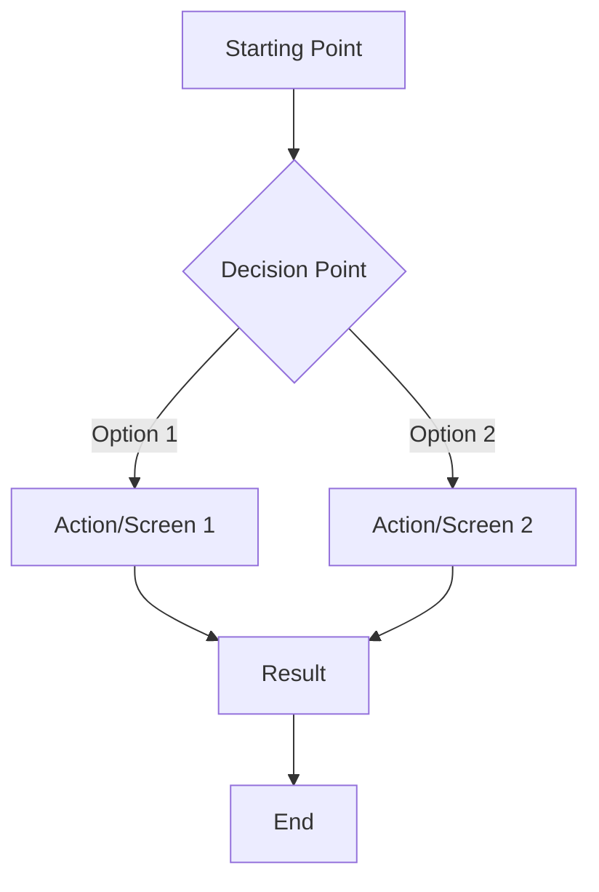

### Node Types

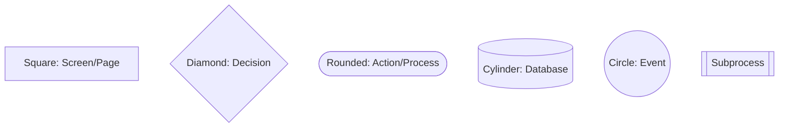

### Arrow Types

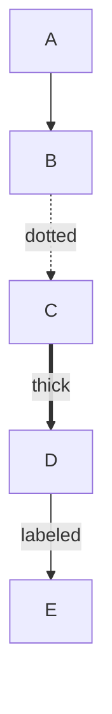

### Layout Options

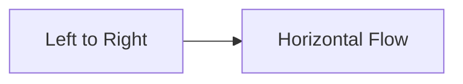

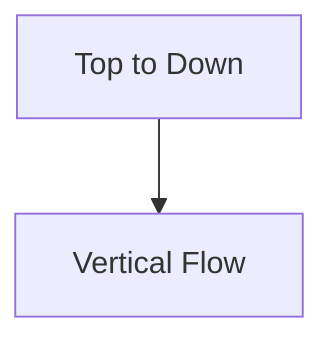

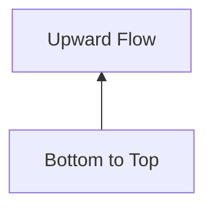

---

## Sequence Diagrams

### Basic Template

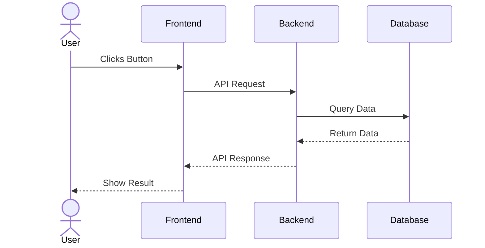

### Advanced Features

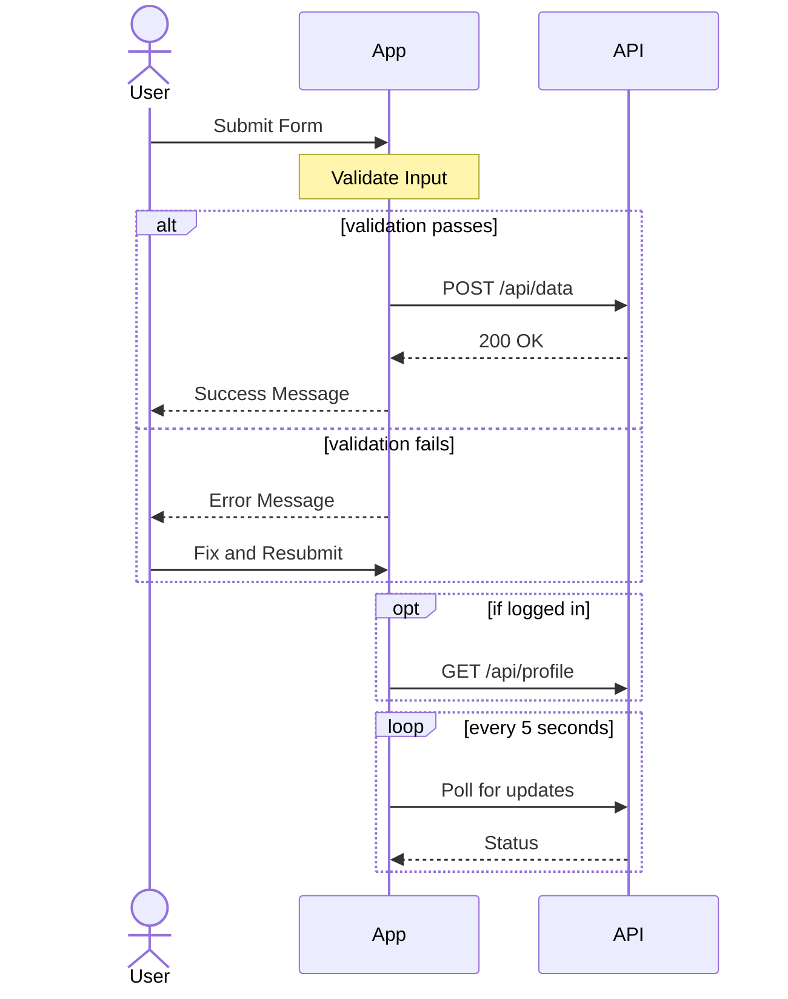

---

## State Diagrams

### Basic Template

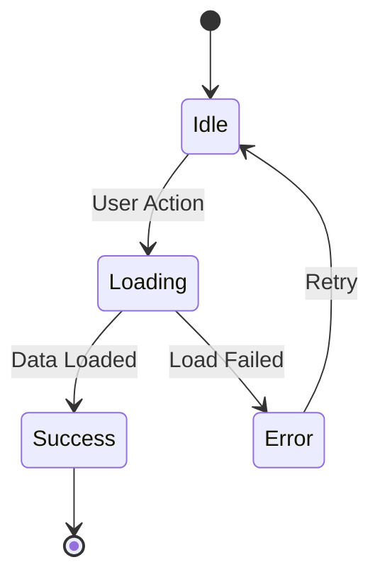

### Complex State Machine

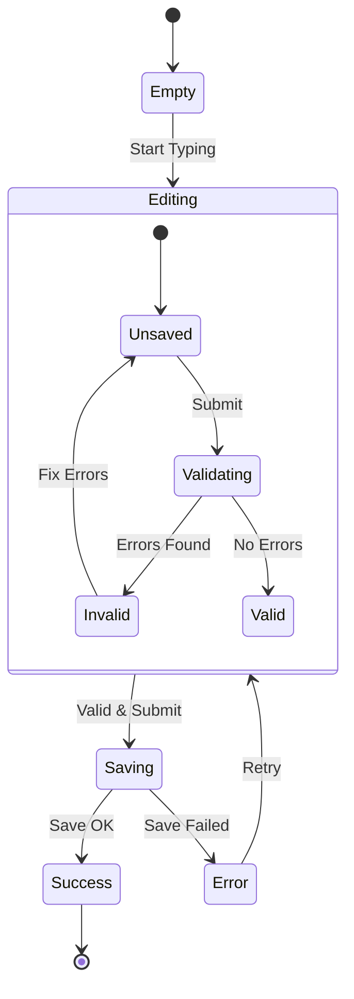

### Composite States

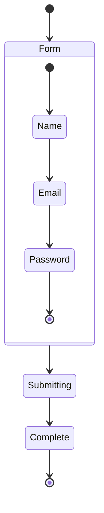

---

## User Journey Diagrams

### Basic Journey Map

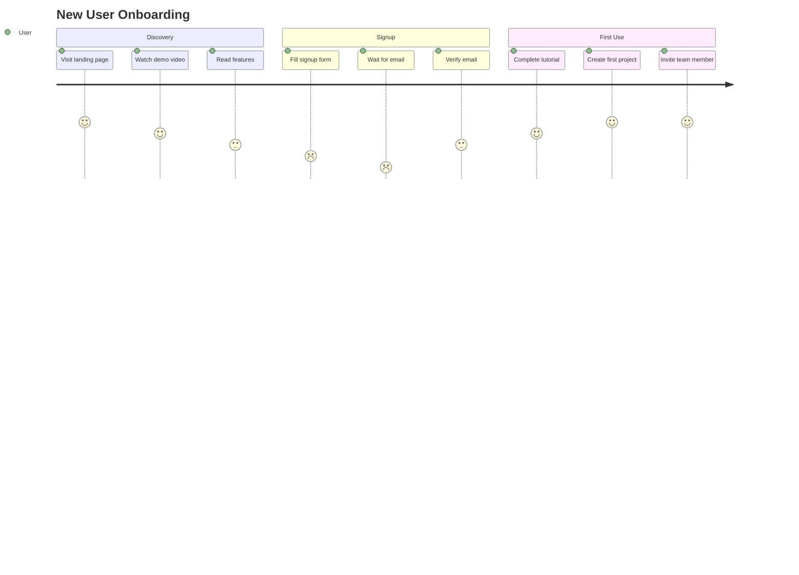

### Multi-Actor Journey

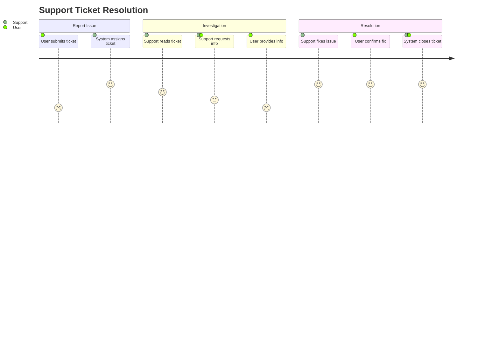

---

## Common Flow Examples

### 1. Authentication Flow

**Basic Login**:

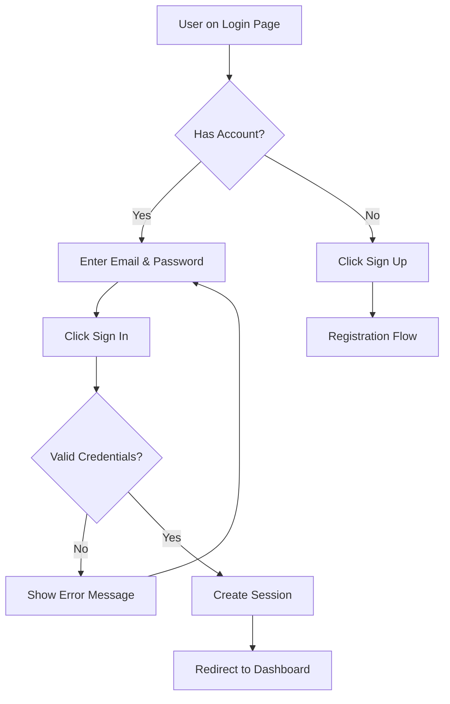

**Complete Auth Flow with Social Login**:

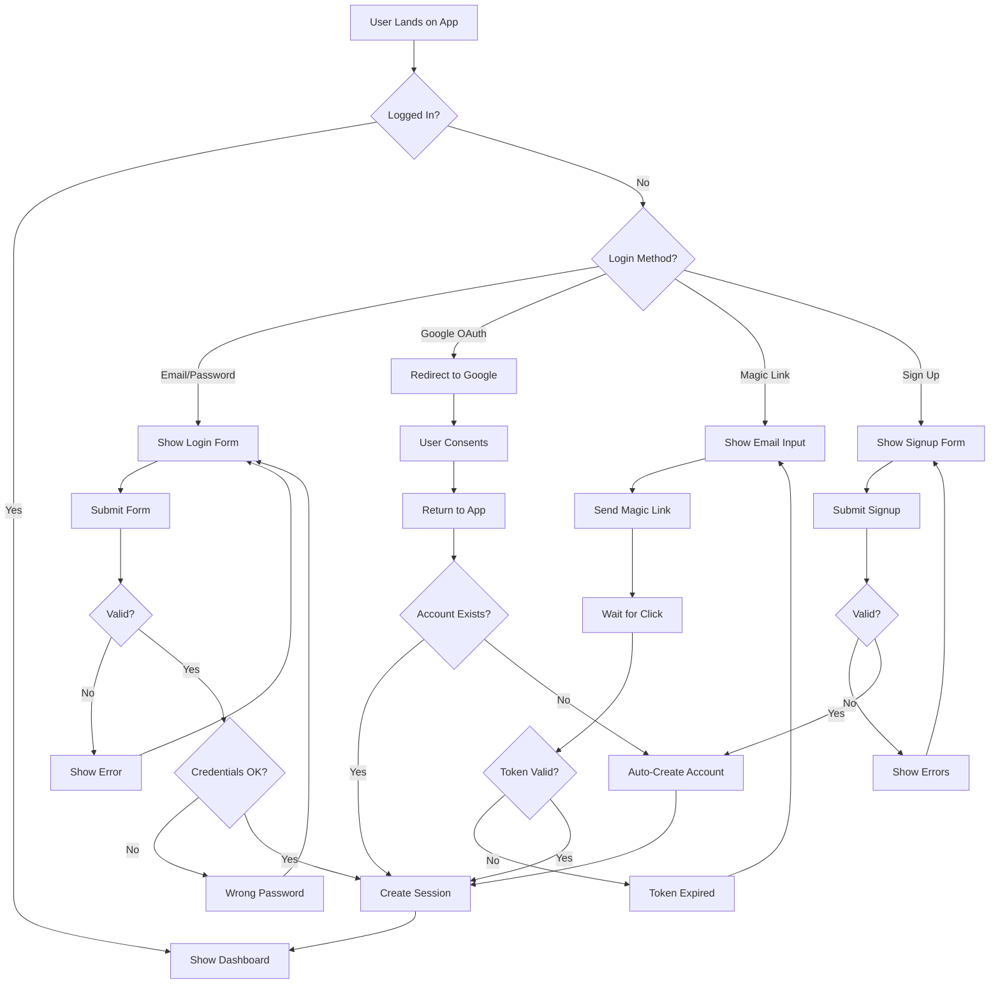

**Password Reset Flow**:

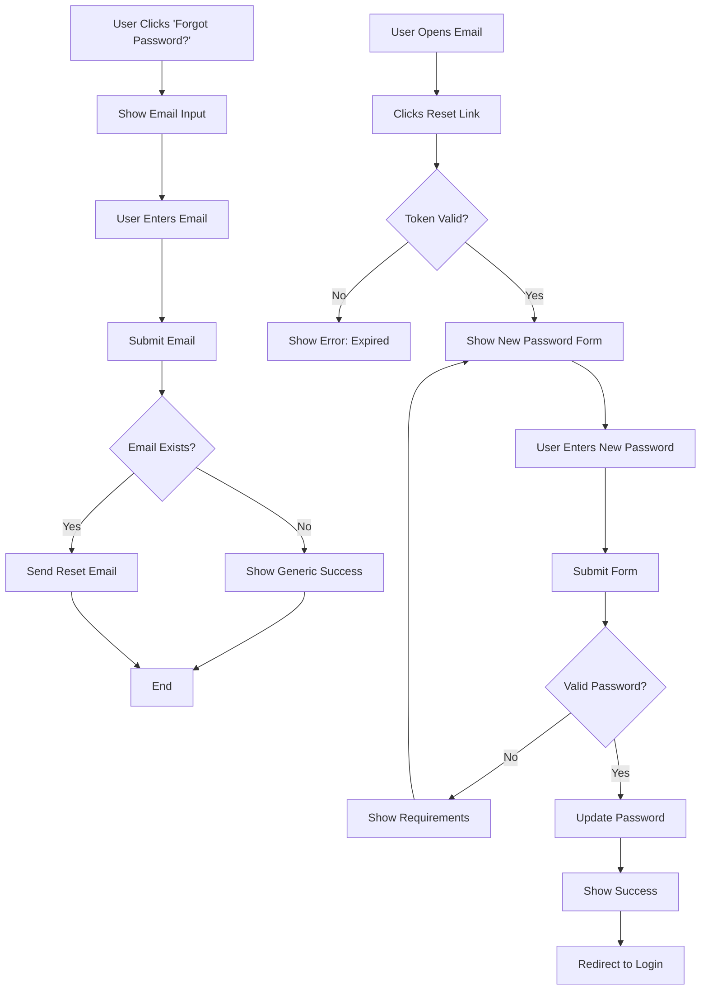

---

### 2. CRUD Operation Flows

**Create (Post/Item/Resource)**:

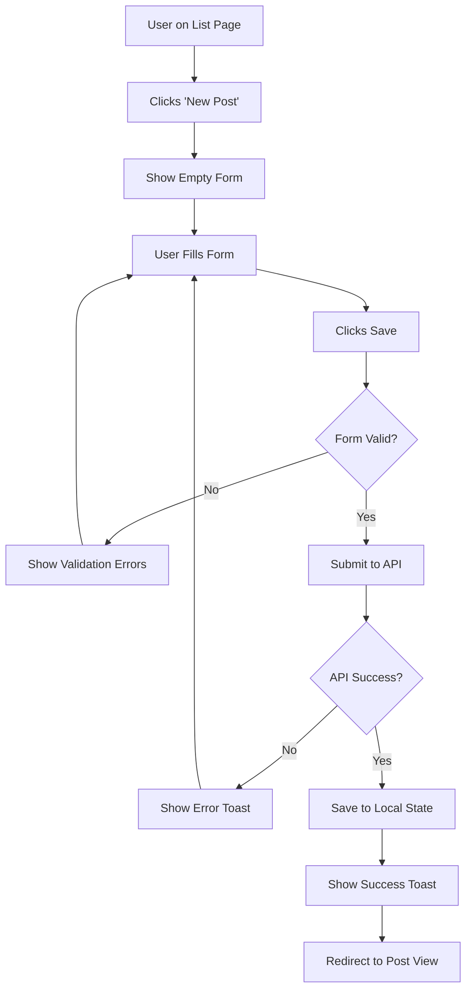

**Read (List with Filters)**:

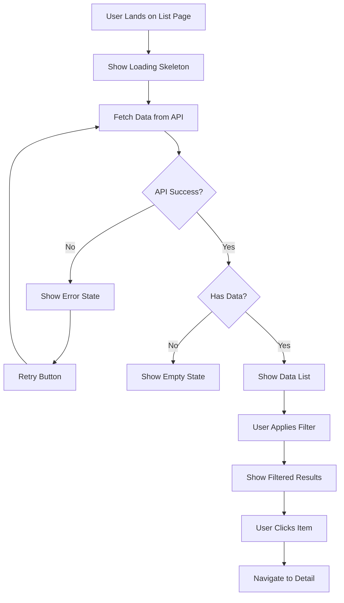

**Update (Edit Existing)**:

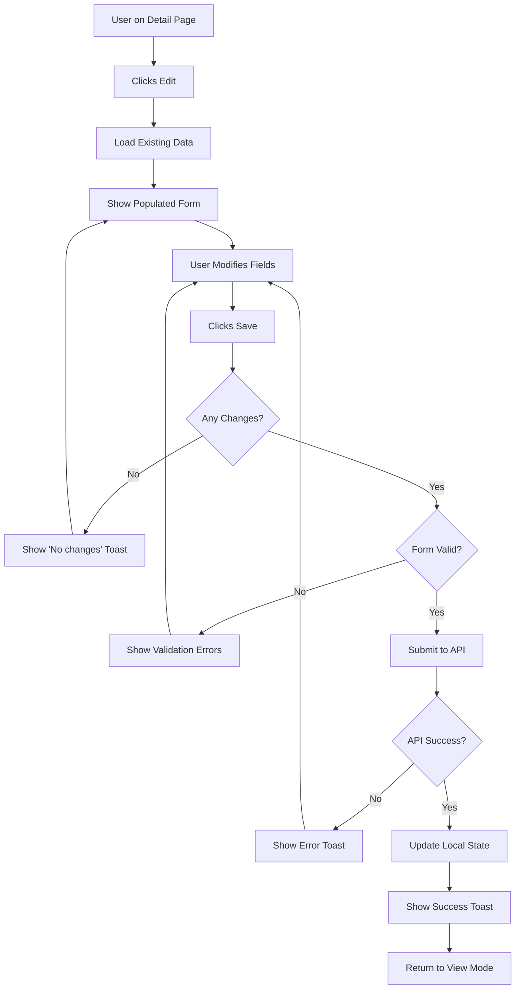

**Delete (With Confirmation)**:

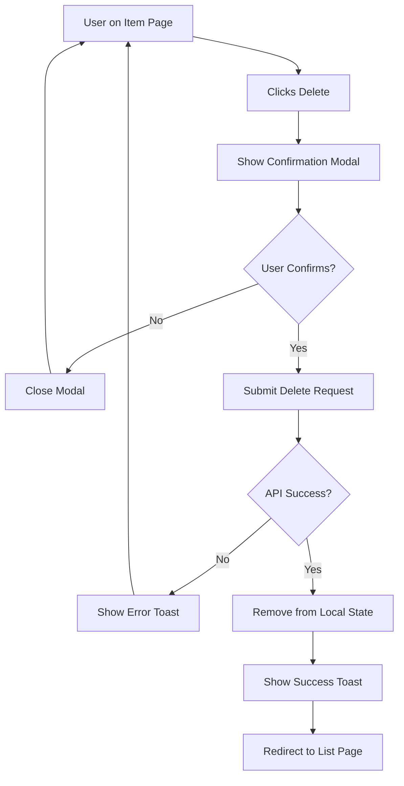

---

### 3. Error Handling Flows

**API Error with Retry**:

```mermaid
graph TD
    A[User Action Triggered] --> B[Show Loading State]
    B --> C[Call API]
    C --> D{Success?}
    D -->|Yes| E[Update UI]
    E --> F[Show Success Feedback]
    D -->|No| G{Error Type?}
    G -->|Network| H[Show Network Error]
    G -->|4xx| I[Show Validation Error]
    G -->|5xx| J[Show Server Error]
    H --> K[Offer Retry Button]
    I --> L[Show Error Details]
    J --> K
    K --> M[User Clicks Retry]
    M --> C
    L --> N[User Fixes Input]
    N --> A
```

**Offline Handling**:

```mermaid
graph TD
    A[User Performs Action] --> B{Online?}
    B -->|Yes| C[Send to Server]
    C --> D[Update UI]
    B -->|No| E[Queue Action Locally]
    E --> F[Show 'Offline' Banner]
    F --> G[Wait for Connection]
    G --> H{Back Online?}
    H -->|Yes| I[Sync Queued Actions]
    I --> J{Sync Success?}
    J -->|Yes| K[Remove Offline Banner]
    J -->|No| L[Show Sync Error]
    L --> M[Offer Manual Retry]
    H -->|No| G
```

**Validation Error Flow**:

```mermaid
graph TD
    A[User Fills Form] --> B[Field Loses Focus]
    B --> C{Field Valid?}
    C -->|Yes| D[Show Green Checkmark]
    C -->|No| E[Show Red Error Icon]
    E --> F[Display Error Message]
    F --> G[User Fixes Input]
    G --> C
    D --> H[User Clicks Submit]
    H --> I{All Fields Valid?}
    I -->|No| J[Scroll to First Error]
    J --> K[Highlight Invalid Fields]
    K --> L[Show Summary Error]
    I -->|Yes| M[Submit Form]
```

---

### 4. Multi-Step Form Flows

**Basic Wizard**:

```mermaid
graph TD
    A[Start Wizard] --> B[Step 1: Basic Info]
    B --> C{Valid?}
    C -->|No| D[Show Errors]
    D --> B
    C -->|Yes| E[Step 2: Details]
    E --> F{Valid?}
    F -->|No| G[Show Errors]
    G --> E
    F -->|Yes| H[Step 3: Confirmation]
    H --> I[User Reviews]
    I --> J{Looks Good?}
    J -->|No| K[Back to Edit]
    K --> L{Which Step?}
    L -->|Step 1| B
    L -->|Step 2| E
    J -->|Yes| M[Submit All Data]
    M --> N{Success?}
    N -->|No| O[Show Error]
    O --> H
    N -->|Yes| P[Show Success Page]
```

**Progressive Disclosure Form**:

```mermaid
graph TD
    A[Show Minimal Form] --> B[Required Fields Only]
    B --> C[User Fills Basic Info]
    C --> D[Clicks 'Next']
    D --> E{Valid?}
    E -->|No| F[Show Errors]
    F --> C
    E -->|Yes| G{Advanced Needed?}
    G -->|Yes| H[Show Advanced Fields]
    G -->|No| I[Submit Form]
    H --> J[User Fills Advanced]
    J --> K[Clicks 'Complete']
    K --> L{Valid?}
    L -->|No| M[Show Errors]
    M --> J
    L -->|Yes| I
```

**Checkout Flow**:

```mermaid
graph TD
    A[View Cart] --> B{Cart Empty?}
    B -->|Yes| C[Show Empty State]
    B -->|No| D[Show Cart Items]
    D --> E[User Clicks Checkout]
    E --> F{Logged In?}
    F -->|No| G[Prompt Login/Signup]
    G --> H[Complete Auth]
    H --> I[Step 1: Shipping]
    F -->|Yes| I
    I --> J[Fill Shipping Info]
    J --> K{Valid Address?}
    K -->|No| L[Show Address Errors]
    L --> J
    K -->|Yes| M[Step 2: Payment]
    M --> N[Enter Payment Info]
    N --> O{Valid Payment?}
    O -->|No| P[Show Payment Errors]
    P --> N
    O -->|Yes| Q[Step 3: Review]
    Q --> R[Show Order Summary]
    R --> S[User Confirms]
    S --> T[Process Payment]
    T --> U{Payment Success?}
    U -->|No| V[Show Payment Failed]
    V --> M
    U -->|Yes| W[Create Order]
    W --> X[Send Confirmation Email]
    X --> Y[Show Success Page]
```

---

### 5. Real-Time Interaction Flow (Sequence)

**Live Chat**:

```mermaid
sequenceDiagram
    actor User
    participant App
    participant WebSocket
    participant Server
    participant Agent

    User->>App: Opens Chat
    App->>WebSocket: Connect
    WebSocket-->>Server: Connection Established
    Server-->>WebSocket: Connection ACK
    WebSocket-->>App: Connected
    App-->>User: Show Chat Interface

    User->>App: Types Message
    App->>WebSocket: Send Message
    WebSocket->>Server: Forward Message
    Server->>Agent: Notify New Message
    Server-->>WebSocket: Message Received ACK
    WebSocket-->>App: Delivery Confirmation
    App-->>User: Show Message Sent ✓

    Agent->>Server: Types Response
    Server->>WebSocket: Push Response
    WebSocket->>App: Receive Message
    App-->>User: Show New Message

    Note over User,Agent: Real-time bidirectional communication
```

**Collaborative Editing**:

```mermaid
sequenceDiagram
    actor User A
    actor User B
    participant App A
    participant App B
    participant Server

    User A->>App A: Opens Document
    App A->>Server: Request Document + Subscribe
    Server-->>App A: Send Document + Subscribe OK

    User B->>App B: Opens Same Document
    App B->>Server: Request Document + Subscribe
    Server-->>App B: Send Document + Subscribe OK
    Server-->>App A: User B Joined (show avatar)

    User A->>App A: Edits Text
    App A->>App A: Apply Change Locally (optimistic)
    App A->>Server: Send Change (Operational Transform)
    Server->>Server: Apply Change to Document
    Server->>App B: Push Change
    App B->>App B: Apply Change
    App B-->>User B: Update View (show User A's change)

    Note over User A,User B: Both users see changes in real-time
```

**File Upload with Progress**:

```mermaid
sequenceDiagram
    actor User
    participant App
    participant API
    participant Storage

    User->>App: Selects File
    App->>App: Validate File (size, type)

    alt file valid
        App-->>User: Show Upload Button
        User->>App: Clicks Upload
        App->>API: POST /upload (start)
        API->>Storage: Create Upload Session
        Storage-->>API: Upload URL
        API-->>App: Return Upload URL

        loop chunks
            App->>Storage: Upload Chunk
            Storage-->>App: Progress %
            App-->>User: Update Progress Bar
        end

        Storage->>API: Notify Upload Complete
        API->>API: Process File (scan, optimize)
        API-->>App: Upload Success + File ID
        App-->>User: Show Success Toast
    else file invalid
        App-->>User: Show Error (size/type)
    end
```

---

### 6. Component State Transitions

**Modal Lifecycle**:

```mermaid
stateDiagram-v2
    [*] --> Closed
    Closed --> Opening: User Clicks Trigger
    Opening --> Open: Animation Complete
    Open --> Closing: User Clicks Close/X/Outside
    Open --> Closing: User Presses ESC
    Closing --> Closed: Animation Complete
    Closed --> [*]

    state Open {
        [*] --> Idle
        Idle --> Submitting: User Submits Form
        Submitting --> Success: Submit OK
        Submitting --> Error: Submit Failed
        Success --> Idle: Reset
        Error --> Idle: User Fixes Error
    }
```

**Form Field State**:

```mermaid
stateDiagram-v2
    [*] --> Empty
    Empty --> Focused: User Focuses Field
    Focused --> Typing: User Types
    Typing --> Focused: Pause
    Focused --> Validating: Blur / Submit
    Typing --> Validating: Blur / Submit

    Validating --> Valid: No Errors
    Validating --> Invalid: Has Errors

    Valid --> Focused: User Focuses Again
    Invalid --> Focused: User Focuses to Fix

    Valid --> [*]: Form Submitted
```

**Data Loading State**:

```mermaid
stateDiagram-v2
    [*] --> Idle
    Idle --> Loading: Fetch Triggered
    Loading --> Success: Data Received
    Loading --> Error: Fetch Failed
    Success --> Idle: Reset
    Error --> Loading: Retry
    Error --> Idle: Cancel
    Success --> Refreshing: Refresh Triggered
    Refreshing --> Success: Data Received
    Refreshing --> Error: Fetch Failed
```

---

## Best Practices

### DO ✅

1. **Start Simple**: Begin with basic flow, add complexity as needed
2. **Use Consistent Terminology**: Same labels for same concepts
3. **Show Happy Path First**: Main flow should be obvious
4. **Include Error Paths**: Show what happens when things go wrong
5. **Label Arrows**: Make decisions and actions clear
6. **Use Colors Sparingly**: Only for emphasis (success/error)
7. **Keep it Readable**: Max 20-30 nodes per diagram
8. **Document Assumptions**: Add notes for context
9. **Version Control**: Commit diagrams with code

### DON'T ❌

1. **Don't Overcomplicate**: Split complex flows into multiple diagrams
2. **Don't Skip Edge Cases**: Consider errors, timeouts, offline
3. **Don't Use Jargon**: Keep language user-friendly
4. **Don't Forget Loading States**: Show what happens during waits
5. **Don't Mix Diagram Types**: One type per diagram
6. **Don't Make Arrows Cross**: Rearrange nodes for clarity
7. **Don't Forget Legend**: Explain symbols if non-standard

### Layout Tips

**Good Flow Direction**:
```mermaid
graph TD
    A[Start] --> B[Step 1]
    B --> C[Step 2]
    C --> D[End]
```
Clear top-to-bottom progression ✅

**Bad Flow Direction**:
```mermaid
graph LR
    A[Start] --> B[Step 1]
    B --> C[Step 2]
    C --> D[End]
    D --> E[More]
    E --> F[Even More]
    F --> G[Continues...]
```
Horizontal scrolling required ❌

**Subgraphs for Grouping**:
```mermaid
graph TD
    A[Start] --> B[Frontend]

    subgraph Frontend
        B --> C[Validate]
        C --> D[Format]
    end

    D --> E[Backend]

    subgraph Backend
        E --> F[Process]
        F --> G[Save]
    end

    G --> H[End]
```

---

## Integration with Other Tools

### With Wireframes

1. Create wireframes first (`wireframe-templates.md`)
2. Map flows between wireframes (this tool)
3. Annotate wireframes with flow step numbers

**Example**:
```
Wireframe 1: Login Page [Flow Step A]
              ↓
Flow Diagram: User enters credentials, validates, redirects
              ↓
Wireframe 2: Dashboard [Flow Step D]
```

### With User Journeys

1. Map high-level journey (`user-journey-template.md`)
2. Create detailed flows for each journey stage (this tool)
3. Link flow diagrams to journey touchpoints

**Example**:
```
Journey Stage: Sign Up (Stage 2)
Detailed Flow: [Mermaid diagram showing complete signup flow]
```

### With Requirements

1. User story defines goal
2. Flow diagram shows how goal is achieved
3. Wireframes show what user sees at each step

**Example**:
```
User Story: As a user, I want to reset my password so I can regain access
Flow Diagram: [Shows complete password reset flow]
Wireframes: [Email input page, confirmation page, new password page]
```

### With Implementation

1. Flow diagrams inform component structure
2. States in diagram = states in code
3. Arrows = events/actions to handle

**Example Flow Step → Code**:
```
Flow: User Clicks Submit → {Form Valid?} → Yes → Submit to API

Code:
const handleSubmit = async () => {
  if (!isFormValid()) return; // Decision point
  await submitToAPI();        // Action
}
```

---

## Tools and Resources

### Mermaid Live Editor

Test your diagrams: https://mermaid.live/

### Mermaid Documentation

Full syntax reference: https://mermaid.js.org/

### Mermaid in Markdown

Supported by:
- GitHub (native)
- GitLab (native)
- VS Code (with extension)
- Notion (with extension)
- Obsidian (native)
- Most modern documentation tools

### Syntax Quick Reference

```
flowchart: graph TD, graph LR, graph BT, graph RL
sequence: sequenceDiagram
state: stateDiagram-v2
journey: journey
pie: pie
gantt: gantt
class: classDiagram
er: erDiagram
```

---

## Examples in Context

### Complete Feature Flow

**Feature**: User publishes a blog post

**1. Wireframes** (ASCII):
- Dashboard with "New Post" button
- Post editor form
- Preview page
- Published post view

**2. Flow Diagram** (Mermaid):

```mermaid
graph TD
    A[Dashboard] --> B[Click 'New Post']
    B --> C[Post Editor]
    C --> D[Fill Title & Content]
    D --> E[Click 'Preview']
    E --> F[Preview Page]
    F --> G{Looks Good?}
    G -->|No| C
    G -->|Yes| H[Click 'Publish']
    H --> I{Valid?}
    I -->|No| J[Show Errors]
    J --> C
    I -->|Yes| K[Submit to API]
    K --> L{Success?}
    L -->|No| M[Show Error Toast]
    M --> C
    L -->|Yes| N[Show Success Toast]
    N --> O[Redirect to Published Post]
```

**3. Sequence Diagram** (API Interaction):

```mermaid
sequenceDiagram
    actor User
    participant Editor
    participant API
    participant Database

    User->>Editor: Enters Title & Content
    User->>Editor: Clicks Publish
    Editor->>Editor: Validate Locally
    Editor->>API: POST /api/posts
    API->>Database: INSERT post
    Database-->>API: post_id
    API->>API: Generate slug
    API-->>Editor: 201 Created + post_url
    Editor-->>User: Show Success + Redirect
```

**4. State Diagram** (Post Status):

```mermaid
stateDiagram-v2
    [*] --> Draft
    Draft --> Reviewing: Submit for Review
    Reviewing --> Draft: Request Changes
    Reviewing --> Scheduled: Approve
    Scheduled --> Published: Publish Date Reached
    Draft --> Published: Publish Immediately
    Published --> Archived: Archive
    Archived --> [*]
```

---

**Last Updated**: 2025-10-25
**Version**: 1.0.0
**Maintainer**: Humanlayer Greenfield Transformation Team
