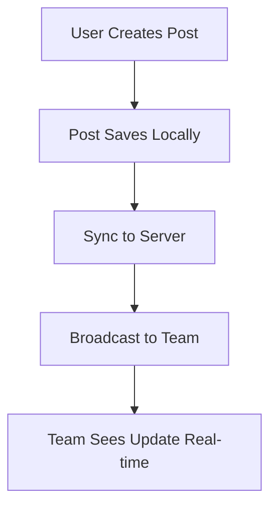
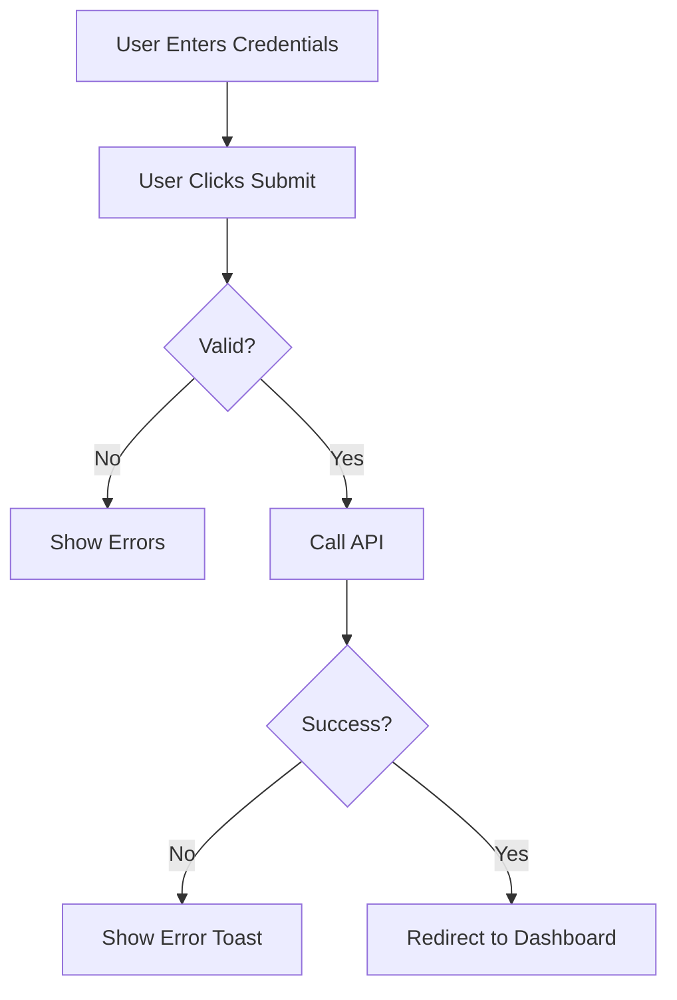
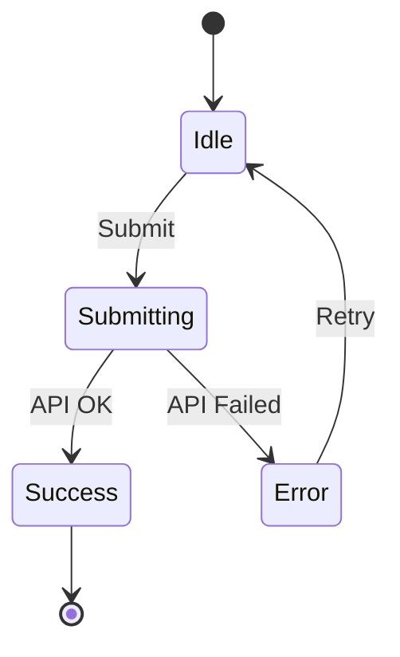

# UX Integration Guide

**Purpose**: Explains how UX artifacts integrate with requirements, architecture, API design, and implementation to create a cohesive greenfield MVP development process.

**Key Insight**: UX design is not isolated—it connects every phase from requirements to deployment.

**2025 Best Practice**: UX-first development—understand the user experience before writing code.

---

## Table of Contents

1. [Overview: UX in the Development Lifecycle](#overview-ux-in-the-development-lifecycle)
2. [Integration Points](#integration-points)
3. [Recommended Workflow](#recommended-workflow)
4. [Tool Integration Matrix](#tool-integration-matrix)
5. [When to Use Each UX Tool](#when-to-use-each-ux-tool)
6. [Validating UX Decisions](#validating-ux-decisions)
7. [Common Workflows](#common-workflows)
8. [Best Practices](#best-practices)

---

## Overview: UX in the Development Lifecycle

### The UX-First Approach

```
Traditional Approach (❌):
Requirements → Architecture → Code → "Oh, the UX is bad" → Costly Redesign

UX-First Approach (✅):
User Research → UX Design → Requirements → Architecture → Code → Smooth Launch
```

### Why UX First?

1. **Prevents Costly Rework**: Changing wireframes is cheap, changing code is expensive
2. **Validates Assumptions Early**: Test UX with users before building
3. **Aligns Team**: Everyone sees the vision before implementation starts
4. **Informs Architecture**: UX reveals data needs, API requirements, performance needs
5. **Reduces Bugs**: Well-designed UX has fewer edge cases and errors
6. **Improves User Satisfaction**: Users get what they need, not what devs think they need

### The UX Bridge

UX connects user needs to technical implementation:

```
User Needs ←→ [UX Design] ←→ Technical Implementation
    ↓                             ↓
  Goals                        Features
  Problems                     Solutions
  Emotions                     Interactions
  Context                      Architecture
```

---

## Integration Points

### 1. UX + Requirements (Phase 5)

**How They Connect**:
- User journeys reveal required features
- Wireframes show what to build
- Pain points become user stories
- UX flows define acceptance criteria

**Workflow**:

```
1. Map user journey (user-journey-template.md)
   ↓
2. Identify pain points and opportunities
   ↓
3. Create wireframes for solutions (wireframe-templates.md)
   ↓
4. Write user stories (requirements-templates.md)
   ↓
5. Link wireframes to stories
```

**Example**:

```markdown
## User Journey Finding
**Pain Point**: Users get lost after dismissing onboarding tour
**Opportunity**: Add contextual empty state guidance

## Wireframe Solution
[ASCII wireframe showing empty state with "Create your first task" prompt]

## User Story (from journey + wireframe)
**As a** new user
**I want to** see guidance on my empty dashboard
**So that** I know how to get started without the onboarding tour

**Acceptance Criteria**:
- [ ] Empty dashboard shows "No tasks yet" heading
- [ ] Shows "Create your first task" button prominently
- [ ] Includes 3 quick tips on what tasks are
- [ ] Button opens task creation form
- [ ] Matches wireframe design

**Wireframe Reference**: wireframe-dashboard-empty-state.md
**User Journey Reference**: Stage 3 - First Use
```

**Tools Used**:
- `user-journey-template.md` → Identifies needs
- `wireframe-templates.md` → Visualizes solution
- `requirements-templates.md` → Documents requirements

---

### 2. UX + Architecture (Phase 1)

**How They Connect**:
- UX flows reveal data relationships
- Wireframes show data needs
- User journeys expose system requirements
- Real-time features need special architecture

**Workflow**:

```
1. Create wireframes and flows (UX artifacts)
   ↓
2. Extract data requirements from wireframes
   ↓
3. Design architecture (greenfield-architecture-designer)
   ↓
4. Validate architecture supports UX flows
   ↓
5. Document architecture decisions
```

**Example**:

**From UX Flow**:


**Architecture Decisions**:
```markdown
## Architecture Requirements (from UX flow)

**Real-time Requirements**:
- Need WebSocket connection for live updates
- Client needs optimistic UI (save locally first)
- Server needs pub/sub for broadcasting

**Data Flow**:
1. Client: User action → Local state update → Show immediate feedback
2. Client → Server: Send data via API
3. Server: Process → Save to DB → Publish to channel
4. Server → Clients: WebSocket push to all connected users
5. Clients: Receive update → Merge with local state

**Implications**:
- Need WebSocket server (Socket.io, ws)
- Need pub/sub (Redis, RabbitMQ)
- Need conflict resolution strategy
- Need offline queue for failed syncs
```

**Tools Used**:
- `mermaid-ux-flows.md` → Shows system interactions
- `greenfield-architecture-designer` agent → Designs system
- `greenfield-data-model-designer` agent → Designs data layer

---

### 3. UX + API Design (Phase 1)

**How They Connect**:
- Wireframes show what data to display
- User flows reveal API call sequences
- Sequence diagrams document API interactions
- Form fields map to API payloads

**Workflow**:

```
1. Create wireframes (what data is shown)
   ↓
2. Create sequence diagrams (when/how data is fetched)
   ↓
3. Design API endpoints (greenfield-api-designer)
   ↓
4. Map UI components to API responses
   ↓
5. Document loading/error states
```

**Example**:

**From Wireframe**:
```
Dashboard Wireframe:
┌────────────────────────────┐
│ Total Posts: 247           │ ← GET /api/stats
│ Total Users: 1,523         │
│ Total Views: 12.4K         │
├────────────────────────────┤
│ Recent Activity:           │ ← GET /api/activity?limit=5
│ • Post created by John...  │
│ • User signed up: Alice... │
└────────────────────────────┘
```

**API Design** (from wireframe data needs):
```markdown
## API Endpoints (derived from Dashboard wireframe)

### GET /api/stats
**Purpose**: Fetch aggregate statistics for dashboard
**Response**:
```json
{
  "total_posts": 247,
  "total_posts_change": "+12%",
  "total_users": 1523,
  "total_users_change": "+8%",
  "total_views": 12400,
  "total_views_change": "+15%"
}
```

### GET /api/activity
**Purpose**: Fetch recent activity feed
**Query Params**:
- `limit` (number, default: 10, max: 50)
- `offset` (number, default: 0)
**Response**:
```json
{
  "items": [
    {
      "type": "post_created",
      "user": {"name": "John Doe", "id": 123},
      "post": {"title": "Getting Started...", "id": 456},
      "timestamp": "2025-10-25T10:30:00Z"
    }
  ],
  "total": 500
}
```

## UI → API Mapping

**Dashboard Component**:
1. On mount: Fetch both endpoints in parallel
2. Show loading skeleton (wireframe-loading-state)
3. On success: Populate dashboard with data
4. On error: Show error state (wireframe-error-state)
5. Auto-refresh every 30 seconds (keep dashboard current)
```

**Tools Used**:
- `wireframe-templates.md` → Shows what data is needed
- `mermaid-ux-flows.md` → Shows API call sequence
- `greenfield-api-designer` agent → Designs APIs

---

### 4. UX + Security/Auth (Phase 5)

**How They Connect**:
- Login/signup wireframes inform auth method choice
- User journeys reveal security requirements
- UX flows show where auth is needed
- Privacy concerns emerge from user research

**Workflow**:

```
1. Design auth UX (login, signup, password reset)
   ↓
2. Map auth user journey
   ↓
3. Select auth method (security-auth-selector.md)
   ↓
4. Implement auth flow matching UX
   ↓
5. Test auth UX with users
```

**Example**:

**From User Journey** (Stage 2: Sign Up):
```
Pain Point: "Password requirements unclear until error"
Pain Point: "Verification email takes 2-3 minutes to arrive"
Opportunity: "Add social login options (Google, GitHub)"
```

**Auth Method Selection** (informed by UX pain points):
```markdown
## Auth Method Decision (from UX requirements)

**Requirements from UX**:
- Quick signup (pain point: too many fields)
- Clear password requirements (pain point: unclear until error)
- Fast email verification (pain point: 2-3 min wait)
- Social login option (opportunity identified)

**Selected Auth Strategy**:
1. **Primary**: Magic Link (passwordless, fast, no password requirements)
2. **Secondary**: Social OAuth (Google, GitHub - one-click signup)
3. **Tertiary**: Email/Password (for users who prefer it)

**Why**:
- Magic link eliminates password pain points
- Social login fastest option (one-click)
- Email/password for users who don't trust magic links
- All three solve UX issues identified in journey

**Implementation**:
- Use security-auth-selector.md guide
- Implement all three methods
- Default to magic link (fastest UX)
- A/B test to confirm best approach
```

**Tools Used**:
- `user-journey-template.md` → Reveals auth pain points
- `wireframe-templates.md` → Designs auth UI
- `security-auth-selector.md` → Chooses auth method

---

### 5. UX + Implementation (Phase 6B-6J)

**How They Connect**:
- Wireframes become component structure
- Flow diagrams become event handlers
- State diagrams become state machines
- Journey stages become analytics events

**Workflow**:

```
1. Complete UX design (wireframes + flows)
   ↓
2. Break wireframes into components
   ↓
3. Map flows to component interactions
   ↓
4. Implement components matching wireframes
   ↓
5. Validate implementation against UX
```

**Example**:

**From Wireframe → Component Structure**:

```
Login Wireframe:
┌────────────────────────┐
│    [Logo]              │ → Header component
│                        │
│ Email:                 │ → LoginForm component
│ [input]                │   - EmailInput
│                        │   - PasswordInput
│ Password:              │   - RememberCheckbox
│ [input]    [show]      │   - SubmitButton
│                        │
│ ☐ Remember me          │
│                        │
│ [Sign In]              │
│                        │
│ Forgot password?       │ → Link component
│                        │
│ [Google Sign In]       │ → SocialAuth component
└────────────────────────┘

Component Tree:
<LoginPage>
  <Header logo={logo} />
  <LoginForm onSubmit={handleLogin}>
    <EmailInput />
    <PasswordInput />
    <RememberCheckbox />
    <SubmitButton />
  </LoginForm>
  <Link to="/forgot-password">Forgot password?</Link>
  <SocialAuth providers={['google', 'github']} />
</LoginPage>
```

**From Flow Diagram → Event Handlers**:



**Code Implementation**:
```typescript
// Matches flow diagram above
const LoginForm = () => {
  const [email, setEmail] = useState('');
  const [password, setPassword] = useState('');
  const [errors, setErrors] = useState({});

  const handleSubmit = async (e) => {
    e.preventDefault();

    // Node C: Validate
    const validationErrors = validate({ email, password });
    if (Object.keys(validationErrors).length > 0) {
      setErrors(validationErrors); // Node D: Show Errors
      return;
    }

    // Node E: Call API
    try {
      const result = await loginAPI({ email, password });

      // Node F-Yes → H: Success, redirect
      router.push('/dashboard');
    } catch (error) {
      // Node F-No → G: Show error
      toast.error(error.message);
    }
  };

  return (
    // Matches wireframe structure
    <form onSubmit={handleSubmit}>
      <EmailInput value={email} onChange={setEmail} error={errors.email} />
      <PasswordInput value={password} onChange={setPassword} error={errors.password} />
      <RememberCheckbox />
      <SubmitButton>Sign In</SubmitButton>
    </form>
  );
};
```

**From State Diagram → State Machine**:



**Code Implementation**:
```typescript
type FormState = 'idle' | 'submitting' | 'success' | 'error';

const [state, setState] = useState<FormState>('idle');

const handleSubmit = async () => {
  setState('submitting'); // Transition: Idle → Submitting

  try {
    await loginAPI();
    setState('success'); // Transition: Submitting → Success
  } catch (error) {
    setState('error');   // Transition: Submitting → Error
  }
};

// UI reflects state
{state === 'submitting' && <Spinner />}
{state === 'error' && <ErrorMessage onRetry={() => setState('idle')} />}
{state === 'success' && <Redirect to="/dashboard" />}
```

**Tools Used**:
- `wireframe-templates.md` → Component structure
- `mermaid-ux-flows.md` → Event flow and state machines
- `.claude/examples/` → Reference implementations

---

## Recommended Workflow

### Complete UX-First Development Flow

```
Phase 0: Research
├─ Identify user personas (requirements-templates.md)
├─ Conduct user interviews
└─ Define project goals

Phase 1: UX Design (Phase 6A Tools - Start Here!)
├─ Map user journeys (user-journey-template.md)
├─ Create wireframes (wireframe-templates.md)
├─ Design user flows (mermaid-ux-flows.md)
├─ Validate with users
└─ Iterate based on feedback

Phase 2: Requirements
├─ Extract requirements from UX artifacts
├─ Write user stories (requirements-templates.md)
├─ Link stories to wireframes
├─ Prioritize using MoSCoW
└─ Get stakeholder approval

Phase 3: Technical Design
├─ Design architecture (greenfield-architecture-designer)
├─ Design APIs (greenfield-api-designer)
├─ Design data models (greenfield-data-model-designer)
├─ Design security/auth (security-auth-selector.md)
└─ Validate design supports UX flows

Phase 4: Implementation
├─ Scaffold project (greenfield-scaffolder)
├─ Implement components from wireframes
├─ Implement flows from diagrams
├─ Implement APIs from design
└─ Write tests

Phase 5: Testing & Validation
├─ Unit tests (business logic)
├─ Integration tests (API + DB)
├─ E2E tests (user flows)
├─ Usability testing (validate UX)
└─ Accessibility testing (WCAG 2.1)

Phase 6: Launch
├─ Deploy (greenfield-deployment-planner)
├─ Monitor (analytics, errors, performance)
├─ Gather user feedback
└─ Plan next iteration
```

### Iteration Cycle

```
Monitor → Learn → UX Design → Requirements → Implement → Monitor
   ↑                                                        ↓
   └────────────────────────────────────────────────────────┘
```

Each cycle:
1. Monitor: Analytics, user feedback, support tickets
2. Learn: Identify pain points, opportunities
3. UX Design: Design solutions
4. Requirements: Document what to build
5. Implement: Build it
6. Monitor: See if it worked

---

## Tool Integration Matrix

| UX Tool | Integrates With | Output → Input |
|---------|----------------|----------------|
| **user-journey-template.md** | requirements-templates.md | Pain points → User stories |
| | wireframe-templates.md | Touchpoints → Wireframes |
| | security-auth-selector.md | Auth pain points → Auth method |
| **wireframe-templates.md** | requirements-templates.md | UI elements → Acceptance criteria |
| | mermaid-ux-flows.md | Screen references in flows |
| | greenfield-api-designer | Data needs → API endpoints |
| | Implementation | Component structure |
| **mermaid-ux-flows.md** | requirements-templates.md | Flow steps → User stories |
| | greenfield-architecture-designer | System interactions → Architecture |
| | greenfield-api-designer | API calls → Endpoint design |
| | Implementation | Event handlers, state machines |
| **greenfield-ux-analyzer** | All UX tools | Analysis → Improvements |
| | requirements-templates.md | Extracted requirements |
| | Implementation | Component suggestions |

---

## When to Use Each UX Tool

### user-journey-template.md

**Use When**:
- Starting a new feature or product
- Redesigning existing feature
- Investigating user pain points
- Planning major UX improvements
- Onboarding new team members (show user perspective)

**Don't Use When**:
- Making small UI tweaks
- Fixing obvious bugs
- Time is extremely limited (use simplified version)

**Time Investment**: 2-4 hours for complete journey map

---

### wireframe-templates.md

**Use When**:
- Designing any new UI
- Before writing any component code
- Communicating design to team
- Getting stakeholder approval
- Testing ideas quickly

**Don't Use When**:
- Making trivial text changes
- Adjusting spacing/colors (use design tools)

**Time Investment**: 30 minutes - 2 hours depending on complexity

---

### mermaid-ux-flows.md

**Use When**:
- Documenting user paths through app
- Showing API interaction sequences
- Defining component state machines
- Explaining complex flows to team
- Planning error handling

**Don't Use When**:
- Flow is single step (just document in text)
- Diagram would be more complex than helpful

**Time Investment**: 30 minutes - 1 hour per flow

---

### greenfield-ux-analyzer

**Use When**:
- Need to analyze existing designs
- Want UX improvement suggestions
- Creating wireframes from descriptions
- Mapping complex user flows
- Learning UX best practices

**Don't Use When**:
- You already have clear wireframes
- No UX questions or issues

**Time Investment**: Varies based on task

---

## Validating UX Decisions

### Methods for Validation

#### 1. Guerrilla Usability Testing

**When**: Early wireframe stage
**How**:
1. Show wireframes to 5 users (not on your team)
2. Ask: "What do you think this page does?"
3. Ask: "How would you [accomplish goal]?"
4. Watch where they click/tap
5. Note confusion, hesitation, wrong paths

**Cost**: Free (use friends, family, coffee shop strangers)
**Time**: 30 minutes per user
**Value**: Catches obvious UX issues before coding

#### 2. Prototype Testing

**When**: After wireframes, before full implementation
**How**:
1. Create clickable prototype (Figma, InVision, or HTML)
2. Give users tasks to complete
3. Think-aloud protocol: "Say what you're thinking"
4. Measure: time, success rate, errors
5. Interview after: "What was confusing?"

**Cost**: Free - $50/user (screened participants)
**Time**: 1 hour per user
**Value**: Validates flows work in practice

#### 3. A/B Testing

**When**: After launch, optimizing existing UX
**How**:
1. Create two versions (A = current, B = new)
2. Split traffic 50/50
3. Measure: conversion, time on task, errors
4. Statistical significance: p < 0.05
5. Roll out winner to 100%

**Cost**: Analytics tool ($0-$200/month)
**Time**: 1-2 weeks for results
**Value**: Data-driven UX decisions

#### 4. Analytics Review

**When**: Ongoing, after launch
**How**:
1. Track key metrics:
   - Task completion rate
   - Time to complete task
   - Error rate
   - Drop-off points
   - Rage clicks (repeated clicks indicating frustration)
2. Identify pain points in data
3. Watch session recordings of problem areas
4. Design improvements

**Tools**: Google Analytics, Mixpanel, Hotjar, FullStory
**Cost**: Free - $100/month
**Value**: Continuous improvement

#### 5. User Interviews

**When**: Discovering new features, understanding context
**How**:
1. Recruit 5-8 target users
2. Ask open-ended questions:
   - "Walk me through how you currently [do task]"
   - "What's frustrating about this?"
   - "What would make this easier?"
3. Don't ask: "Would you use this feature?" (they'll lie)
4. Do ask: "Show me how you'd use this" (behavior > opinion)

**Cost**: $50-100/user for compensation
**Time**: 45-60 minutes per interview
**Value**: Deep insights into user needs

#### 6. Heuristic Evaluation

**When**: Internal review, before user testing
**How**:
1. Evaluate against usability heuristics:
   - Visibility of system status
   - Match between system and real world
   - User control and freedom
   - Consistency and standards
   - Error prevention
   - Recognition over recall
   - Flexibility and efficiency
   - Aesthetic and minimalist design
   - Error recovery
   - Help and documentation
2. Rate severity: 0 (not a problem) to 4 (critical)
3. Prioritize issues

**Cost**: Free (internal team)
**Time**: 1-2 hours
**Value**: Expert review catches obvious issues

### Validation Checklist

Before implementing UX:

- [ ] **Wireframes tested** with 3+ users
- [ ] **User flows validated** (users can complete tasks)
- [ ] **Accessibility checked** (WCAG 2.1 AA compliance)
- [ ] **Mobile tested** (works on small screens)
- [ ] **Edge cases considered** (empty states, errors, long text)
- [ ] **Performance considered** (loading states, perceived speed)
- [ ] **Stakeholders approved** (aligned on vision)
- [ ] **Team aligned** (developers understand requirements)

After implementing UX:

- [ ] **Usability tested** with 5+ users
- [ ] **Analytics implemented** (tracking key metrics)
- [ ] **Error tracking enabled** (Sentry, Rollbar)
- [ ] **Session recordings reviewed** (Hotjar, FullStory)
- [ ] **Feedback collected** (surveys, interviews)
- [ ] **Metrics baselined** (know current performance)
- [ ] **Improvement plan created** (what to fix next)

---

## Common Workflows

### Workflow 1: New Feature Design

```
1. User Request / Idea
   ↓
2. User Research (optional for small features)
   - Who needs this?
   - Why?
   - Current workarounds?
   ↓
3. Map User Journey
   - How would this fit in user's workflow?
   - What are touchpoints?
   - Pain points addressed?
   ↓
4. Create Wireframes
   - Sketch solution
   - Show to stakeholders
   - Get feedback
   ↓
5. Create Flow Diagrams
   - How does user navigate?
   - What are error paths?
   - Where are APIs called?
   ↓
6. Write Requirements
   - User stories from UX artifacts
   - Acceptance criteria reference wireframes
   - Technical requirements from flows
   ↓
7. Validate with Users (prototype)
   - Can they complete task?
   - Any confusion?
   ↓
8. Implement
   - Components from wireframes
   - Logic from flows
   - Tests for all paths
   ↓
9. Launch & Monitor
   - Track metrics
   - Gather feedback
   - Iterate
```

### Workflow 2: Fixing UX Issues

```
1. Identify Issue
   - Analytics show drop-off
   - User complaints
   - Support tickets
   ↓
2. Understand Root Cause
   - Watch session recordings
   - Interview users
   - Analyze current user journey
   ↓
3. Brainstorm Solutions
   - Multiple UX approaches
   - Research best practices
   - Use greenfield-ux-analyzer for suggestions
   ↓
4. Design Solution
   - Create wireframes
   - Update user journey
   - Show improvements
   ↓
5. Validate Solution
   - Test with users
   - Get feedback
   - Iterate
   ↓
6. Implement & A/B Test
   - Split traffic
   - Measure impact
   - Roll out winner
```

### Workflow 3: Onboarding New Team Member

```
1. Share User Personas
   - Who are we building for?
   ↓
2. Walk Through User Journeys
   - What are key user flows?
   - Where are pain points?
   ↓
3. Review Wireframes
   - What does product look like?
   - How is it structured?
   ↓
4. Explain Flow Diagrams
   - How do features work?
   - Where are APIs called?
   ↓
5. Show Implementation
   - How UX maps to code
   - Component structure
   ↓
6. Review Metrics
   - What are we measuring?
   - What's working/not working?
```

---

## Best Practices

### DO ✅

1. **Always Start with UX**: Design before coding
2. **Involve Users Early**: Test wireframes, not just finished products
3. **Document UX Decisions**: Explain why, not just what
4. **Link Artifacts**: Connect wireframes, flows, requirements, code
5. **Iterate Based on Data**: Use analytics and feedback
6. **Consider Accessibility**: From first wireframe
7. **Design for Mobile First**: Smallest screen first
8. **Plan for Edge Cases**: Empty, loading, error states
9. **Validate Before Building**: Cheaper to change wireframes
10. **Keep UX Docs Updated**: As product evolves

### DON'T ❌

1. **Don't Skip UX**: "We'll design as we code" = disaster
2. **Don't Design in Isolation**: Involve users, stakeholders, team
3. **Don't Ignore Analytics**: Data shows what's really happening
4. **Don't Forget Accessibility**: Not optional, legal requirement
5. **Don't Over-design**: Simple > complex for MVPs
6. **Don't Build Then Ask**: Too late to change easily
7. **Don't Assume**: Test assumptions with users
8. **Don't Copy Blindly**: Context matters, competitors may be wrong
9. **Don't Neglect Documentation**: Future you will thank you
10. **Don't Stop Iterating**: UX is never "done"

### Quality Checklist

Before marking UX phase complete:

#### Completeness
- [ ] All key user flows designed
- [ ] All screens have wireframes
- [ ] All states considered (empty, loading, error, success)
- [ ] All decision points documented
- [ ] All error paths designed

#### Quality
- [ ] Tested with 3+ users
- [ ] Accessibility considered (WCAG 2.1)
- [ ] Mobile-responsive design
- [ ] Follows 2025 UX best practices
- [ ] Clear visual hierarchy
- [ ] Fast, perceived performance

#### Documentation
- [ ] User journeys mapped
- [ ] Wireframes created
- [ ] Flow diagrams drawn
- [ ] Requirements extracted
- [ ] Design decisions explained

#### Integration
- [ ] Linked to user stories
- [ ] Informs architecture design
- [ ] Informs API design
- [ ] Informs data model
- [ ] Implementation plan clear

---

## Resources

### Further Learning

**UX Research**:
- Nielsen Norman Group: https://www.nngroup.com/
- UX Research field guide: https://dovetailapp.com/ux-research-field-guide/

**UX Design**:
- Laws of UX: https://lawsofux.com/
- Refactoring UI: https://www.refactoringui.com/

**Accessibility**:
- WCAG Guidelines: https://www.w3.org/WAI/WCAG21/quickref/
- A11y Project: https://www.a11yproject.com/

**Tools**:
- Figma (design): https://www.figma.com/
- Miro (journey mapping): https://miro.com/
- Hotjar (analytics): https://www.hotjar.com/
- UserTesting (research): https://www.usertesting.com/

### Within This System

**UX Tools** (Phase 6A):
- `wireframe-templates.md` - ASCII wireframes
- `user-journey-template.md` - Journey mapping
- `mermaid-ux-flows.md` - Flow diagrams
- `greenfield-ux-analyzer` - UX analysis agent

**Related Tools** (Other Phases):
- `requirements-templates.md` (Phase 5)
- `security-auth-selector.md` (Phase 5)
- `greenfield-architecture-designer` (Phase 1)
- `greenfield-api-designer` (Phase 1)
- `greenfield-data-model-designer` (Phase 1)

---

## Summary

**Key Takeaway**: UX design is the bridge between user needs and technical implementation. It should happen first, inform all technical decisions, and be validated continuously.

**Integration Flow**:
```
Users → Research → UX Design → Requirements → Architecture → API → Data → Implementation → Users
   ↑                                                                                           ↓
   └───────────────────────────── Feedback Loop ──────────────────────────────────────────────┘
```

**When in Doubt**:
1. Talk to users
2. Create wireframes
3. Test with users
4. Iterate
5. Only then build

---

**Last Updated**: 2025-10-25
**Version**: 1.0.0
**Maintainer**: Humanlayer Greenfield Transformation Team
