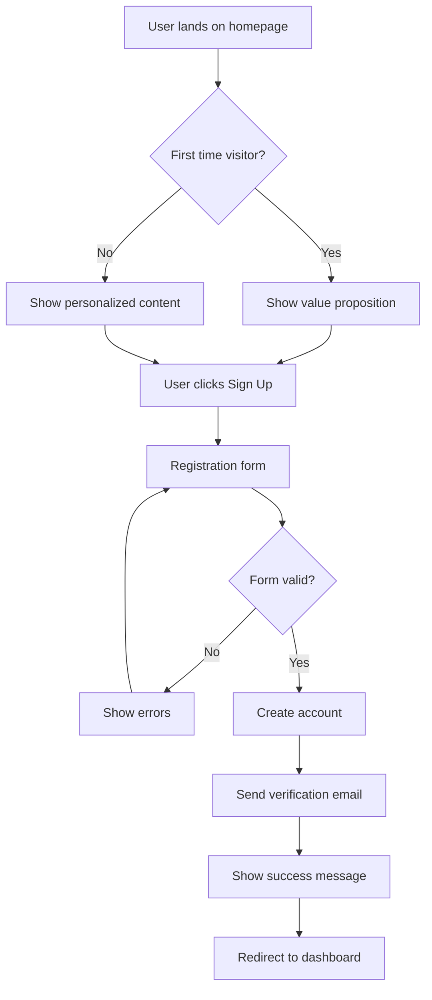

# Phase 6 Roadmap - Working Example Projects

**PRIORITY CHANGE**: UX/Wireframe capabilities added as Phase 6A (MUST DO FIRST)

**Strategy**: Break each example project into multiple sub-phases for better context management and quality control.

**Total Sub-Phases**: 10 (6A through 6J) - **Updated from 9**
**Estimated Total Time**: 5-7 hours across multiple sessions
**User Control**: After each sub-phase, user decides "continue" or "handoff"

---

## 🎨 **Phase 6A: UX/Wireframe System (NEW - HIGHEST PRIORITY)**

**THIS MUST BE DONE FIRST** - Foundation for all example projects

### Overview
Create comprehensive UX/wireframe capabilities including templates, tools, and an agent for analyzing user journeys and creating visual representations.

**Directory**: `.claude/utils/` and `.claude/agents/`
**Estimated Time**: 60-75 minutes
**Expected Context**: 30-40%

### Deliverables

#### 1. Wireframe Templates Utility
**File**: `.claude/utils/wireframe-templates.md`

**Must Include**:
- [ ] ASCII wireframe templates for common pages:
  - [ ] Login/Signup page
  - [ ] Dashboard layout
  - [ ] List view page
  - [ ] Detail/edit page
  - [ ] Settings page
  - [ ] Landing page
- [ ] Responsive layout patterns (mobile/tablet/desktop)
- [ ] Component library in ASCII format:
  - [ ] Navigation bars
  - [ ] Forms
  - [ ] Cards
  - [ ] Modals
  - [ ] Tables
  - [ ] Buttons and inputs
- [ ] Usage guidelines for each template
- [ ] How to customize templates

#### 2. User Journey Template
**File**: `.claude/utils/user-journey-template.md`

**Must Include**:
- [ ] Complete user journey map template
- [ ] Stage-by-stage breakdown format:
  - [ ] Touchpoints
  - [ ] User actions
  - [ ] Emotions/feelings
  - [ ] Pain points
  - [ ] Opportunities for improvement
- [ ] Example journey maps:
  - [ ] New user onboarding
  - [ ] Feature discovery
  - [ ] Task completion
  - [ ] Error recovery
- [ ] Integration with user personas (from Phase 5)
- [ ] Tips for effective journey mapping

#### 3. UX Analyzer Agent
**File**: `.claude/agents/greenfield-ux-analyzer.md`

**Must Include**:
- [ ] Agent frontmatter:
  ```yaml
  name: greenfield-ux-analyzer
  description: Analyzes wireframes, creates user flows, and designs UX
  tools: Read, Write, WebSearch, WebFetch, AskUserQuestion, TodoWrite
  color: pink
  model: sonnet
  ```
- [ ] Agent capabilities:
  - [ ] Analyze uploaded wireframes/mockups (images)
  - [ ] Extract UI components from designs
  - [ ] Create user flow documentation
  - [ ] Generate ASCII wireframes
  - [ ] Map user journeys
  - [ ] Suggest UX improvements
  - [ ] Create sequence diagrams for flows
- [ ] Instructions to:
  - [ ] Ask clarifying questions about UX goals
  - [ ] Research 2025 UX best practices (WebSearch)
  - [ ] Consider accessibility (WCAG 2.1)
  - [ ] Consider mobile-first design
  - [ ] Validate flows with user personas
- [ ] Example prompts for agent:
  - [ ] "Analyze this wireframe and extract requirements"
  - [ ] "Create a user journey for new user onboarding"
  - [ ] "Design an ASCII wireframe for a dashboard"
  - [ ] "Map the user flow for checkout process"

#### 4. Mermaid Flow Diagrams Guide
**File**: `.claude/utils/mermaid-ux-flows.md`

**Must Include**:
- [ ] User flow diagram templates (Mermaid)
- [ ] Sequence diagram templates for user interactions
- [ ] State diagram templates for UI states
- [ ] Journey stage diagram templates
- [ ] Examples for common flows:
  - [ ] Authentication flow
  - [ ] CRUD operation flows
  - [ ] Error handling flows
  - [ ] Multi-step form flows
- [ ] Best practices for flow diagrams

#### 5. Integration Documentation
**File**: `.claude/utils/ux-integration-guide.md`

**Must Include**:
- [ ] How UX artifacts integrate with:
  - [ ] Requirements templates (Phase 5)
  - [ ] Architecture design (Phase 1)
  - [ ] API design (Phase 1)
  - [ ] Example projects (Phase 6B-6J)
- [ ] Workflow: Wireframes → User Flows → Requirements → Architecture → Implementation
- [ ] When to use each UX tool
- [ ] How to validate UX decisions with users

### Success Criteria
- [ ] All 5 files created and comprehensive
- [ ] Agent can analyze uploaded wireframe images
- [ ] Agent can create ASCII wireframes from descriptions
- [ ] Templates cover common UI patterns
- [ ] User journey templates are actionable
- [ ] Mermaid examples render correctly
- [ ] Integration guide is clear
- [ ] Code is well-commented and educational
- [ ] Examples demonstrate 2025 best practices

### Example Output Preview

**ASCII Wireframe** (from templates):
```
┌──────────────────────────────────────────┐
│  [Logo]    Dashboard         [User ▼]   │ ← Header
├────────┬─────────────────────────────────┤
│ Nav    │ Welcome back, John!             │
│ ├Home  │                                 │
│ ├Posts │ 📊 Quick Stats                  │
│ ├Users │ ┌─────┐ ┌─────┐ ┌─────┐        │
│ └Settings│Posts │ │Users │ │Views │      │
│        │ │ 24  │ │ 156 │ │ 1.2K│        │
│        │ └─────┘ └─────┘ └─────┘        │
│        │                                 │
│        │ 📝 Recent Activity              │
│        │ ┌──────────────────────────┐   │
│        │ │ Post: New Feature        │   │
│        │ │ By: Jane • 2h ago        │   │
│        │ └──────────────────────────┘   │
│        │ ┌──────────────────────────┐   │
│        │ │ User: Bob signed up      │   │
│        │ │ 3h ago                   │   │
│        │ └──────────────────────────┘   │
└────────┴─────────────────────────────────┘
```

**User Journey Map** (from templates):
```markdown
## User Journey: New User Onboarding

### Stage 1: Discovery
- **Touchpoint**: Landing page
- **User Actions**: Reads headline, scrolls, watches demo video
- **Emotions**: 😊 Curious, hopeful about solution
- **Pain Points**: Not clear what makes this different
- **Opportunities**: Add comparison table, add customer testimonials

### Stage 2: Sign Up
- **Touchpoint**: Registration form
- **User Actions**: Enters email, creates password, clicks signup
- **Emotions**: 😐 Neutral, wants quick process
- **Pain Points**: Form feels long, not sure about password requirements
- **Opportunities**: Add social login, show password strength, reduce fields

[... continues for each stage ...]
```

**Mermaid User Flow** (from templates):


---

## 📋 Example 1: SaaS Next.js + Prisma (Shifted from 6A-6C to 6B-6D)

### Phase 6B: Project Setup + Authentication
**Directory**: `.claude/examples/saas-nextjs-prisma/`
**Estimated Time**: 45-60 minutes
**Expected Context**: 30-40%

**NOTE**: Now that we have UX templates from 6A, use them to design the auth flow first!

**Deliverables**:
- [ ] Initialize Next.js 15 + TypeScript project
- [ ] Configure Prisma with PostgreSQL schema
- [ ] Set up database schema (User model)
- [ ] Create initial Prisma migrations
- [ ] **Use UX templates**: Design login/signup wireframes first
- [ ] **Use journey map**: Map authentication user journey
- [ ] Implement NextAuth.js authentication
  - [ ] Email/password provider
  - [ ] Google OAuth provider (optional)
  - [ ] Session management (JWT strategy)
- [ ] Create auth pages based on wireframes:
  - [ ] `/login` - Login page
  - [ ] `/signup` - Registration page
  - [ ] `/api/auth/[...nextauth]` - Auth API routes
- [ ] Basic layout and navigation
- [ ] Environment setup (`.env.example`)
- [ ] Basic README with setup instructions

**Success Criteria**:
- ✅ Wireframes created before implementation
- ✅ User can register with email/password
- ✅ User can login and logout
- ✅ Protected routes work with auth middleware
- ✅ Database connection works
- ✅ Code is well-commented

**Tech Stack**:
- Next.js 15 (App Router)
- TypeScript
- Prisma ORM
- PostgreSQL
- NextAuth.js
- Tailwind CSS

---

### Phase 6C: Core CRUD + Tests
**Estimated Time**: 60-75 minutes
**Expected Context**: 30-40%

**Deliverables**:
- [ ] **Use UX templates**: Design dashboard and CRUD wireframes
- [ ] **Use journey map**: Map CRUD user journey
- [ ] Design data model (e.g., Posts/Items/Tasks)
- [ ] Create Prisma schema for main entity
- [ ] Generate and run migrations
- [ ] Implement API routes:
  - [ ] `POST /api/posts` - Create
  - [ ] `GET /api/posts` - List (with pagination)
  - [ ] `GET /api/posts/[id]` - Get one
  - [ ] `PUT /api/posts/[id]` - Update
  - [ ] `DELETE /api/posts/[id]` - Delete
- [ ] Add authorization middleware (user can only edit own posts)
- [ ] Create frontend pages based on wireframes:
  - [ ] `/dashboard` - List view
  - [ ] `/posts/new` - Create form
  - [ ] `/posts/[id]` - Detail/edit page
- [ ] Implement React components:
  - [ ] PostList component
  - [ ] PostForm component
  - [ ] PostCard component
- [ ] Add unit tests:
  - [ ] API route tests (Jest/Vitest)
  - [ ] Component tests (React Testing Library)
- [ ] Add integration tests:
  - [ ] Database operations
  - [ ] Full CRUD workflows
- [ ] Error handling and loading states

**Success Criteria**:
- ✅ All CRUD operations work end-to-end
- ✅ Users can only access their own data
- ✅ All tests pass
- ✅ Proper error messages shown
- ✅ Code is well-commented

**Test Coverage Target**: >70%

---

### Phase 6D: Docker + Deployment + Documentation
**Estimated Time**: 45-60 minutes
**Expected Context**: 30-40%

**Deliverables**:
- [ ] Create `Dockerfile` for Next.js app
- [ ] Create `docker-compose.yml`:
  - [ ] Next.js service
  - [ ] PostgreSQL service
  - [ ] Environment variables via .env
  - [ ] Volume mounts for persistence
  - [ ] Health checks
- [ ] Production deployment guide:
  - [ ] Vercel deployment instructions
  - [ ] Environment variables setup
  - [ ] Database migration on deploy
  - [ ] Troubleshooting common issues
- [ ] Comprehensive README:
  - [ ] Project overview
  - [ ] Prerequisites
  - [ ] Local setup instructions
  - [ ] Running with Docker
  - [ ] Running tests
  - [ ] Project structure explanation
  - [ ] API documentation
  - [ ] Deployment guide
- [ ] Code documentation:
  - [ ] Add comprehensive comments
  - [ ] JSDoc for functions
  - [ ] Explain authentication flow
  - [ ] Explain database schema decisions
- [ ] Create `.env.example` with all variables
- [ ] Add troubleshooting guide

**Success Criteria**:
- ✅ `docker compose up` works out of box
- ✅ README allows new dev to get started in <15 min
- ✅ All code has explanatory comments
- ✅ Deployment guide is clear and complete
- ✅ Example is production-ready

**Phase 6B-6D Complete**: ✅ Example 1 (Next.js) Complete

---

## 📋 Example 2: Go REST API + PostgreSQL (Shifted from 6D-6F to 6E-6G)

### Phase 6E: Project Setup + Authentication
**Directory**: `.claude/examples/api-go-postgres/`
**Estimated Time**: 45-60 minutes
**Expected Context**: 30-40%

**Deliverables**:
- [ ] Initialize Go module (go.mod)
- [ ] Set up project structure:
  ```
  cmd/api/main.go
  internal/
    handlers/
    middleware/
    models/
    database/
  pkg/
  migrations/
  ```
- [ ] Install dependencies:
  - [ ] Gin framework
  - [ ] GORM or pgx
  - [ ] golang-jwt/jwt
  - [ ] golang-migrate for migrations
  - [ ] godotenv
- [ ] Set up PostgreSQL connection
- [ ] Create initial migration (users table)
- [ ] Implement User model
- [ ] **Use UX flow diagrams**: Design API authentication flow
- [ ] Implement JWT authentication:
  - [ ] `/auth/register` endpoint
  - [ ] `/auth/login` endpoint
  - [ ] JWT token generation
  - [ ] Password hashing (bcrypt)
- [ ] Create auth middleware:
  - [ ] JWT verification
  - [ ] User context injection
- [ ] Environment configuration (.env support)
- [ ] Basic error handling
- [ ] Request logging middleware

**Success Criteria**:
- ✅ User can register via API
- ✅ User can login and receive JWT
- ✅ Protected endpoints require valid JWT
- ✅ Database migrations work
- ✅ Code follows Go idioms

**Tech Stack**:
- Go 1.21+
- Gin framework
- PostgreSQL
- GORM or pgx
- golang-jwt

---

### Phase 6F: REST API + Tests + Swagger
**Estimated Time**: 60-75 minutes
**Expected Context**: 30-40%

**Deliverables**:
- [ ] Design main resource (e.g., Posts/Items)
- [ ] Create database migration
- [ ] Create model struct
- [ ] **Use API flow diagrams**: Design CRUD API flows
- [ ] Implement CRUD handlers:
  - [ ] `POST /api/posts` - Create
  - [ ] `GET /api/posts` - List (pagination, filtering)
  - [ ] `GET /api/posts/:id` - Get one
  - [ ] `PUT /api/posts/:id` - Update
  - [ ] `DELETE /api/posts/:id` - Delete
- [ ] Add authorization (user owns resource)
- [ ] Request validation:
  - [ ] Input validation
  - [ ] Error messages
- [ ] Response formatting:
  - [ ] Consistent JSON structure
  - [ ] Error responses
  - [ ] Success responses
- [ ] Add Swagger documentation:
  - [ ] Install swaggo/swag
  - [ ] Annotate handlers
  - [ ] Generate swagger.json
  - [ ] `/swagger/*` endpoint
- [ ] Write tests:
  - [ ] Unit tests for handlers
  - [ ] Integration tests with test database
  - [ ] Test helpers and fixtures
  - [ ] Table-driven tests
- [ ] Add health check endpoint

**Success Criteria**:
- ✅ All CRUD operations work
- ✅ API documented in Swagger UI
- ✅ All tests pass (>70% coverage)
- ✅ Proper error handling
- ✅ Code follows Go best practices

**Test Coverage Target**: >70%

---

### Phase 6G: Docker + Deployment + Documentation
**Estimated Time**: 45-60 minutes
**Expected Context**: 30-40%

**Deliverables**:
- [ ] Create multi-stage `Dockerfile`:
  - [ ] Builder stage
  - [ ] Minimal runtime image
  - [ ] Non-root user
- [ ] Create `docker-compose.yml`:
  - [ ] API service
  - [ ] PostgreSQL service
  - [ ] Environment variables
  - [ ] Health checks
  - [ ] Volume mounts
- [ ] Production deployment guide:
  - [ ] Deploying to Fly.io
  - [ ] Deploying to Railway
  - [ ] Environment setup
  - [ ] Migration strategy
  - [ ] Monitoring setup
- [ ] Comprehensive README:
  - [ ] Project overview
  - [ ] API documentation (link to Swagger)
  - [ ] Local setup
  - [ ] Running with Docker
  - [ ] Running tests
  - [ ] Project structure
  - [ ] Deployment guide
- [ ] Code documentation:
  - [ ] Comments for all exported functions
  - [ ] Package documentation
  - [ ] Example usage
  - [ ] Architecture decisions
- [ ] Makefile with common commands:
  - [ ] `make build`
  - [ ] `make test`
  - [ ] `make migrate-up`
  - [ ] `make docker-build`
- [ ] `.env.example` with all variables

**Success Criteria**:
- ✅ Docker build succeeds
- ✅ `docker compose up` works
- ✅ README is comprehensive
- ✅ Deployment guide is clear
- ✅ Code is production-ready

**Phase 6E-6G Complete**: ✅ Example 2 (Go) Complete

---

## 📋 Example 3: FastAPI + React Full-Stack (Shifted from 6G-6I to 6H-6J)

### Phase 6H: Backend Setup + Authentication
**Directory**: `.claude/examples/fullstack-fastapi-react/`
**Estimated Time**: 45-60 minutes
**Expected Context**: 30-40%

**Deliverables**:
- [ ] Initialize FastAPI project structure:
  ```
  backend/
    app/
      api/
      core/
      models/
      schemas/
      main.py
    alembic/
    tests/
  frontend/
  ```
- [ ] Install dependencies:
  - [ ] FastAPI
  - [ ] SQLAlchemy
  - [ ] Alembic (migrations)
  - [ ] python-jose (JWT)
  - [ ] passlib (password hashing)
  - [ ] python-multipart
  - [ ] uvicorn
- [ ] Set up PostgreSQL with SQLAlchemy
- [ ] Create User model (SQLAlchemy)
- [ ] Create Alembic migrations
- [ ] **Use UX flow diagrams**: Design auth API flow
- [ ] Implement authentication:
  - [ ] `/auth/register` endpoint
  - [ ] `/auth/login` endpoint (OAuth2 password flow)
  - [ ] `/auth/me` endpoint
  - [ ] JWT token creation
  - [ ] Password hashing
- [ ] Create Pydantic schemas:
  - [ ] UserCreate
  - [ ] UserResponse
  - [ ] Token
- [ ] Add OAuth2 dependency for protected routes
- [ ] Configure CORS for frontend
- [ ] Environment configuration (.env)
- [ ] Basic error handlers

**Success Criteria**:
- ✅ User registration works via API
- ✅ Login returns JWT token
- ✅ Protected endpoints require token
- ✅ Database migrations work
- ✅ Modern async patterns used

**Tech Stack**:
- FastAPI 0.119+
- SQLAlchemy 2.0
- Alembic
- PostgreSQL
- Python 3.11+

---

### Phase 6I: Full API + React Frontend
**Estimated Time**: 75-90 minutes
**Expected Context**: 35-45%

**Deliverables**:

**Backend**:
- [ ] Create main resource model (Posts/Items)
- [ ] Create Alembic migration
- [ ] Create Pydantic schemas
- [ ] **Use API flow diagrams**: Design CRUD API flows
- [ ] Implement CRUD endpoints:
  - [ ] `POST /api/posts`
  - [ ] `GET /api/posts` (async pagination)
  - [ ] `GET /api/posts/{id}`
  - [ ] `PUT /api/posts/{id}`
  - [ ] `DELETE /api/posts/{id}`
- [ ] Add authorization (user owns resource)
- [ ] Request validation with Pydantic
- [ ] OpenAPI documentation (auto-generated)
- [ ] Async database queries

**Frontend**:
- [ ] Initialize React + Vite + TypeScript
- [ ] Install dependencies:
  - [ ] React Router
  - [ ] Axios or Tanstack Query
  - [ ] Tailwind CSS or Material-UI
  - [ ] React Hook Form
  - [ ] Zustand or Context for state
- [ ] **Use wireframe templates**: Design all pages first
- [ ] **Use journey map**: Map complete user journey
- [ ] Set up API client:
  - [ ] Axios instance with interceptors
  - [ ] JWT token management
  - [ ] Request/response typing
- [ ] Create pages:
  - [ ] `/login` - Login page
  - [ ] `/register` - Registration page
  - [ ] `/dashboard` - List view
  - [ ] `/posts/new` - Create form
  - [ ] `/posts/:id` - Detail/edit page
- [ ] Create components:
  - [ ] AuthProvider (context)
  - [ ] PrivateRoute wrapper
  - [ ] PostList
  - [ ] PostForm
  - [ ] PostCard
- [ ] Implement auth flow:
  - [ ] Login/logout
  - [ ] Token storage (localStorage)
  - [ ] Auto redirect on 401
- [ ] Error handling and loading states

**Success Criteria**:
- ✅ Full CRUD works end-to-end
- ✅ Frontend and backend integrated
- ✅ Auth flow works seamlessly
- ✅ Modern React patterns used
- ✅ TypeScript properly typed

---

### Phase 6J: Tests + Docker + Documentation
**Estimated Time**: 60-75 minutes
**Expected Context**: 30-40%

**Deliverables**:

**Backend Tests**:
- [ ] Install pytest, pytest-asyncio
- [ ] Create test fixtures (test database)
- [ ] Write unit tests:
  - [ ] API endpoint tests
  - [ ] Authentication tests
  - [ ] Authorization tests
- [ ] Write integration tests:
  - [ ] Database operations
  - [ ] Full workflows
- [ ] Test coverage report

**Frontend Tests**:
- [ ] Install Vitest, Testing Library
- [ ] Write component tests:
  - [ ] Auth components
  - [ ] CRUD components
  - [ ] Form validation
- [ ] Write integration tests:
  - [ ] API integration
  - [ ] User flows

**Docker**:
- [ ] Create `Dockerfile` for backend
- [ ] Create `Dockerfile` for frontend
- [ ] Create `docker-compose.yml`:
  - [ ] Backend service
  - [ ] Frontend service
  - [ ] PostgreSQL service
  - [ ] Nginx reverse proxy (optional)
  - [ ] Environment variables
  - [ ] Health checks
  - [ ] Volume mounts

**Documentation**:
- [ ] Comprehensive README:
  - [ ] Project overview
  - [ ] Architecture explanation
  - [ ] Prerequisites
  - [ ] Local setup (backend + frontend)
  - [ ] Running with Docker
  - [ ] Running tests
  - [ ] API documentation (link to /docs)
  - [ ] Project structure
  - [ ] Deployment guide
- [ ] Backend code comments
- [ ] Frontend code comments
- [ ] API usage examples
- [ ] Environment variable documentation
- [ ] Deployment guide:
  - [ ] Backend deployment (Railway/Render)
  - [ ] Frontend deployment (Vercel/Netlify)
  - [ ] Database setup
  - [ ] Environment configuration

**Success Criteria**:
- ✅ All tests pass (backend >70%, frontend >60%)
- ✅ `docker compose up` works perfectly
- ✅ README is comprehensive
- ✅ Code is production-ready
- ✅ Both backend and frontend well-documented

**Phase 6H-6J Complete**: ✅ Example 3 (FastAPI+React) Complete

---

## 🎯 Phase 6 Complete!

All 10 sub-phases done = **UX foundation + 3 complete working example projects** ready for production use.

---

## 🔄 User Control Flow

After **each sub-phase** (6A, 6B, 6C, etc.):

1. **Agent completes the phase work**
2. **Agent updates handoff docs**
3. **Agent reports context usage**
4. **User decides**:
   - ✅ **"continue [next phase]"** → Agent continues if context < 40%
   - ⏸️ **Handoff** → If context > 40% or user wants to review
   - 🔄 **"review"** → User wants to check work first

This gives you maximum control and flexibility!

---

## 📊 Estimated Context Usage Per Sub-Phase

| Sub-Phase | Description | Est. Context |
|-----------|-------------|--------------|
| **6A** | **UX/Wireframe System** | **30-40%** |
| 6B | Next.js Setup + Auth | 30-40% |
| 6C | Next.js CRUD + Tests | 30-40% |
| 6D | Next.js Docker + Docs | 30-40% |
| 6E | Go Setup + Auth | 30-40% |
| 6F | Go API + Tests + Swagger | 30-40% |
| 6G | Go Docker + Docs | 30-40% |
| 6H | FastAPI Setup + Auth | 30-40% |
| 6I | FastAPI + React Full | 35-45% |
| 6J | Tests + Docker + Docs | 30-40% |

---

## 🎨 Quality Standards

Each sub-phase must meet these standards:

**Code Quality**:
- ✅ Production-ready (not just prototypes)
- ✅ Comprehensive comments explaining why, not just what
- ✅ Follows language/framework best practices
- ✅ Proper error handling
- ✅ Security best practices (from security-auth-selector.md)

**UX Quality** (NEW from Phase 6A):
- ✅ Wireframes created before implementation
- ✅ User journeys mapped for all features
- ✅ Flows documented with diagrams
- ✅ Accessibility considered (WCAG 2.1)
- ✅ Mobile-first responsive design

**Testing**:
- ✅ Unit tests for business logic
- ✅ Integration tests for API/database
- ✅ >70% backend coverage, >60% frontend coverage
- ✅ Tests are clear and well-documented

**Documentation**:
- ✅ README allows new dev to start in <15 minutes
- ✅ Code has explanatory comments
- ✅ API documented (Swagger/OpenAPI)
- ✅ Deployment guide is complete
- ✅ Troubleshooting section included

**Docker**:
- ✅ `docker compose up` works out of the box
- ✅ No hardcoded secrets
- ✅ Health checks included
- ✅ Volumes for data persistence

---

## 🚀 Getting Started

**Next agent should**:
1. Read this roadmap completely
2. **Start with Phase 6A (UX/Wireframe System)** - HIGHEST PRIORITY
3. Follow the deliverables checklist for 6A
4. Hand off or continue based on user direction

**User will**:
- Monitor context usage
- Decide "continue" or "handoff" after each phase
- Review work quality between phases

---

**Last Updated**: 2025-10-24 (Updated: Added Phase 6A UX/Wireframe system as highest priority)
**Status**: Ready to begin Phase 6A
**Estimated Total Time**: 5-7 hours across multiple sessions (updated from 4-6)
