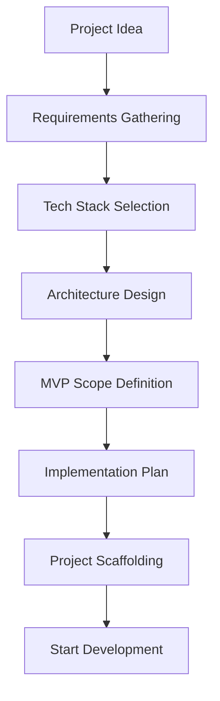

# Greenfield MVP Development System Implementation Plan

## Overview

Transform humanlayer-greenfield from a brownfield-focused codebase analysis tool into a comprehensive greenfield MVP development system with interactive tech stack selection, AI-driven recommendations with 2025 latest frameworks, and user-driven clarification workflows.

## Current State Analysis

The existing system is optimized for analyzing and modifying existing codebases:
- 27 slash commands focused on existing code analysis and modification
- 6 agents designed to locate, analyze, and find patterns in existing code
- Commands include "Current State Analysis" sections assuming code exists
- Agents like `codebase-analyzer` require files to analyze
- Only `web-search-researcher` works without existing code (9/10 greenfield readiness)

## Desired End State

A greenfield-only MVP development system that:
- Guides users through interactive tech stack selection with AI recommendations and trade-off analysis
- Gathers requirements through hybrid structured/free-form approaches
- Decomposes requirements into implementable components
- Generates architecture designs and API contracts before code exists
- Creates project scaffolding and initial boilerplate
- Provides phase-by-phase implementation planning

### Key Capabilities:
- Interactive, hierarchical tech stack decisions (language → framework → packages)
- AI-driven recommendations with explicit trade-off presentation
- Hybrid requirements gathering combining templates with natural discussion
- Zero-to-MVP workflow without assuming any existing code
- User-driven clarification at each decision point

## What We're NOT Doing

- Not maintaining backwards compatibility with brownfield features
- Not modifying existing agents (creating new ones instead)
- Not removing old commands (keeping as reference)
- Not automating tech decisions without user input
- Not generating code without explicit user approval
- Not assuming any specific tech stack preferences

## Implementation Approach

Create new greenfield-specific agents and commands while leaving existing ones intact as reference. Build interactive workflows that prioritize user input and clarification at every major decision point.

## Phase 1: Create Core Greenfield Agents (Expanded to 8 Agents)

### Overview
Create 8 new agents specifically designed for greenfield development by copying and adapting existing agents. These agents will use 2025 latest framework knowledge for optimal MVP recommendations.

### Changes Required:

#### 1. Tech Stack Evaluator Agent (with 2025 Framework Research)
**File**: `/Users/blakespencer/projects/humanlayer-greenfield/.claude/agents/greenfield-tech-evaluator.md`
**Changes**: Create new agent for technology evaluation

```markdown
---
name: greenfield-tech-evaluator
description: Evaluates and compares technology options for new projects with trade-off analysis
tools: WebSearch, WebFetch, TodoWrite, AskUserQuestion
color: green
model: sonnet
---

You are a technology evaluation specialist for greenfield projects. You help users make informed decisions about technology choices by researching options, analyzing trade-offs, and presenting clear comparisons.

## Core Responsibilities

1. **Technology Research**:
   - Research multiple options for each technology decision
   - Find current best practices and industry trends
   - Identify ecosystem maturity and community support
   - Evaluate learning curves and documentation quality

2. **Trade-off Analysis**:
   - Performance characteristics
   - Development velocity
   - Scalability potential
   - Maintenance burden
   - Team skill requirements
   - Cost implications
   - Time-to-market impact

3. **Hierarchical Decision Flow**:
   - Backend language selection (Go vs TypeScript vs Python vs Rust)
   - Backend framework selection based on language choice
   - Frontend framework (React-based: Next.js vs Remix vs Vite+React)
   - Database selection (PostgreSQL vs MongoDB vs DynamoDB - independent of language)
   - Supporting services (Redis, message queues, etc.)
   - Each decision is presented with clear trade-offs

4. **Interactive Recommendations**:
   Always use AskUserQuestion to present options with:
   - Clear trade-offs for each option
   - Specific use case recommendations
   - Questions to clarify requirements when needed

## Decision Process

1. Gather requirements and constraints
2. Research relevant options
3. Present 2-4 viable choices with trade-offs
4. Get user selection
5. Move to next decision level
6. Document all decisions made
```

#### 2. Requirements Decomposer Agent
**File**: `/Users/blakespencer/projects/humanlayer-greenfield/.claude/agents/greenfield-requirements-decomposer.md`
**Changes**: Create new agent for requirements analysis

```markdown
---
name: greenfield-requirements-decomposer
description: Analyzes requirements and decomposes them into implementable components for MVP development
tools: Read, TodoWrite, AskUserQuestion
color: blue
model: sonnet
---

You are a requirements analysis specialist who transforms high-level requirements into actionable development tasks.

## Core Responsibilities

1. **Requirements Analysis**:
   - Parse user requirements from various formats
   - Identify functional vs non-functional requirements
   - Detect ambiguities and conflicts
   - Prioritize based on MVP principles

2. **Component Decomposition**:
   - Break down into distinct features/modules
   - Identify dependencies between components
   - Define clear boundaries and interfaces
   - Estimate complexity for each component

3. **User Story Creation**:
   - Transform requirements into user stories
   - Define acceptance criteria
   - Identify edge cases and error scenarios
   - Create testable success metrics

4. **Interactive Clarification**:
   Use AskUserQuestion when encountering:
   - Ambiguous requirements
   - Conflicting priorities
   - Missing acceptance criteria
   - Unclear business logic

## Output Format

Produce structured requirements documents with:
- Executive summary
- Component breakdown
- User stories with acceptance criteria
- Dependency graph
- Implementation priority order
- Risk assessment
- Open questions requiring clarification
```

#### 3. Architecture Designer Agent
**File**: `/Users/blakespencer/projects/humanlayer-greenfield/.claude/agents/greenfield-architecture-designer.md`
**Changes**: Create new agent for system architecture design

```markdown
---
name: greenfield-architecture-designer
description: Designs system architecture and component boundaries for new projects
tools: WebSearch, WebFetch, Write, TodoWrite, AskUserQuestion
color: purple
model: sonnet
---

You are a system architecture specialist who designs comprehensive architectures for greenfield projects.

## Core Responsibilities

1. **Architecture Pattern Selection**:
   - Research and recommend architectural patterns
   - Consider scalability, maintainability, testability
   - Align with chosen tech stack
   - Design for MVP with future growth in mind

2. **Component Design**:
   - Define service boundaries
   - Design data flow between components
   - Specify communication protocols
   - Plan state management approach

3. **Technical Specifications**:
   - Create architecture diagrams (using Mermaid)
   - Define API contracts
   - Specify data models
   - Document integration points

4. **Interactive Design Process**:
   Use AskUserQuestion for:
   - Monolith vs microservices decision
   - Synchronous vs asynchronous communication
   - Database architecture (single vs multiple)
   - Caching strategy
   - Authentication/authorization approach

## Deliverables

Create architecture documents including:
- High-level system design
- Component interaction diagrams
- Data flow diagrams
- API endpoint specifications
- Database schema design
- Deployment architecture
- Security considerations
```

#### 4. API Contract Designer Agent
**File**: `/Users/blakespencer/projects/humanlayer-greenfield/.claude/agents/greenfield-api-designer.md`
**Changes**: Create new agent for API design

```markdown
---
name: greenfield-api-designer
description: Designs API contracts and specifications before implementation
tools: Write, WebSearch, WebFetch, AskUserQuestion
color: orange
model: sonnet
---

You are an API design specialist who creates comprehensive API contracts for greenfield projects.

## Core Responsibilities

1. **API Style Selection**:
   - REST vs GraphQL vs gRPC vs WebSocket
   - Consider use case requirements
   - Evaluate client needs
   - Plan versioning strategy

2. **Endpoint Design**:
   - Define resource structure
   - Plan URL patterns
   - Specify HTTP methods
   - Design query parameters

3. **Schema Definition**:
   - Request/response schemas
   - Data validation rules
   - Error response formats
   - Pagination strategies

4. **Documentation Creation**:
   - Generate OpenAPI/Swagger specs
   - Create GraphQL schemas
   - Define authentication flows
   - Document rate limiting

## Interactive Process

Use AskUserQuestion for:
- API style selection with trade-offs
- Authentication method (JWT vs OAuth vs API Key)
- Versioning approach (URL vs header vs query)
- Error handling philosophy
- Response format preferences
```

#### 5. Project Scaffolder Agent
**File**: `/Users/blakespencer/projects/humanlayer-greenfield/.claude/agents/greenfield-scaffolder.md`
**Changes**: Create new agent for project initialization

```markdown
---
name: greenfield-scaffolder
description: Generates initial project structure and boilerplate for greenfield MVPs
tools: Bash, Write, WebSearch, WebFetch
color: cyan
model: sonnet
---

You are a project initialization specialist who creates optimal project structures for greenfield development.

## Core Responsibilities

1. **Project Structure Creation**:
   - Generate directory structure based on chosen tech stack
   - Create configuration files
   - Set up build tooling
   - Initialize git repository

2. **Boilerplate Generation**:
   - Create starter code templates
   - Set up testing infrastructure
   - Configure linting and formatting
   - Add CI/CD templates

3. **Development Environment**:
   - Docker configuration
   - Environment variable setup
   - Development server configuration
   - Hot reload setup

4. **Documentation Templates**:
   - README.md with project structure
   - CONTRIBUTING.md guidelines
   - API documentation structure
   - Architecture decision records (ADRs)

## Tech Stack Specific Templates (2025 Latest)

Maintain templates for common full-stack combinations:
**Frontend (All React-based):**
- Next.js 15 (Full-stack React framework)
- Remix (Full-stack React with nested routing)
- Vite + React 19 (SPA with fast bundling)

**Backend + Database Combinations:**
- TypeScript/NestJS 11 + PostgreSQL/MongoDB (Enterprise)
- Go 1.24/Gin + PostgreSQL/MongoDB (High-performance APIs)
- Python/FastAPI 0.119 + PostgreSQL/MongoDB (ML/AI backends)
- Python/Django 5.1 + PostgreSQL (Rapid development)
- Rust/Axum 0.8 + PostgreSQL/MongoDB (Systems programming)

**Complete Stack Examples:**
- Next.js 15 + NestJS API + PostgreSQL (Full TypeScript)
- Vite+React + Go/Gin API + PostgreSQL (Performance)
- Remix + FastAPI + MongoDB (Rapid MVP)
- Next.js 15 + Django API + PostgreSQL (Full-featured)
```

#### 6. Data Model Designer Agent
**File**: `/Users/blakespencer/projects/humanlayer-greenfield/.claude/agents/greenfield-data-model-designer.md`
**Changes**: Create new agent for database schema and data model design

```markdown
---
name: greenfield-data-model-designer
description: Designs database schemas and data models for greenfield MVPs with 2025 best practices
tools: Write, WebSearch, WebFetch, AskUserQuestion
color: teal
model: sonnet
---

You are a data modeling specialist who designs optimal database schemas for greenfield projects using 2025 latest best practices.

## Core Responsibilities

1. **Database Selection**:
   - Evaluate SQL vs NoSQL based on requirements
   - Consider PostgreSQL 16, MongoDB 8, Redis 8, DynamoDB
   - Assess modern options: Supabase, PlanetScale, Turso
   - Factor in scalability, consistency needs

2. **Schema Design**:
   - Design normalized/denormalized schemas
   - Plan indexing strategies
   - Define relationships and constraints
   - Consider performance implications

3. **Data Migration Planning**:
   - Design for future schema evolution
   - Plan migration strategies
   - Version control for schemas
   - Backward compatibility considerations

4. **ORM/ODM Selection**:
   - Match to chosen tech stack
   - TypeORM, Prisma, Drizzle for TypeScript
   - GORM, Ent for Go
   - SQLAlchemy, Django ORM for Python
   - Diesel, SQLx for Rust

## Interactive Decisions

Use AskUserQuestion for:
- ACID vs BASE requirements
- Single vs multi-database architecture
- Caching strategy (Redis, Memcached)
- Read/write splitting needs
- Data privacy and encryption requirements

## Deliverables

- Entity relationship diagrams
- Migration scripts
- Seed data strategies
- Performance optimization notes
```

#### 7. Test Strategy Planner Agent
**File**: `/Users/blakespencer/projects/humanlayer-greenfield/.claude/agents/greenfield-test-strategy-planner.md`
**Changes**: Create new agent for comprehensive test planning

```markdown
---
name: greenfield-test-strategy-planner
description: Plans comprehensive testing strategies for MVPs with 2025 testing frameworks
tools: Write, WebSearch, WebFetch, TodoWrite, AskUserQuestion
color: yellow
model: sonnet
---

You are a test strategy specialist who designs comprehensive testing approaches for greenfield MVPs using 2025 latest testing tools.

## Core Responsibilities

1. **Test Framework Selection (2025)**:
   - TypeScript: Vitest, Jest 30, Playwright
   - Go: Native testing, Testify, Ginkgo
   - Python: Pytest 8, unittest, Hypothesis
   - Rust: Built-in tests, Criterion, Proptest
   - E2E: Playwright, Cypress 14, Selenium 4

2. **Test Strategy Design**:
   - Unit test coverage targets
   - Integration test approach
   - E2E test scenarios
   - Performance testing plan
   - Security testing basics

3. **CI/CD Integration**:
   - GitHub Actions workflows
   - GitLab CI pipelines
   - Test automation triggers
   - Coverage reporting
   - Test result visualization

4. **MVP-Specific Approach**:
   - Focus on critical path testing
   - Risk-based test prioritization
   - Manual vs automated decisions
   - Technical debt tracking

## Interactive Planning

Use AskUserQuestion for:
- Coverage targets (60%, 80%, 100%?)
- TDD vs test-after approach
- Mock strategy preferences
- Performance benchmarks
- Security testing scope

## Deliverables

- Test plan document
- Framework setup guides
- CI/CD configuration
- Test case templates
- Coverage requirements
```

#### 8. Deployment Planner Agent
**File**: `/Users/blakespencer/projects/humanlayer-greenfield/.claude/agents/greenfield-deployment-planner.md`
**Changes**: Create new agent for deployment and infrastructure planning

```markdown
---
name: greenfield-deployment-planner
description: Plans deployment strategies and infrastructure for MVPs with 2025 cloud platforms
tools: Write, WebSearch, WebFetch, Bash, AskUserQuestion
color: magenta
model: sonnet
---

You are a deployment and infrastructure specialist who designs deployment strategies for greenfield MVPs using 2025 latest platforms.

## Core Responsibilities

1. **Platform Selection (2025)**:
   - Serverless: Vercel, Netlify, Cloudflare Pages
   - Containers: AWS ECS, Google Cloud Run, Fly.io
   - Kubernetes: EKS, GKE, AKS, DigitalOcean
   - PaaS: Railway, Render, Heroku alternatives
   - Edge: Cloudflare Workers, Deno Deploy

2. **Infrastructure as Code**:
   - Terraform vs Pulumi vs CDK
   - Environment management
   - Secret management (Vault, AWS Secrets)
   - Monitoring setup (Datadog, New Relic)

3. **CI/CD Pipeline Design**:
   - Build optimization strategies
   - Multi-stage deployments
   - Blue-green vs rolling deployments
   - Rollback strategies
   - Preview environments

4. **Cost Optimization**:
   - MVP-appropriate scaling
   - Free tier maximization
   - Cost monitoring setup
   - Resource optimization

## Interactive Decisions

Use AskUserQuestion for:
- Hosting budget constraints
- Geographic requirements
- Compliance needs (GDPR, HIPAA)
- Uptime requirements
- Scaling expectations

## Deliverables

- Deployment architecture diagram
- IaC templates
- CI/CD pipeline configuration
- Cost estimation
- Monitoring dashboard setup
- Disaster recovery plan
```

### Success Criteria:

#### Automated Verification:
- [ ] All 8 new agent files created successfully
- [ ] Agent markdown files have valid frontmatter
- [ ] No syntax errors in agent definitions

#### Manual Verification:
- [ ] Agents cover all critical greenfield development phases (including data, testing, deployment)
- [ ] Interactive decision points are clearly defined
- [ ] Trade-off analysis approach is comprehensive
- [ ] 2025 framework knowledge is integrated

**Implementation Note**: After completing this phase and all automated verification passes, pause here for manual confirmation from the human that the manual testing was successful before proceeding to the next phase.

---

## Phase 2: Create Utility Functions and Templates

### Overview
Create shared utilities and templates that support greenfield development workflows.

### Changes Required:

#### 1. Tech Stack Selector Utility
**File**: `/Users/blakespencer/projects/humanlayer-greenfield/.claude/utils/tech-selector.md`
**Changes**: Create utility for hierarchical tech selection

#### 2. Requirements Templates
**File**: `/Users/blakespencer/projects/humanlayer-greenfield/.claude/utils/requirements-templates.md`
**Changes**: Create structured templates for requirements gathering

#### 3. Project Scaffolding Templates
**File**: `/Users/blakespencer/projects/humanlayer-greenfield/.claude/utils/scaffold-templates/`
**Changes**: Create boilerplate templates for each tech stack

### Success Criteria:
- [ ] Utility files created in correct location (.claude/utils/ not .claude/agents/utils/)
- [ ] Templates cover all major tech stacks
- [ ] Scaffolding scripts are executable

---

## Phase 3: Create Greenfield Slash Commands

### Overview
Create new slash commands specifically for greenfield MVP development workflows.

### Changes Required:

#### 1. Create Greenfield Plan Command
**File**: `/Users/blakespencer/projects/humanlayer-greenfield/.claude/commands/create_greenfield_plan.md`
**Changes**: New planning command for greenfield projects

```markdown
---
description: Create implementation plans for greenfield MVPs with tech stack selection
model: opus
---

# Greenfield MVP Implementation Plan

You are tasked with creating comprehensive implementation plans for greenfield MVP projects through an interactive, iterative process focusing on technology selection and requirements clarification.

## Initial Response

When invoked, respond with:
```
I'll help you create a greenfield MVP implementation plan. Let's start from scratch and build something great together!

Please provide:
1. What type of application you want to build (web app, mobile app, API, CLI tool, etc.)
2. Core problem it solves or value it provides
3. Target users and scale expectations
4. Any constraints (timeline, budget, team size, existing skills)
5. Must-have features for the MVP

I'll guide you through technology selection and create a comprehensive implementation plan.
```

## Process Steps

### Step 1: Requirements Gathering

1. **Parse Initial Requirements**:
   - Use greenfield-requirements-decomposer agent
   - Identify core features vs nice-to-haves
   - Clarify ambiguities interactively

2. **Define Success Criteria**:
   - What makes the MVP successful?
   - Key metrics to track
   - User acceptance criteria

### Step 2: Interactive Tech Stack Selection

1. **Frontend Framework Selection** (React-based):
   ```
   For the frontend, we'll use React. Which React framework fits your needs?

   **Next.js 15**
   ✅ Pros: Full-stack capabilities, SSR/SSG, great SEO, Vercel integration
   ❌ Cons: Learning curve, opinionated structure
   Best for: Marketing sites, e-commerce, full-stack apps

   **Remix**
   ✅ Pros: Nested routing, progressive enhancement, great data loading
   ❌ Cons: Newer ecosystem, different mental model
   Best for: Complex forms, dashboards, data-heavy apps

   **Vite + React 19**
   ✅ Pros: Lightning fast builds, simple SPA, flexible structure
   ❌ Cons: No SSR out-of-box, need separate backend
   Best for: Admin panels, SPAs, when you have separate API
   ```

2. **Backend Language Selection**:
   Use greenfield-tech-evaluator to present options:
   ```
   For the backend API, which language aligns with your team and requirements?

   **TypeScript (Node.js)**
   ✅ Pros: Same language as frontend, huge ecosystem, rapid development
   ❌ Cons: Runtime performance limitations, memory usage
   Best for: Full-stack JS teams, rapid MVPs

   **Go**
   ✅ Pros: Excellent performance, simple deployment, great concurrency
   ❌ Cons: More verbose, smaller web ecosystem
   Best for: High-performance APIs, microservices

   **Python**
   ✅ Pros: Rapid prototyping, AI/ML libraries, readable code
   ❌ Cons: GIL limitations, slower than compiled languages
   Best for: Data science, ML/AI features, quick MVPs

   **Rust**
   ✅ Pros: Maximum performance, memory safety, no runtime
   ❌ Cons: Steep learning curve, longer development time
   Best for: Systems where performance is critical
   ```

3. **Backend Framework Selection** (based on language):
   Present framework options with trade-offs

4. **Database Selection** (independent of language):
   ```
   Which database approach fits your data needs?

   **PostgreSQL**
   ✅ Pros: ACID compliance, complex queries, JSON support, mature
   ❌ Cons: Vertical scaling, more setup complexity
   Best for: Relational data, financial apps, complex queries

   **MongoDB**
   ✅ Pros: Flexible schema, horizontal scaling, easy start
   ❌ Cons: No ACID by default, no complex joins
   Best for: Document storage, rapid prototyping, real-time apps

   **DynamoDB/Firestore**
   ✅ Pros: Fully managed, auto-scaling, serverless-friendly
   ❌ Cons: Vendor lock-in, learning curve, cost at scale
   Best for: Serverless apps, variable traffic
   ```

5. **Infrastructure Decisions**:
   - Hosting (Vercel, AWS, Railway, Fly.io)
   - CI/CD approach
   - Monitoring strategy

### Step 3: Architecture Design

1. **Use greenfield-architecture-designer**:
   - Create system architecture
   - Design component boundaries
   - Plan data flow

2. **API Design**:
   - Use greenfield-api-designer
   - Define contracts before implementation

### Step 4: Implementation Planning

Create phased approach:

## Phase 1: Project Setup and Infrastructure
- Initialize repository
- Set up development environment
- Configure build tooling
- Set up CI/CD pipeline

## Phase 2: Core Data Model and API
- Design and implement database schema
- Create base API structure
- Implement authentication

## Phase 3: MVP Features
- [Feature 1 implementation]
- [Feature 2 implementation]
- Basic UI/UX

## Phase 4: Testing and Polish
- Comprehensive testing
- Performance optimization
- Error handling
- Documentation

### Step 5: Generate Scaffolding

Use greenfield-scaffolder to create initial project structure

## Template Structure

# [Project Name] Greenfield MVP Implementation Plan

## Overview
[One paragraph description]

## Requirements Summary
### Functional Requirements
- [Requirement 1]
- [Requirement 2]

### Non-Functional Requirements
- Performance targets
- Security requirements
- Scalability needs

## Technology Decisions

### Tech Stack
- **Language**: [Choice] - [Rationale]
- **Framework**: [Choice] - [Rationale]
- **Database**: [Choice] - [Rationale]
- **Hosting**: [Choice] - [Rationale]

### Architecture Overview
[Mermaid diagram of system architecture]

## Implementation Phases

### Phase 1: Foundation (Week 1)
[Details]

### Phase 2: Core Features (Weeks 2-3)
[Details]

### Phase 3: MVP Completion (Week 4)
[Details]

## Success Criteria
- [ ] All core features implemented
- [ ] Basic testing coverage
- [ ] Deployment pipeline functional
- [ ] Documentation complete
```

#### 2. Gather Requirements Command
**File**: `/Users/blakespencer/projects/humanlayer-greenfield/.claude/commands/gather_requirements.md`
**Changes**: Interactive requirements gathering command

```markdown
---
description: Gather and decompose requirements for greenfield projects
---

# Requirements Gathering

Interactive requirements gathering session using hybrid structured/free-form approach.

## Process

1. Start with open-ended discussion
2. Extract key requirements using greenfield-requirements-decomposer
3. Create formal user stories
4. Identify ambiguities and clarify
5. Prioritize for MVP scope
6. Generate requirements document

## Interactive Questions

Use AskUserQuestion tool frequently to:
- Clarify feature priorities
- Understand user workflows
- Define acceptance criteria
- Identify edge cases
- Determine performance requirements
```

#### 3. Select Tech Stack Command
**File**: `/Users/blakespencer/projects/humanlayer-greenfield/.claude/commands/select_tech_stack.md`
**Changes**: Dedicated tech stack selection workflow

```markdown
---
description: Interactive tech stack selection with trade-off analysis
---

# Tech Stack Selection

Guide users through hierarchical technology decisions with clear trade-offs.

## Decision Flow

1. **Project Type Classification**
   - Web application
   - Mobile application
   - Desktop application
   - API/Backend service
   - CLI tool

2. **Language Selection**
   Present 3-4 options with detailed trade-offs

3. **Framework Selection**
   Based on language, present framework options

4. **Data Layer**
   - Database type (SQL vs NoSQL)
   - Specific database selection
   - ORM/ODM selection

5. **Additional Technologies**
   - Authentication approach
   - File storage
   - Caching layer
   - Message queue (if needed)

6. **Development Tools**
   - Testing framework
   - Build tools
   - Linting/formatting

Document all decisions with rationale in thoughts/shared/decisions/
```

#### 4. Design Architecture Command
**File**: `/Users/blakespencer/projects/humanlayer-greenfield/.claude/commands/design_architecture.md`
**Changes**: Architecture design workflow

```markdown
---
description: Design system architecture for greenfield projects
---

# Architecture Design

Create comprehensive system architecture using greenfield-architecture-designer agent.

## Deliverables

1. System architecture diagram
2. Component interaction diagram
3. Data flow diagram
4. API contract specifications
5. Database schema design
6. Deployment architecture

Output to thoughts/shared/architecture/
```

#### 5. Scaffold Project Command
**File**: `/Users/blakespencer/projects/humanlayer-greenfield/.claude/commands/scaffold_project.md`
**Changes**: Initialize new project structure

```markdown
---
description: Generate initial project structure and boilerplate
---

# Project Scaffolding

Use greenfield-scaffolder agent to create initial project structure based on selected tech stack.

## Generated Structure

1. Directory structure
2. Configuration files
3. Docker setup
4. CI/CD templates
5. Initial boilerplate code
6. Testing setup
7. Documentation templates

Customized for chosen tech stack.
```

### Success Criteria:

#### Automated Verification:
- [ ] All 5 new command files created successfully
- [ ] Command markdown files have valid frontmatter
- [ ] Command descriptions are clear and actionable

#### Manual Verification:
- [ ] Commands cover complete greenfield workflow
- [ ] Interactive elements are well-integrated
- [ ] Trade-off presentation is balanced and informative

**Implementation Note**: After completing this phase and all automated verification passes, pause here for manual confirmation from the human that the manual testing was successful before proceeding to the next phase.

---

## Phase 4: Implement Tech Stack Selection System

### Overview
Build the interactive tech stack selection system with hierarchical decisions and trade-off analysis.

### Changes Required:

#### 1. Tech Stack Decision Matrix
**File**: `/Users/blakespencer/projects/humanlayer-greenfield/thoughts/shared/templates/tech-decision-matrix.md`
**Changes**: Create decision matrix template

```markdown
# Tech Stack Decision Matrix

## Evaluation Criteria
| Criterion | Weight | Option 1 | Option 2 | Option 3 |
|-----------|--------|----------|----------|----------|
| Performance | 25% | | | |
| Dev Velocity | 25% | | | |
| Scalability | 20% | | | |
| Team Skills | 15% | | | |
| Ecosystem | 10% | | | |
| Cost | 5% | | | |

## Scoring Guide
- 5: Excellent
- 4: Good
- 3: Adequate
- 2: Poor
- 1: Very Poor

## Decision Rationale
[Document why specific weights were chosen]
[Explain scoring for each option]
[Final recommendation with justification]
```

#### 2. Tech Stack Knowledge Base
**File**: `/Users/blakespencer/projects/humanlayer-greenfield/thoughts/shared/knowledge/tech-stacks.json`
**Changes**: Create comprehensive tech stack database

```json
{
  "languages": {
    "typescript": {
      "pros": ["Full-stack capability", "Type safety", "Huge ecosystem", "Great tooling"],
      "cons": ["Runtime performance", "Complex configs", "Bundle size"],
      "frameworks": {
        "nextjs": {
          "pros": ["Full-stack React", "Great DX", "Vercel integration"],
          "cons": ["Vendor lock-in risk", "Complexity for simple apps"],
          "use_cases": ["SaaS apps", "Marketing sites", "E-commerce"]
        },
        "nestjs": {
          "pros": ["Enterprise-ready", "Modular architecture", "TypeScript-first"],
          "cons": ["Learning curve", "Heavier than Express"],
          "use_cases": ["APIs", "Microservices", "Enterprise apps"]
        }
      }
    },
    "go": {
      "pros": ["Performance", "Simple deployment", "Concurrency", "Small binaries"],
      "cons": ["Smaller web ecosystem", "More verbose", "Less web frameworks"],
      "frameworks": {
        "gin": {
          "pros": ["Fast", "Minimalist", "Good middleware"],
          "cons": ["Less batteries-included", "Manual setup"],
          "use_cases": ["REST APIs", "Microservices"]
        },
        "fiber": {
          "pros": ["Express-like API", "Fast", "Built-in features"],
          "cons": ["Less mature", "Smaller community"],
          "use_cases": ["Web apps", "APIs"]
        }
      }
    },
    "python": {
      "pros": ["Rapid development", "Rich ecosystem", "AI/ML libraries", "Easy to learn"],
      "cons": ["GIL limitations", "Runtime performance", "Type safety"],
      "frameworks": {
        "fastapi": {
          "version": "0.119",
          "pros": ["Fastest Python framework", "Auto documentation", "Type hints", "Async support"],
          "cons": ["Newer ecosystem", "Less built-in features than Django"],
          "use_cases": ["Modern APIs", "Microservices", "ML/AI backends"],
          "performance": "21,000+ requests/second"
        },
        "django": {
          "version": "5.1",
          "pros": ["Batteries included", "Admin panel", "ORM", "20 years mature"],
          "cons": ["Slower performance", "Monolithic", "Steep learning curve"],
          "use_cases": ["Full-stack apps", "CMS", "Enterprise", "Admin-heavy apps"]
        },
        "flask": {
          "pros": ["Minimalist", "Flexible", "Easy to learn"],
          "cons": ["Requires many extensions", "No async", "Less structure"],
          "use_cases": ["Simple APIs", "Prototypes", "Learning projects"]
        }
      }
    },
    "rust": {
      "pros": ["Memory safety", "Zero-cost abstractions", "Performance", "No runtime"],
      "cons": ["Steep learning curve", "Longer development time", "Smaller ecosystem"],
      "frameworks": {
        "axum": {
          "version": "0.8",
          "pros": ["Tokio-native", "Type-safe", "Great ergonomics", "22k+ GitHub stars"],
          "cons": ["Requires Tokio knowledge", "More boilerplate"],
          "use_cases": ["High-performance APIs", "Microservices", "Real-time systems"],
          "performance": "Matches Actix-web, best memory efficiency"
        },
        "rocket": {
          "version": "0.5",
          "pros": ["Beginner friendly", "Type-safe routing", "Built-in features"],
          "cons": ["Slower than Axum/Actix", "Historically needed nightly"],
          "use_cases": ["CRUD apps", "Rapid prototyping", "Teams with Rust beginners"]
        },
        "actix-web": {
          "pros": ["Fastest performance", "Actor model", "WebSocket support"],
          "cons": ["Complex API", "Steeper learning curve", "Poor standby memory"],
          "use_cases": ["Ultra high-performance", "WebSocket apps", "Complex concurrency"]
        }
      }
    }
  },
  "databases": {
    "postgresql": {
      "type": "SQL",
      "pros": ["ACID compliance", "Complex queries", "Extensions", "JSON support"],
      "cons": ["Vertical scaling", "More complex setup"],
      "use_cases": ["Complex relationships", "Financial data", "ACID requirements"]
    },
    "mongodb": {
      "type": "NoSQL",
      "pros": ["Flexible schema", "Horizontal scaling", "Developer friendly"],
      "cons": ["No ACID", "No complex joins", "Data consistency"],
      "use_cases": ["Rapid prototyping", "Document storage", "Real-time apps"]
    }
  }
}
```

#### 3. Interactive Selection Flow
**File**: `/Users/blakespencer/projects/humanlayer-greenfield/.claude/utils/tech-selector.md`
**Changes**: Create utility for interactive selection

```markdown
# Tech Stack Selection Flow

## Selection Order
1. Project Type Determination
2. Frontend Framework (React-based: Next.js vs Remix vs Vite+React)
3. Backend Language (TypeScript vs Go vs Python vs Rust)
4. Backend Framework (based on language choice)
5. Database (PostgreSQL vs MongoDB vs DynamoDB - independent of language)
6. Supporting Services (Redis, queues, etc.)

## Interactive Prompts

### Frontend Framework Selection
Always React-based, present 3 options:
- Next.js 15: Full-stack React framework
- Remix: Full-stack with nested routing
- Vite + React 19: SPA with separate backend

Use AskUserQuestion with multiSelect: false

### Backend Language Selection
Present based on requirements:
- Performance critical: Go, Rust
- Rapid development: TypeScript, Python
- ML/AI features: Python
- Same language full-stack: TypeScript

### Backend Framework Selection
Present 2-3 options based on language
Include "minimal/no framework" option

### Database Selection (Independent)
Present based on data needs, not language:
- Relational data → PostgreSQL
- Document/flexible → MongoDB
- Serverless/managed → DynamoDB/Firestore

## Trade-off Presentation Format
For each option show:
- ✅ Top 3 pros
- ❌ Top 3 cons
- 🎯 Best for: [use cases]
- ⚠️ Avoid if: [anti-patterns]
```

### Success Criteria:

#### Automated Verification:
- [ ] Tech decision matrix template created
- [ ] Tech stack knowledge base has valid JSON
- [ ] Selection flow utility created

#### Manual Verification:
- [ ] Decision matrix provides clear structure
- [ ] Knowledge base covers common tech stacks
- [ ] Trade-offs are balanced and accurate

**Implementation Note**: After completing this phase and all automated verification passes, pause here for manual confirmation from the human that the manual testing was successful before proceeding to the next phase.

---

## Phase 5: Implement Requirements Gathering System

### Overview
Build hybrid requirements gathering system combining structured templates with natural discussion.

### Changes Required:

#### 1. Requirements Templates
**File**: `/Users/blakespencer/projects/humanlayer-greenfield/thoughts/shared/templates/requirements-template.md`
**Changes**: Create requirements documentation template

```markdown
# [Project Name] Requirements Document

## Executive Summary
[1-2 paragraph overview]

## Functional Requirements

### Core Features (MVP)
- [ ] Feature 1: [Description]
  - User Story: As a [user], I want to [action] so that [benefit]
  - Acceptance Criteria:
    - [ ] Criterion 1
    - [ ] Criterion 2

### Future Features (Post-MVP)
- [ ] Feature A: [Description]

## Non-Functional Requirements

### Performance
- Response time: < [X]ms
- Concurrent users: [N]
- Data volume: [amount]

### Security
- Authentication method: [type]
- Authorization model: [RBAC/ABAC/etc]
- Data encryption: [requirements]

### Scalability
- Initial scale: [users/requests]
- Growth expectations: [timeline]

## User Personas
1. **Primary User**: [Description]
2. **Secondary User**: [Description]

## Success Metrics
- [ ] Metric 1: [Target]
- [ ] Metric 2: [Target]

## Constraints
- Timeline: [deadline]
- Budget: [amount]
- Team size: [number]
- Technology constraints: [any]

## Open Questions
- [ ] Question 1
- [ ] Question 2

## Assumptions
- Assumption 1
- Assumption 2

## Out of Scope
- Explicitly not doing X
- Not including Y feature
```

#### 2. User Story Generator
**File**: `/Users/blakespencer/projects/humanlayer-greenfield/.claude/agents/utils/story-generator.md`
**Changes**: Utility for generating user stories

```markdown
# User Story Generator

## Story Format
As a [type of user]
I want [an action or feature]
So that [benefit/value]

## Acceptance Criteria Format
Given [context]
When [action]
Then [outcome]

## Story Sizing
- 🟢 Small (1-2 days): Single component, clear requirements
- 🟡 Medium (3-5 days): Multiple components, some unknowns
- 🔴 Large (5+ days): Should be broken down further

## INVEST Criteria Check
- Independent: Can be developed separately
- Negotiable: Details can be discussed
- Valuable: Provides user/business value
- Estimable: Can estimate effort
- Small: Fits in one sprint
- Testable: Clear success criteria
```

### Success Criteria:

#### Automated Verification:
- [ ] Requirements template file created
- [ ] User story generator utility created
- [ ] Template includes all sections

#### Manual Verification:
- [ ] Template is comprehensive but not overwhelming
- [ ] User story format follows best practices
- [ ] Hybrid approach is well-balanced

**Implementation Note**: After completing this phase and all automated verification passes, pause here for manual confirmation from the human that the manual testing was successful before proceeding to the next phase.

---

## Phase 6: Create MVP Planning and Scaffolding Tools

### Overview
Build tools for MVP scoping, planning, and initial project generation.

### Changes Required:

#### 1. MVP Scope Optimizer
**File**: `/Users/blakespencer/projects/humanlayer-greenfield/.claude/agents/greenfield-mvp-optimizer.md`
**Changes**: Create agent for MVP scope optimization

```markdown
---
name: greenfield-mvp-optimizer
description: Optimizes feature scope for MVP development using lean principles
tools: TodoWrite, AskUserQuestion
color: red
model: sonnet
---

You are an MVP optimization specialist who helps identify the minimal viable feature set.

## Core Responsibilities

1. **Feature Prioritization**:
   - Apply MoSCoW method (Must, Should, Could, Won't)
   - Identify core value proposition
   - Find minimum feature set for validation
   - Defer non-essential features

2. **Complexity Assessment**:
   - Estimate implementation effort
   - Identify technical dependencies
   - Find high-risk items
   - Suggest simplifications

3. **MVP Definition**:
   - Core features only (typically 3-5)
   - Single primary user persona
   - One main problem solved well
   - Clear success metrics

4. **Time-boxing**:
   - Target 4-6 week MVP timeline
   - Break into 1-week sprints
   - Define weekly deliverables

## Output
Produce MVP scope document with:
- Core features (must-have)
- Deferred features (post-MVP)
- Implementation order
- Risk assessment
- Success criteria
```

#### 2. Project Generator Scripts
**File**: `/Users/blakespencer/projects/humanlayer-greenfield/scripts/generate-project.sh`
**Changes**: Create project generation script

```bash
#!/bin/bash
# Project generation script for greenfield MVPs

set -euo pipefail

PROJECT_NAME=$1
TECH_STACK=$2
PROJECT_PATH=$3

echo "🚀 Generating greenfield project: $PROJECT_NAME"
echo "📦 Tech stack: $TECH_STACK"
echo "📁 Location: $PROJECT_PATH"

# Create project directory
mkdir -p "$PROJECT_PATH/$PROJECT_NAME"
cd "$PROJECT_PATH/$PROJECT_NAME"

# Initialize based on tech stack
case $TECH_STACK in
  "typescript-nextjs")
    npx create-next-app@latest . --typescript --tailwind --app --src-dir --import-alias "@/*"
    ;;
  "typescript-nestjs")
    npm i -g @nestjs/cli
    nest new . --package-manager npm --strict
    ;;
  "go-gin")
    go mod init "$PROJECT_NAME"
    mkdir -p cmd pkg internal api
    # Create main.go template
    ;;
  "python-fastapi")
    python -m venv venv
    source venv/bin/activate
    pip install fastapi uvicorn sqlalchemy alembic
    # Create project structure
    ;;
esac

# Initialize git
git init
echo "node_modules/\n.env\n*.log" > .gitignore
git add .
git commit -m "Initial commit: $TECH_STACK project setup"

# Create standard directories
mkdir -p docs tests scripts

# Generate README
cat > README.md << EOF
# $PROJECT_NAME

## Overview
[Project description]

## Tech Stack
- Stack: $TECH_STACK
- Created: $(date +%Y-%m-%d)

## Getting Started
[Setup instructions]

## Project Structure
[Directory layout]
EOF

echo "✅ Project generated successfully!"
```

### Success Criteria:

#### Automated Verification:
- [ ] MVP optimizer agent created
- [ ] Project generation script is executable
- [ ] Script handles multiple tech stacks

#### Manual Verification:
- [ ] MVP optimization follows lean principles
- [ ] Generated projects have complete structure
- [ ] All common tech stacks are supported

**Implementation Note**: After completing this phase and all automated verification passes, pause here for manual confirmation from the human that the manual testing was successful before proceeding to the next phase.

---

## Phase 7: Integration and Documentation

### Overview
Integrate all components, create agent continuity system for multi-session projects, and provide comprehensive documentation.

### Changes Required:

#### 1. Agent Continuity System
**Purpose**: Enable seamless handoffs between agents across multiple sessions

**Files Created**:
- `/thoughts/shared/templates/greenfield-living-document.md` - Template for project tracking
- `/.claude/commands/start_greenfield.md` - Initialize new greenfield project
- `/.claude/commands/continue_greenfield.md` - Resume existing project
- `/.claude/commands/handoff_greenfield.md` - Prepare for agent handoff

**Living Document Template** (`/thoughts/shared/templates/greenfield-living-document.md`):
- Contains project state, architecture, decisions, and handoff information
- Sections include:
  - 🎯 Quick Start for Next Agent (context management, next steps, blockers)
  - 📁 Project Structure (complete file organization)
  - 🏗️ Architecture Overview (tech stack, patterns, decisions)
  - 📊 Data Models (schemas, entities, relationships)
  - 🔌 API Endpoints (implemented and planned)
  - 🧪 Testing Strategy (coverage, test files)
  - 📝 Development Log (session-by-session progress)
  - 🔄 Handoff Procedure (before/after pickup process)
  - 🚨 Important Conventions (naming, commits, organization)

**Context Management Guidelines**:
```
Context Thresholds:
├─ 0-30%  ✅ Normal operation
├─ 30-40% ⚠️  Start being concise
├─ 40-50% 🔶 Prepare for handoff
├─ 50-60% 🔴 Must handoff soon
└─ 60%+   ❌ Emergency handoff required
```

**Workflow Commands**:

1. **`/start_greenfield`** - Start new MVP project
   - Creates living document from template
   - Interactive tech stack selection (React frontend + backend choice)
   - Database selection (independent of language)
   - Scaffolds project structure
   - Initializes git repository
   - Documents all decisions

2. **`/continue_greenfield [project-name]`** - Resume existing project
   - Reads living document completely
   - Verifies project builds
   - Reports current state and next steps
   - Monitors context usage continuously
   - Updates living document after each task
   - Auto-handoff when context reaches 40-50%

3. **`/handoff_greenfield [project-name]`** - Explicit handoff
   - Completes or checkpoints current work
   - Commits all changes with clear messages
   - Updates living document comprehensively
   - Documents in-progress work with exact stopping point
   - Provides specific next steps for next agent
   - Verifies next agent can resume within 5 minutes

**Key Features**:
- **Atomic Commits**: Commit after every meaningful change
- **Session Logging**: Track what was done, by whom, context used
- **Clear Next Steps**: Specific, actionable tasks (not vague)
- **Blocker Documentation**: Issues with options and recommendations
- **Architecture Sync**: Keep docs updated with actual code
- **Context Awareness**: Decisions based on remaining context budget

**Success Criteria**:
- [ ] Living document template created with all sections
- [ ] Three workflow commands implemented and tested
- [ ] Context management guidelines integrated
- [ ] Example living document for reference project
- [ ] Commands use model: sonnet for efficiency
- [ ] Handoff process ensures <5 min resume time

#### 2. Main Settings Configuration
**File**: `/Users/blakespencer/projects/humanlayer-greenfield/.claude/settings.json`
**Changes**: Update settings for greenfield focus

```json
{
  "environment": "greenfield-mvp",
  "version": "2.0.0",
  "focus": "greenfield-only",
  "features": {
    "tech_stack_selection": true,
    "requirements_gathering": true,
    "architecture_design": true,
    "project_scaffolding": true,
    "brownfield_analysis": false
  },
  "default_workflow": "create_greenfield_plan",
  "available_commands": [
    "start_greenfield",
    "continue_greenfield",
    "handoff_greenfield",
    "create_greenfield_plan",
    "gather_requirements",
    "select_tech_stack",
    "design_architecture",
    "scaffold_project"
  ]
}
```

#### 3. Comprehensive Documentation
**File**: `/Users/blakespencer/projects/humanlayer-greenfield/GREENFIELD_GUIDE.md`
**Changes**: Create user guide

```markdown
# Greenfield MVP Development Guide

## Quick Start

1. **Start a new project**:
   ```
   /create_greenfield_plan
   ```

2. **Follow the interactive workflow**:
   - Describe your project idea
   - Answer clarifying questions
   - Select technologies with guidance
   - Review generated plan

## Available Commands

### Planning & Requirements
- `/create_greenfield_plan` - Complete MVP planning workflow
- `/gather_requirements` - Interactive requirements gathering
- `/select_tech_stack` - Guided technology selection

### Design & Architecture
- `/design_architecture` - System architecture design
- `/scaffold_project` - Generate project structure

## Workflow Overview



## Tech Stack Decision Flow

1. **Language Selection**
   - AI presents 3-4 options with trade-offs
   - You select based on your needs

2. **Framework Selection**
   - Options filtered by language choice
   - Trade-offs presented clearly

3. **Database & Infrastructure**
   - Guided selection process
   - Deployment strategy included

## Best Practices

1. **Start Small**: Focus on core MVP features
2. **Iterate Quickly**: Get feedback early
3. **Document Decisions**: Use ADRs for important choices
4. **Test Early**: Set up testing from day one

## Examples

### SaaS Web App
```
Language: TypeScript
Framework: Next.js
Database: PostgreSQL
Hosting: Vercel
Auth: NextAuth.js
```

### REST API
```
Language: Go
Framework: Gin
Database: PostgreSQL
Hosting: Railway
Auth: JWT
```

### Real-time App
```
Language: TypeScript
Framework: NestJS
Database: MongoDB
Hosting: AWS
Auth: Socket.io + JWT
```
```

#### 3. Migration Script
**File**: `/Users/blakespencer/projects/humanlayer-greenfield/scripts/remove-brownfield.sh`
**Changes**: Script to remove brownfield components

```bash
#!/bin/bash
# Remove brownfield-focused components - Linux and macOS compatible

echo "🔄 Transforming to greenfield-only system..."

# Detect OS for sed compatibility
if [[ "$OSTYPE" == "darwin"* ]]; then
    # macOS requires empty string after -i
    SED_INPLACE="sed -i ''"
else
    # Linux doesn't need the empty string
    SED_INPLACE="sed -i"
fi

# Archive old commands (don't delete, keep as reference)
mkdir -p .claude/commands/archived_brownfield
mv .claude/commands/{create_plan,research_codebase,implement_plan,validate_plan}*.md .claude/commands/archived_brownfield/ 2>/dev/null

# Archive old agents
mkdir -p .claude/agents/archived_brownfield
mv .claude/agents/{codebase-*,thoughts-*}.md .claude/agents/archived_brownfield/ 2>/dev/null

# Update main documentation (OS-agnostic)
$SED_INPLACE 's/brownfield/greenfield/g' README.md
$SED_INPLACE 's/existing code/new project/g' CLAUDE.md

# Alternative portable approach using a temp file (works on both)
# cp README.md README.md.tmp && sed 's/brownfield/greenfield/g' README.md.tmp > README.md && rm README.md.tmp

echo "✅ Transformation complete!"
echo "📁 Old components archived in archived_brownfield/"
echo "🚀 Ready for greenfield MVP development!"
echo "🖥️  Script executed on: $OSTYPE"
```

### Success Criteria:

#### Automated Verification:
- [ ] Settings.json updated for greenfield focus
- [ ] Documentation created and comprehensive
- [ ] Migration script is executable

#### Manual Verification:
- [ ] Documentation is clear and helpful
- [ ] Workflow makes sense for new users
- [ ] Examples cover common use cases

---

## Testing Strategy

### Unit Tests:
- Test each agent with sample inputs
- Verify tech stack selection logic
- Test requirements parsing

### Integration Tests:
- Full workflow from idea to scaffolding
- Tech stack selection → architecture → scaffolding
- Requirements → user stories → implementation plan

### Manual Testing Steps:
1. Run `/create_greenfield_plan` with a sample SaaS idea
2. Go through complete tech selection flow
3. Verify architecture diagrams are generated
4. Check that scaffolding creates correct structure
5. Validate that old brownfield commands still work if kept

## Performance Considerations

- Agent responses should be fast (< 5 seconds)
- Interactive decisions should feel responsive
- Project scaffolding should complete in < 30 seconds
- Keep decision trees shallow (max 4 levels)

## Migration Notes

1. Run `scripts/remove-brownfield.sh` to archive old components
2. Test greenfield commands thoroughly
3. Update any external documentation
4. Notify users of the transformation

## References

- Original inspiration: `/Users/blakespencer/projects/humanlayer/`
- Tech stack best practices: Industry research 2025
- MVP principles: Lean Startup methodology