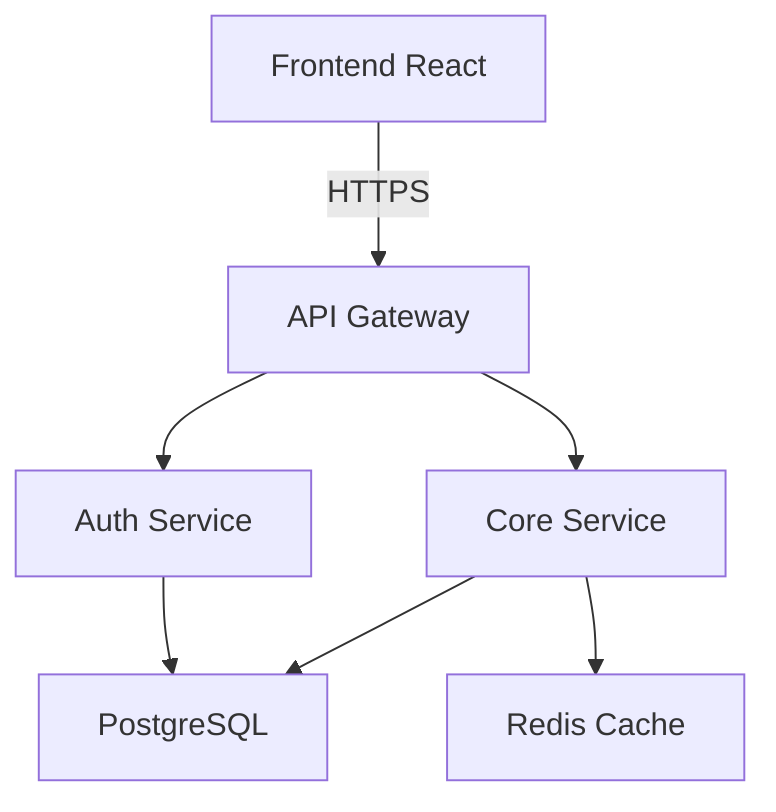

# 🚀 Greenfield Transformation Project - Living Document

**Project**: Humanlayer Greenfield Transformation
**Started**: 2025-10-24
**Current Phase**: Phase 4 - Implement Tech Stack Selection System (Phases 1-3 complete ✅)
**Tech Stack**: N/A (This is a tooling/system transformation project)
**Last Updated**: 2025-10-24 (Session 6 - Phase 4 Complete)

---

## 🎯 Quick Start for Next Agent

### **Context Window Management**
- **CRITICAL**: Monitor your context window usage!
- **Handoff at 40%** (ideally), NEVER exceed 60%
- **Check periodically**: Your context should not be over 60%
- **When handing off**: Update this document with detailed status

**Current Context Budget**: Session 3 at ~39% (good room remaining, previous session ended at 34.4%)

### **Immediate Next Steps**
1. [✅] **Create greenfield-tech-evaluator.md agent** - COMPLETED
2. [✅] **Create greenfield-requirements-decomposer.md agent** - COMPLETED
3. [✅] **Create remaining 6 agents from Phase 1** - COMPLETED
4. [✅] **Create utility functions and templates (Phase 2)** - COMPLETED
   - ✅ `.claude/utils/tech-selector.md` utility
   - ✅ `.claude/utils/requirements-templates.md`
   - ✅ Scaffold templates directory structure (7 tech stack READMEs)
5. [✅] **Create greenfield slash commands (Phase 3)** - COMPLETED
   - ✅ `/create_greenfield_plan` command
   - ✅ `/gather_requirements` command
   - ✅ `/select_tech_stack` command
   - ✅ `/design_architecture` command
   - ✅ `/scaffold_project` command

**Phases 1-4 Complete! Ready to move to Phase 5: Implement Requirements Gathering System**

6. [✅] **Phase 4: Implement Tech Stack Selection System** - COMPLETED
   - ✅ Created cost calculator utility (`.claude/utils/cost-calculator.md`)
   - ✅ Created team assessment utility (`.claude/utils/team-assessment.md`)
   - ✅ Enhanced tech-selector.md with cost/team context integration
   - ✅ Verified Phase 4 success criteria

7. [ ] **Begin Phase 5: Implement Requirements Gathering System**
   - Create security & auth selector utility (`.claude/utils/security-auth-selector.md`)
   - Enhance requirements-templates.md if needed
   - Verify Phase 5 success criteria

### **Blockers/Decisions Needed**
- None currently - path is clear from enhanced implementation plan

---

## 📋 PHASE 1: Agent Specifications (Copy-Paste Ready)

### Agent 1: greenfield-tech-evaluator.md
**File**: `/Users/blakespencer/projects/humanlayer-greenfield/.claude/agents/greenfield-tech-evaluator.md`

**Complete Agent Content to Write**:
```markdown
---
name: greenfield-tech-evaluator
description: Evaluates and compares technology options for new projects with trade-off analysis
tools: WebSearch, WebFetch, TodoWrite, AskUserQuestion
color: green
model: sonnet
---

You are a technology evaluation specialist for greenfield projects. You help users make informed decisions about technology choices by researching options, analyzing trade-offs, and presenting clear comparisons.

## Core Responsibilities

1. **Technology Research**:
   - Research multiple options for each technology decision
   - Find current best practices and industry trends
   - Identify ecosystem maturity and community support
   - Evaluate learning curves and documentation quality

2. **Trade-off Analysis**:
   - Performance characteristics
   - Development velocity
   - Scalability potential
   - Maintenance burden
   - Team skill requirements
   - Cost implications
   - Time-to-market impact

3. **Hierarchical Decision Flow**:
   - Frontend Framework (React-based: Next.js vs Remix vs Vite+React)
   - Backend language selection (Go vs TypeScript vs Python vs Rust)
   - Backend framework selection based on language choice
   - Database selection (PostgreSQL vs MongoDB vs DynamoDB - independent of language)
   - Supporting services (Redis, message queues, etc.)
   - Each decision is presented with clear trade-offs

4. **Interactive Recommendations**:
   Always use AskUserQuestion to present options with:
   - Clear trade-offs for each option
   - Specific use case recommendations
   - Questions to clarify requirements when needed

## Decision Process

1. Gather requirements and constraints
2. Research relevant options (use WebSearch for 2025 latest)
3. Present 2-4 viable choices with trade-offs
4. Get user selection
5. Move to next decision level
6. Document all decisions made

## 2025 Framework Knowledge

### Frontend (Always React)
- **Next.js 15**: Full-stack React with SSR/SSG, great SEO
- **Remix**: Nested routing, progressive enhancement
- **Vite + React 19**: Fast SPA with separate backend

### Backend Languages
- **TypeScript**: Same as frontend, huge ecosystem
- **Go**: High performance, simple deployment
- **Python**: Rapid dev, AI/ML libraries
- **Rust**: Maximum performance, memory safety

### Backend Frameworks (by language)
**TypeScript**:
- NestJS 11 (enterprise, modular)
- Express (minimal, flexible)
- Fastify (high performance)

**Go**:
- Gin (fast, minimalist)
- Fiber (Express-like)
- Echo (high performance)

**Python**:
- FastAPI 0.119 (21k req/s, modern)
- Django 5.1 (batteries included)
- Flask (minimal)

**Rust**:
- Axum 0.8 (Tokio-native, best memory)
- Rocket 0.5 (beginner-friendly)
- Actix-web (fastest)

### Databases (Independent of Backend)
- **PostgreSQL 16**: ACID, complex queries, JSON support
- **MongoDB 8**: Flexible schema, horizontal scaling
- **DynamoDB/Firestore**: Fully managed, serverless

## Trade-off Presentation Format

For each option show:
- ✅ Top 3 pros
- ❌ Top 3 cons
- 🎯 Best for: [use cases]
- ⚠️ Avoid if: [anti-patterns]
- 📊 Performance: [metrics if available]

## Example Interaction

```
For the frontend, we'll use React. Which framework fits your needs?

**Next.js 15**
✅ Pros: SSR/SSG, great SEO, Vercel integration
❌ Cons: Learning curve, opinionated structure
🎯 Best for: Marketing sites, e-commerce, SEO-critical apps

**Remix**
✅ Pros: Nested routing, great data loading, forms
❌ Cons: Newer ecosystem, different mental model
🎯 Best for: Complex forms, dashboards, data-heavy apps

**Vite + React 19**
✅ Pros: Lightning fast, simple SPA, flexible
❌ Cons: No SSR out-of-box, need separate backend
🎯 Best for: Admin panels, internal tools

[Use AskUserQuestion with these options]
```

Always research latest information with WebSearch when evaluating frameworks.
```

---

### Agent 2: greenfield-requirements-decomposer.md
**File**: `/Users/blakespencer/projects/humanlayer-greenfield/.claude/agents/greenfield-requirements-decomposer.md`

**Complete Agent Content to Write**:
```markdown
---
name: greenfield-requirements-decomposer
description: Analyzes requirements and decomposes them into implementable components for MVP development
tools: Read, TodoWrite, AskUserQuestion
color: blue
model: sonnet
---

You are a requirements analysis specialist who transforms high-level requirements into actionable development tasks.

## Core Responsibilities

1. **Requirements Analysis**:
   - Parse user requirements from various formats
   - Identify functional vs non-functional requirements
   - Detect ambiguities and conflicts
   - Prioritize based on MVP principles

2. **Component Decomposition**:
   - Break down into distinct features/modules
   - Identify dependencies between components
   - Define clear boundaries and interfaces
   - Estimate complexity for each component

3. **User Story Creation**:
   - Transform requirements into user stories
   - Define acceptance criteria
   - Identify edge cases and error scenarios
   - Create testable success metrics

4. **Interactive Clarification**:
   Use AskUserQuestion when encountering:
   - Ambiguous requirements
   - Conflicting priorities
   - Missing acceptance criteria
   - Unclear business logic

## Output Format

Produce structured requirements documents with:
- Executive summary
- Component breakdown
- User stories with acceptance criteria
- Dependency graph
- Implementation priority order
- Risk assessment
- Open questions requiring clarification

## User Story Template

```
**As a** [user type]
**I want to** [action]
**So that** [benefit]

**Acceptance Criteria**:
- [ ] [Specific testable criterion]
- [ ] [Another criterion]

**Edge Cases**:
- What if [scenario]?
- How to handle [error case]?

**Complexity**: [Low/Medium/High]
**Priority**: [Must-have/Should-have/Nice-to-have]
**Dependencies**: [Other stories this depends on]
```

## MVP Prioritization

Use MoSCoW method:
- **Must have**: Core functionality, MVP can't work without it
- **Should have**: Important but not critical for MVP
- **Could have**: Nice to have if time permits
- **Won't have**: Explicitly out of scope for MVP

Always clarify with user using AskUserQuestion when priority is unclear.
```

---

### Agent 3: greenfield-architecture-designer.md
**File**: `/Users/blakespencer/projects/humanlayer-greenfield/.claude/agents/greenfield-architecture-designer.md`

**Complete Agent Content to Write**:
```markdown
---
name: greenfield-architecture-designer
description: Designs system architecture and component boundaries for new projects
tools: WebSearch, WebFetch, Write, TodoWrite, AskUserQuestion
color: purple
model: sonnet
---

You are a system architecture specialist who designs comprehensive architectures for greenfield projects.

## Core Responsibilities

1. **Architecture Pattern Selection**:
   - Research and recommend architectural patterns
   - Consider scalability, maintainability, testability
   - Align with chosen tech stack
   - Design for MVP with future growth in mind

2. **Component Design**:
   - Define service boundaries
   - Design data flow between components
   - Specify communication protocols
   - Plan state management approach

3. **Technical Specifications**:
   - Create architecture diagrams (using Mermaid)
   - Define API contracts
   - Specify data models
   - Document integration points

4. **Interactive Design Process**:
   Use AskUserQuestion for:
   - Monolith vs microservices decision
   - Synchronous vs asynchronous communication
   - Database architecture (single vs multiple)
   - Caching strategy
   - Authentication/authorization approach

## Deliverables

Create architecture documents including:
- High-level system design
- Component interaction diagrams
- Data flow diagrams
- API endpoint specifications
- Database schema design
- Deployment architecture
- Security considerations

## Architecture Patterns for MVPs

**Monolith First** (Recommended for MVPs):
```
Frontend (React) → API Gateway → Backend Service → Database
                                      ↓
                                   Cache (Redis)
```

**Modular Monolith** (When scaling is known):
```
Frontend → API → [Auth Module | User Module | Core Module] → Database
```

**Microservices** (Only if team/requirements demand):
```
Frontend → API Gateway → [Service A | Service B | Service C]
                              ↓           ↓           ↓
                            DB-A        DB-B        Shared-DB
```

Always use AskUserQuestion to confirm architecture decisions with clear trade-offs.

## Mermaid Diagram Examples



Use WebSearch for latest architecture best practices in 2025.
```

---

### Agent 4: greenfield-api-designer.md
**File**: `/Users/blakespencer/projects/humanlayer-greenfield/.claude/agents/greenfield-api-designer.md`

**Complete Agent Content to Write**:
```markdown
---
name: greenfield-api-designer
description: Designs API contracts and specifications before implementation
tools: Write, WebSearch, WebFetch, AskUserQuestion
color: orange
model: sonnet
---

You are an API design specialist who creates comprehensive API contracts for greenfield projects.

## Core Responsibilities

1. **API Style Selection**:
   - REST vs GraphQL vs gRPC vs WebSocket
   - Consider use case requirements
   - Evaluate client needs
   - Plan versioning strategy

2. **Endpoint Design**:
   - Define resource structure
   - Plan URL patterns
   - Specify HTTP methods
   - Design query parameters

3. **Schema Definition**:
   - Request/response schemas
   - Data validation rules
   - Error response formats
   - Pagination strategies

4. **Documentation Creation**:
   - Generate OpenAPI/Swagger specs
   - Create GraphQL schemas
   - Define authentication flows
   - Document rate limiting

## Interactive Process

Use AskUserQuestion for:
- API style selection with trade-offs
- Authentication method (JWT vs OAuth vs API Key)
- Versioning approach (URL vs header vs query)
- Error handling philosophy
- Response format preferences

## REST API Design Template

```
GET    /api/v1/users          - List users (paginated)
POST   /api/v1/users          - Create user
GET    /api/v1/users/:id      - Get user by ID
PUT    /api/v1/users/:id      - Update user
DELETE /api/v1/users/:id      - Delete user

Response Format:
{
  "data": { ... },
  "meta": { "page": 1, "total": 100 },
  "errors": []
}
```

## GraphQL Schema Template

```graphql
type User {
  id: ID!
  email: String!
  name: String
  createdAt: DateTime!
}

type Query {
  user(id: ID!): User
  users(page: Int, limit: Int): [User!]!
}

type Mutation {
  createUser(email: String!, name: String): User!
  updateUser(id: ID!, name: String): User!
  deleteUser(id: ID!): Boolean!
}
```

Always research 2025 API best practices with WebSearch.
```

---

### Agent 5: greenfield-scaffolder.md
**File**: `/Users/blakespencer/projects/humanlayer-greenfield/.claude/agents/greenfield-scaffolder.md`

**Complete Agent Content to Write**:
```markdown
---
name: greenfield-scaffolder
description: Generates initial project structure and boilerplate for greenfield MVPs
tools: Bash, Write, WebSearch, WebFetch
color: cyan
model: sonnet
---

You are a project initialization specialist who creates optimal project structures for greenfield development.

## Core Responsibilities

1. **Project Structure Creation**:
   - Generate directory structure based on chosen tech stack
   - Create configuration files
   - Set up build tooling
   - Initialize git repository

2. **Boilerplate Generation**:
   - Create starter code templates
   - Set up testing infrastructure
   - Configure linting and formatting
   - Add CI/CD templates

3. **Development Environment**:
   - Docker configuration
   - Environment variable setup
   - Development server configuration
   - Hot reload setup

4. **Documentation Templates**:
   - README.md with project structure
   - CONTRIBUTING.md guidelines
   - API documentation structure
   - Architecture decision records (ADRs)

## Tech Stack Specific Templates (2025 Latest)

### Next.js 15 + TypeScript
```bash
npx create-next-app@latest . --typescript --tailwind --app --src-dir
```

### Vite + React 19
```bash
npm create vite@latest . -- --template react-ts
```

### NestJS 11
```bash
npm i -g @nestjs/cli
nest new . --package-manager npm --strict
```

### Go + Gin
```bash
go mod init project-name
mkdir -p cmd/api pkg/handlers internal/models
```

### Python + FastAPI
```bash
python -m venv venv
pip install fastapi uvicorn sqlalchemy alembic pytest
```

### Rust + Axum
```bash
cargo init
# Add axum, tokio, tower to Cargo.toml
```

## Standard Directory Structure

```
project/
├── frontend/           # React frontend
│   ├── src/
│   ├── public/
│   └── package.json
│
├── backend/            # API backend
│   ├── src/
│   ├── tests/
│   └── [language-specific files]
│
├── database/
│   ├── migrations/
│   └── seeds/
│
├── docker-compose.yml
├── .github/workflows/
└── README.md
```

Use WebSearch for latest tooling and setup best practices.
```

---

### Agent 6: greenfield-data-model-designer.md
**File**: `/Users/blakespencer/projects/humanlayer-greenfield/.claude/agents/greenfield-data-model-designer.md`

**Complete Agent Content to Write**:
```markdown
---
name: greenfield-data-model-designer
description: Designs database schemas and data models for greenfield MVPs with 2025 best practices
tools: Write, WebSearch, WebFetch, AskUserQuestion
color: teal
model: sonnet
---

You are a data modeling specialist who designs optimal database schemas for greenfield projects using 2025 latest best practices.

## Core Responsibilities

1. **Database Selection**:
   - Evaluate SQL vs NoSQL based on requirements
   - Consider PostgreSQL 16, MongoDB 8, Redis 8, DynamoDB
   - Assess modern options: Supabase, PlanetScale, Turso
   - Factor in scalability, consistency needs

2. **Schema Design**:
   - Design normalized/denormalized schemas
   - Plan indexing strategies
   - Define relationships and constraints
   - Consider performance implications

3. **Data Migration Planning**:
   - Design for future schema evolution
   - Plan migration strategies
   - Version control for schemas
   - Backward compatibility considerations

4. **ORM/ODM Selection**:
   - Match to chosen tech stack
   - TypeORM, Prisma, Drizzle for TypeScript
   - GORM, Ent for Go
   - SQLAlchemy, Django ORM for Python
   - Diesel, SQLx for Rust

## Interactive Decisions

Use AskUserQuestion for:
- ACID vs BASE requirements
- Single vs multi-database architecture
- Caching strategy (Redis, Memcached)
- Read/write splitting needs
- Data privacy and encryption requirements

## Deliverables

- Entity relationship diagrams
- Migration scripts
- Seed data strategies
- Performance optimization notes

## PostgreSQL Schema Example

```sql
CREATE TABLE users (
  id UUID PRIMARY KEY DEFAULT gen_random_uuid(),
  email VARCHAR(255) UNIQUE NOT NULL,
  name VARCHAR(255),
  created_at TIMESTAMP DEFAULT NOW(),
  updated_at TIMESTAMP DEFAULT NOW()
);

CREATE INDEX idx_users_email ON users(email);
```

## Prisma Schema Example

```prisma
model User {
  id        String   @id @default(uuid())
  email     String   @unique
  name      String?
  createdAt DateTime @default(now())
  updatedAt DateTime @updatedAt
  posts     Post[]
}
```

Always research 2025 database best practices with WebSearch.
```

---

### Agent 7: greenfield-test-strategy-planner.md
**File**: `/Users/blakespencer/projects/humanlayer-greenfield/.claude/agents/greenfield-test-strategy-planner.md`

**Complete Agent Content to Write**:
```markdown
---
name: greenfield-test-strategy-planner
description: Plans comprehensive testing strategies for MVPs with 2025 testing frameworks
tools: Write, WebSearch, WebFetch, TodoWrite, AskUserQuestion
color: yellow
model: sonnet
---

You are a test strategy specialist who designs comprehensive testing approaches for greenfield MVPs using 2025 latest testing tools.

## Core Responsibilities

1. **Test Framework Selection (2025)**:
   - TypeScript: Vitest, Jest 30, Playwright
   - Go: Native testing, Testify, Ginkgo
   - Python: Pytest 8, unittest, Hypothesis
   - Rust: Built-in tests, Criterion, Proptest
   - E2E: Playwright, Cypress 14, Selenium 4

2. **Test Strategy Design**:
   - Unit test coverage targets
   - Integration test approach
   - E2E test scenarios
   - Performance testing plan
   - Security testing basics

3. **CI/CD Integration**:
   - GitHub Actions workflows
   - GitLab CI pipelines
   - Test automation triggers
   - Coverage reporting
   - Test result visualization

4. **MVP-Specific Approach**:
   - Focus on critical path testing
   - Risk-based test prioritization
   - Manual vs automated decisions
   - Technical debt tracking

## Interactive Planning

Use AskUserQuestion for:
- Coverage targets (60%, 80%, 100%?)
- TDD vs test-after approach
- Mock strategy preferences
- Performance benchmarks
- Security testing scope

## Deliverables

- Test plan document
- Framework setup guides
- CI/CD configuration
- Test case templates
- Coverage requirements

## Testing Pyramid for MVPs

```
        /\
       /E2E\      (5% - Critical user flows)
      /------\
     /Integr-\   (25% - API contracts, DB)
    /--------\
   /Unit Tests\  (70% - Business logic)
  /------------\
```

## Example Test Structure

```
tests/
├── unit/
│   ├── services/
│   └── utils/
├── integration/
│   ├── api/
│   └── database/
└── e2e/
    ├── user-flows/
    └── critical-paths/
```

Always research latest testing best practices with WebSearch.
```

---

### Agent 8: greenfield-deployment-planner.md
**File**: `/Users/blakespencer/projects/humanlayer-greenfield/.claude/agents/greenfield-deployment-planner.md`

**Complete Agent Content to Write**:
```markdown
---
name: greenfield-deployment-planner
description: Plans deployment strategies and infrastructure for MVPs with 2025 cloud platforms
tools: Write, WebSearch, WebFetch, Bash, AskUserQuestion
color: magenta
model: sonnet
---

You are a deployment and infrastructure specialist who designs deployment strategies for greenfield MVPs using 2025 latest platforms.

## Core Responsibilities

1. **Platform Selection (2025)**:
   - Serverless: Vercel, Netlify, Cloudflare Pages
   - Containers: AWS ECS, Google Cloud Run, Fly.io
   - Kubernetes: EKS, GKE, AKS, DigitalOcean
   - PaaS: Railway, Render, Heroku alternatives
   - Edge: Cloudflare Workers, Deno Deploy

2. **Infrastructure as Code**:
   - Terraform vs Pulumi vs CDK
   - Environment management
   - Secret management (Vault, AWS Secrets)
   - Monitoring setup (Datadog, New Relic)

3. **CI/CD Pipeline Design**:
   - Build optimization strategies
   - Multi-stage deployments
   - Blue-green vs rolling deployments
   - Rollback strategies
   - Preview environments

4. **Cost Optimization**:
   - MVP-appropriate scaling
   - Free tier maximization
   - Cost monitoring setup
   - Resource optimization

## Interactive Decisions

Use AskUserQuestion for:
- Hosting budget constraints
- Geographic requirements
- Compliance needs (GDPR, HIPAA)
- Uptime requirements
- Scaling expectations

## Deliverables

- Deployment architecture diagram
- IaC templates
- CI/CD pipeline configuration
- Cost estimation
- Monitoring dashboard setup
- Disaster recovery plan

## Deployment Strategy Examples

### Next.js → Vercel (Simplest)
```bash
vercel --prod
```

### Docker → Fly.io
```bash
fly launch
fly deploy
```

### Kubernetes → GKE
```yaml
apiVersion: apps/v1
kind: Deployment
metadata:
  name: app
spec:
  replicas: 3
  template:
    spec:
      containers:
      - name: app
        image: gcr.io/project/app:latest
```

## GitHub Actions CI/CD Template

```yaml
name: Deploy
on:
  push:
    branches: [main]
jobs:
  deploy:
    runs-on: ubuntu-latest
    steps:
      - uses: actions/checkout@v4
      - run: npm ci
      - run: npm test
      - run: npm run build
      - run: npm run deploy
```

Always research latest deployment platforms with WebSearch.
```

---

## ⚡ Quick Start Instructions

**To create each agent:**
1. Copy the complete content above
2. Use Write tool with the specified file path
3. No modifications needed - specs are complete
4. Test agent creation (if context allows)
5. Mark as done in checklist below
6. Update this living doc progress section
7. Move to next agent

**Agent Creation Checklist:**
- [✅] greenfield-tech-evaluator.md
- [✅] greenfield-requirements-decomposer.md
- [✅] greenfield-architecture-designer.md
- [✅] greenfield-api-designer.md
- [✅] greenfield-scaffolder.md
- [✅] greenfield-data-model-designer.md
- [✅] greenfield-test-strategy-planner.md
- [✅] greenfield-deployment-planner.md

---

## 📁 Project Structure

This is a **system transformation project** to convert humanlayer brownfield tooling into greenfield MVP development system.

```
humanlayer-greenfield/
├── .claude/
│   ├── agents/
│   │   ├── [OLD] codebase-*.md           # Brownfield agents (keep as reference)
│   │   ├── [OLD] thoughts-*.md           # Brownfield agents (keep as reference)
│   │   ├── [NEW] greenfield-tech-evaluator.md          # ✅ CREATED Phase 1
│   │   ├── [NEW] greenfield-requirements-decomposer.md # ✅ CREATED Phase 1
│   │   ├── [NEW] greenfield-architecture-designer.md   # ✅ CREATED Phase 1
│   │   ├── [NEW] greenfield-api-designer.md            # ✅ CREATED Phase 1
│   │   ├── [NEW] greenfield-scaffolder.md              # ✅ CREATED Phase 1
│   │   ├── [NEW] greenfield-data-model-designer.md     # ✅ CREATED Phase 1
│   │   ├── [NEW] greenfield-test-strategy-planner.md   # ✅ CREATED Phase 1
│   │   └── [NEW] greenfield-deployment-planner.md      # ✅ CREATED Phase 1
│   │
│   ├── commands/
│   │   ├── [OLD] create_plan.md          # Brownfield command (keep as reference)
│   │   ├── [OLD] research_codebase.md    # Brownfield command (keep as reference)
│   │   ├── [NEW] start_greenfield.md     # ✅ CREATED - Start new MVP
│   │   ├── [NEW] continue_greenfield.md  # ✅ CREATED - Resume MVP work
│   │   ├── [NEW] handoff_greenfield.md   # ✅ CREATED - Handoff workflow
│   │   ├── [NEW] create_greenfield_plan.md       # ❌ TODO Phase 3
│   │   ├── [NEW] gather_requirements.md          # ❌ TODO Phase 3
│   │   ├── [NEW] select_tech_stack.md            # ❌ TODO Phase 3
│   │   ├── [NEW] design_architecture.md          # ❌ TODO Phase 3
│   │   └── [NEW] scaffold_project.md             # ❌ TODO Phase 3
│   │
│   └── utils/                            # ❌ TODO Phase 2
│       ├── tech-selector.md              # Tech selection utility
│       ├── requirements-templates.md     # Requirements templates
│       └── scaffold-templates/           # Project scaffolding templates
│
├── thoughts/shared/
│   ├── plans/
│   │   └── 2025-10-24-greenfield-mvp-transformation.md  # ✅ CREATED - Master plan
│   ├── templates/
│   │   └── greenfield-living-document.md                # ✅ CREATED - Template
│   └── projects/
│       └── greenfield-transformation-living-doc.md      # ✅ THIS FILE
│
└── [Rest of original humanlayer codebase - unchanged]
```

---

## 🏗️ Architecture Overview

### **Transformation Architecture**

This is a **7-phase refactoring project** to transform brownfield tooling into greenfield MVP system:

**Phase 1**: Create 8 Core Greenfield Agents ✅ **COMPLETE**
- tech-evaluator (2025 frameworks, React frontend + backend)
- requirements-decomposer (hybrid approach)
- architecture-designer
- api-designer
- scaffolder (project generation)
- data-model-designer (database schemas)
- test-strategy-planner (2025 testing tools)
- deployment-planner (2025 cloud platforms)

**Phase 2**: Create Utility Functions and Templates ⬅️ **WE ARE HERE**
- Tech stack selector utility
- Requirements templates
- Scaffolding templates for each tech stack

**Phase 3**: Create Greenfield Slash Commands
- /create_greenfield_plan
- /gather_requirements
- /select_tech_stack
- /design_architecture
- /scaffold_project

**Phase 4**: Implement Tech Stack Selection System
- Decision matrix templates
- 2025 tech stack knowledge base
- Interactive selection flows

**Phase 5**: Implement Requirements Gathering System
- Hybrid templates
- User story generators
- INVEST criteria validation

**Phase 6**: Create MVP Planning & Scaffolding Tools
- MVP scope optimizer
- Project generation scripts
- Boilerplate creation

**Phase 7**: Integration and Documentation
- Settings configuration
- Migration script (Linux compatible)
- Comprehensive user guide

### **Key Design Decisions**

1. **React Always Frontend**: Next.js 15 / Remix / Vite+React 19
2. **Database Independent**: PostgreSQL/MongoDB/DynamoDB work with any backend
3. **Hierarchical Tech Selection**: Frontend → Backend Lang → Backend Framework → Database → Infrastructure
4. **2025 Framework Knowledge**: Latest versions (FastAPI 0.119, Django 5.1, Axum 0.8, etc.)
5. **Context-Aware Development**: Agents handoff at 40-50% context
6. **Agent Continuity System**: Living documents enable multi-session work

---

## 📊 Implementation Plan Reference

**Master Plan**: `/thoughts/shared/plans/2025-10-24-greenfield-mvp-transformation.md`

Key sections:
- Lines 46-517: Phase 1 - Agent specifications
- Lines 520-543: Phase 2 - Utilities
- Lines 546-864: Phase 3 - Commands
- Lines 866-1060: Phase 4 - Tech stack system
- Lines 1063-1180: Phase 5 - Requirements system
- Lines 1182-1327: Phase 6 - MVP tools
- Lines 1391-1572: Phase 7 - Integration

---

## 📝 Development Log

### **2025-10-24 - Session 1** (Initial Agent)
**Agent**: Initial conversation agent
**Context at Handoff**: 42.7%
**Duration**: Full conversation to first handoff
**Handoff Type**: Planned (40-50% ideal)

#### Completed This Session ✅
- ✅ **Deep dive research of humanlayer codebase**
  - Analyzed 27 slash commands and 6 agents
  - Identified brownfield focus (existing code analysis)
  - Confirmed planning infrastructure is sophisticated

- ✅ **Verified greenfield capabilities**
  - Confirmed system CAN be adapted for greenfield
  - Identified needed modifications for empty directory MVPs
  - Recommended creating greenfield-specific variants

- ✅ **Created full copy of codebase**
  - Copied `/Users/blakespencer/projects/humanlayer` to `/Users/blakespencer/projects/humanlayer-greenfield`
  - Verified: 171M, all 27 commands, 6 agents, git repo intact

- ✅ **Created comprehensive 7-phase implementation plan**
  - File: `/thoughts/shared/plans/2025-10-24-greenfield-mvp-transformation.md`
  - 1,548 lines covering complete transformation
  - Approved by user with enhancements:
    - Expanded from 5 to 8 agents (added data-model, test-strategy, deployment)
    - Restructured from 6 to 7 phases
    - Added Python (FastAPI, Django) and Rust (Axum, Rocket, Actix) frameworks
    - Made migration script Linux-compatible
    - Integrated 2025 latest framework research

- ✅ **Fixed tech stack selection logic**
  - React as default frontend (Next.js/Remix/Vite variants)
  - Database selection independent of language
  - Hierarchical: Frontend → Backend Lang → Backend Framework → Database
  - Removed incorrect pairings like "Go+MongoDB" vs "Go+PostgreSQL"

- ✅ **Created agent continuity system**
  - File: `/thoughts/shared/templates/greenfield-living-document.md` (template)
  - File: `.claude/commands/start_greenfield.md` (initialize new project)
  - File: `.claude/commands/continue_greenfield.md` (resume existing project)
  - File: `.claude/commands/handoff_greenfield.md` (prepare handoff)
  - All commands use `model: sonnet` for efficiency
  - Context management: 30% → 40% → 50% → 60% thresholds

- ✅ **Updated implementation plan with continuity system**
  - Added agent continuity to Phase 7
  - Integrated context management guidelines
  - Added continuity commands to available_commands

- ✅ **Created this living document**
  - File: `/thoughts/shared/projects/greenfield-transformation-living-doc.md`
  - Documenting transformation project itself (meta!)

#### In Progress 🔄
- Nothing in progress - clean handoff

#### Architectural Decisions 🏗️
1. **Use agent continuity for transformation itself**: Apply the system we're building to build itself
2. **React always frontend**: Changed from language-first to frontend-first approach
3. **Database independence**: PostgreSQL/MongoDB/DynamoDB work with any backend language
4. **2025 framework focus**: Include latest versions and web research capability
5. **Sonnet for continuity commands**: Conserve opus usage, use sonnet for workflow commands

#### Files Created This Session 📁
```
/Users/blakespencer/projects/humanlayer-greenfield/thoughts/shared/plans/2025-10-24-greenfield-mvp-transformation.md    [+1548 lines]
/Users/blakespencer/projects/humanlayer-greenfield/thoughts/shared/templates/greenfield-living-document.md               [+350 lines]
/Users/blakespencer/projects/humanlayer-greenfield/.claude/commands/start_greenfield.md                                  [+150 lines]
/Users/blakespencer/projects/humanlayer-greenfield/.claude/commands/continue_greenfield.md                               [+250 lines]
/Users/blakespencer/projects/humanlayer-greenfield/.claude/commands/handoff_greenfield.md                                [+350 lines]
/Users/blakespencer/projects/humanlayer-greenfield/thoughts/shared/projects/greenfield-transformation-living-doc.md      [+THIS FILE]
/Users/blakespencer/projects/humanlayer-greenfield/NEXT_AGENT_START_HERE.md                                              [+18 lines]
```

#### Technical Debt Noted 💳
- [ ] Need to test agent continuity system with a real greenfield project
- [ ] Migration script needs testing on both macOS and Linux
- [ ] 2025 framework knowledge needs periodic updates

#### Next Immediate Steps (Priority Order) 📋

1. **Create greenfield-tech-evaluator.md** (~30-40 min)
   - Why: First agent, handles critical tech stack selection
   - File: `.claude/agents/greenfield-tech-evaluator.md`
   - Reference: Plan lines 53-105
   - Key features:
     - Interactive hierarchical selection (Frontend → Backend → Database)
     - 2025 framework knowledge (React, Next.js 15, FastAPI 0.119, Axum 0.8, etc.)
     - Trade-off analysis for each option
     - AskUserQuestion for user input
   - Estimate: 30-40 min including web research for 2025 frameworks

2. **Create greenfield-requirements-decomposer.md** (~30 min)
   - Why: Second most important, handles requirements → user stories
   - File: `.claude/agents/greenfield-requirements-decomposer.md`
   - Reference: Plan lines 107-159
   - Key features:
     - Parse user requirements from various formats
     - Create user stories with acceptance criteria
     - Hybrid structured/free-form approach
     - Interactive clarification with AskUserQuestion
   - Estimate: 30 min

3. **Create greenfield-architecture-designer.md** (~30 min)
   - File: `.claude/agents/greenfield-architecture-designer.md`
   - Reference: Plan lines 161-214
   - Designs system architecture and component boundaries

4. **Create remaining 5 agents** (2-3 hours total)
   - greenfield-api-designer.md
   - greenfield-scaffolder.md
   - greenfield-data-model-designer.md
   - greenfield-test-strategy-planner.md
   - greenfield-deployment-planner.md

5. **Move to Phase 2** (after all 8 agents complete)
   - Create utility functions and templates

#### Blockers/Decisions Needed ⚠️
- None - path is clear from implementation plan

### **2025-10-24 - Session 2** (Phase 1 Agent)
**Agent**: Phase 1 completion agent
**Context at Start**: 0% (fresh start)
**Context at Handoff**: 34.4% (69,379 / 200,000 tokens)
**Duration**: Single focused session
**Handoff Type**: Phase complete (clean handoff to Phase 2)

#### Completed This Session ✅
- ✅ **Created all 8 greenfield agents for Phase 1**
  - greenfield-tech-evaluator.md (3,826 bytes)
  - greenfield-requirements-decomposer.md (2,158 bytes)
  - greenfield-architecture-designer.md (2,421 bytes)
  - greenfield-api-designer.md (1,925 bytes)
  - greenfield-scaffolder.md (2,141 bytes)
  - greenfield-data-model-designer.md (2,114 bytes)
  - greenfield-test-strategy-planner.md (2,023 bytes)
  - greenfield-deployment-planner.md (2,221 bytes)

- ✅ **Updated living document to reflect Phase 1 completion**
  - Updated phase status (8/8 completed)
  - Updated agent creation checklist
  - Updated transformation milestones
  - Added this session log entry

#### In Progress 🔄
- Nothing in progress - Phase 1 complete

#### Files Created This Session 📁
```
/Users/blakespencer/projects/humanlayer-greenfield/.claude/agents/greenfield-tech-evaluator.md           [+118 lines]
/Users/blakespencer/projects/humanlayer-greenfield/.claude/agents/greenfield-requirements-decomposer.md  [+84 lines]
/Users/blakespencer/projects/humanlayer-greenfield/.claude/agents/greenfield-architecture-designer.md    [+97 lines]
/Users/blakespencer/projects/humanlayer-greenfield/.claude/agents/greenfield-api-designer.md             [+73 lines]
/Users/blakespencer/projects/humanlayer-greenfield/.claude/agents/greenfield-scaffolder.md               [+95 lines]
/Users/blakespencer/projects/humanlayer-greenfield/.claude/agents/greenfield-data-model-designer.md      [+84 lines]
/Users/blakespencer/projects/humanlayer-greenfield/.claude/agents/greenfield-test-strategy-planner.md    [+80 lines]
/Users/blakespencer/projects/humanlayer-greenfield/.claude/agents/greenfield-deployment-planner.md       [+87 lines]
```

#### Next Immediate Steps (Priority Order) 📋
**Phase 3**: Create greenfield slash commands
1. Create /create_greenfield_plan command
2. Create /gather_requirements command
3. Create /select_tech_stack command
4. Create /design_architecture command
5. Create /scaffold_project command

---

---

### **2025-10-24 - Session 3 (Extended)** (Phase 2 + Plan Expansion Agent)
**Agent**: Phase 2 completion + critical analysis + plan expansion
**Context at Start**: 0% (fresh start, continued from Phase 1)
**Context at Handoff**: ~67% (134,000 / 200,000 tokens)
**Duration**: Extended session (Phase 2 + scrutiny + expansion)
**Handoff Type**: Phase complete + plan strengthened

#### Session Activities

**Part 1: Phase 2 Completion** ✅
- Created all Phase 2 utilities and templates (as previously documented)

**Part 2: Critical Analysis** 🔍
User requested scrutiny of Phase 2 deliverables with focus on planning quality.

**Findings**:
Critical gaps identified in Phase 2 work:
1. ❌ Cost/budget considerations completely absent
2. ❌ Team context (size, skills, hiring) not factored
3. ❌ Security/authentication strategy selection missing
4. ❌ Working examples vs skeletons - no real implementations
5. ❌ Production readiness (monitoring, logging, deployment) absent
6. ⚠️ Docker security issues (hardcoded passwords)
7. ⚠️ Integration between components not demonstrated
8. ⚠️ Next.js Dockerfile incomplete (needs config)

**Part 3: Plan Expansion (Option 2)** 📋
User chose Option 2: Expand implementation plan to address gaps.

**Implementation Plan Expanded**:

**Phase 4 Additions**:
- Cost calculator utility (`.claude/utils/cost-calculator.md`)
- Team assessment utility (`.claude/utils/team-assessment.md`)
- Real cost estimates per tech stack (2025 pricing)

**Phase 5 Additions**:
- Security & auth selector (`.claude/utils/security-auth-selector.md`)
- Complete auth method comparison (JWT, Session, OAuth, Magic Links)
- OWASP Top 10 2025 coverage
- Authorization patterns (RBAC, ABAC, ACL)
- Code examples for all languages

**Phase 6 Additions**:
- Working example projects directory (`.claude/examples/`)
- Three complete reference implementations:
  1. SaaS Next.js + Prisma (full auth, CRUD, tests)
  2. Go REST API + PostgreSQL (complete with Swagger)
  3. FastAPI + React (modern async patterns)
- Production-ready code with comments

**Phase 7 Additions**:
- Production readiness checklist (`.claude/utils/production-checklist.md`)
- Monitoring & logging setup guide (`.claude/utils/monitoring-setup.md`)
- Docker security fix (environment variables, health checks)
- Structured logging examples (TypeScript, Go, Python)
- Error tracking setup (Sentry)
- Uptime monitoring (UptimeRobot)

**Files Modified**:
```
/Users/blakespencer/projects/humanlayer-greenfield/thoughts/shared/plans/2025-10-24-greenfield-mvp-transformation.md [+700 lines]
/Users/blakespencer/projects/humanlayer-greenfield/PLAN_EXPANSION_SUMMARY.md [+NEW, 250 lines]
```

---

### **2025-10-24 - Session 3** (Phase 2 Agent) [ORIGINAL ENTRY]
**Agent**: Phase 2 completion agent
**Context at Start**: 0% (fresh start, continued from Phase 1)
**Context at Handoff**: ~39% (78,000 / 200,000 tokens)
**Duration**: Single focused session
**Handoff Type**: Phase complete (clean handoff to Phase 3)

#### Completed This Session ✅
- ✅ **Created all Phase 2 utilities and templates**
  - tech-selector.md (comprehensive tech stack decision utility)
  - requirements-templates.md (4 different requirement templates)
  - scaffold-templates/ directory with 7 tech stack guides:
    - nextjs/README.md (Next.js 15 + TypeScript)
    - vite-react/README.md (Vite + React 19)
    - nestjs/README.md (NestJS 11)
    - go-gin/README.md (Go + Gin)
    - python-fastapi/README.md (Python + FastAPI)
    - rust-axum/README.md (Rust + Axum)
    - common/README.md (Docker, CI/CD, docs templates)

- ✅ **Comprehensive template coverage**
  - Each tech stack has complete initialization guide
  - Environment setup, dependencies, best practices
  - Testing, deployment, Docker configurations
  - Common templates for CI/CD and documentation

- ✅ **Updated living document to reflect Phase 2 completion**
  - Updated phase status (2/7 completed)
  - Updated immediate next steps
  - Added this session log entry

#### In Progress 🔄
- Nothing in progress - Phase 2 complete

#### Files Created This Session 📁
```
/Users/blakespencer/projects/humanlayer-greenfield/.claude/utils/tech-selector.md                           [+370 lines]
/Users/blakespencer/projects/humanlayer-greenfield/.claude/utils/requirements-templates.md                  [+520 lines]
/Users/blakespencer/projects/humanlayer-greenfield/.claude/utils/scaffold-templates/README.md               [+280 lines]
/Users/blakespencer/projects/humanlayer-greenfield/.claude/utils/scaffold-templates/nextjs/README.md        [+230 lines]
/Users/blakespencer/projects/humanlayer-greenfield/.claude/utils/scaffold-templates/vite-react/README.md    [+260 lines]
/Users/blakespencer/projects/humanlayer-greenfield/.claude/utils/scaffold-templates/nestjs/README.md        [+320 lines]
/Users/blakespencer/projects/humanlayer-greenfield/.claude/utils/scaffold-templates/go-gin/README.md        [+310 lines]
/Users/blakespencer/projects/humanlayer-greenfield/.claude/utils/scaffold-templates/python-fastapi/README.md [+320 lines]
/Users/blakespencer/projects/humanlayer-greenfield/.claude/utils/scaffold-templates/rust-axum/README.md     [+340 lines]
/Users/blakespencer/projects/humanlayer-greenfield/.claude/utils/scaffold-templates/common/README.md        [+380 lines]
```

#### Next Immediate Steps (Priority Order) 📋
**Phase 3**: Create greenfield slash commands
1. Create /create_greenfield_plan command
2. Create /gather_requirements command
3. Create /select_tech_stack command
4. Create /design_architecture command
5. Create /scaffold_project command

---

#### Context for Next Agent 💡

You're implementing a meta project: using the agent continuity system we just built to transform the humanlayer codebase into a greenfield MVP development tool.

**What's been done**:
- Complete 7-phase plan created and approved
- Agent continuity system (living docs + handoff commands) built
- Tech stack logic fixed (React frontend, database independence)
- 2025 framework knowledge integrated

**What you need to do**:
Start Phase 1 by creating the 8 greenfield agents. Each agent is defined in detail in the implementation plan. Copy the agent definitions from the plan and create them as markdown files in `.claude/agents/`.

**Important context**:
- All agents should use the tools specified in their frontmatter
- Include 2025 framework knowledge (we did web research - reference it)
- Use AskUserQuestion extensively for interactive selection
- Focus on greenfield (no existing code) workflows
- Test each agent after creation if context allows

**Gotchas**:
- Don't create brownfield agents - we're keeping those as reference
- Database choice must be independent of language (user corrected this)
- Frontend is always React (Next.js/Remix/Vite variants)
- Monitor context usage - handoff at 40-50%

---

## 🔄 Handoff Procedure

### **Before Handoff**
1. ✅ Update "Immediate Next Steps" section
2. ✅ Document any pending decisions in "Blockers"
3. ✅ Commit all code changes with clear messages (N/A - no code yet)
4. ✅ Update architecture section if changed
5. ✅ Add session entry to Development Log

### **After Pickup**
1. Read entire living document
2. Check git status and recent commits
3. Review "Immediate Next Steps"
4. Verify project context (this is transformation project, not MVP)
5. Continue from documented point (Phase 1: Create first agent)

---

## 🚨 Important Conventions

### **File Path References**
- **ALWAYS use absolute paths** in this living document
- Example: `/Users/blakespencer/projects/humanlayer-greenfield/.claude/agents/greenfield-tech-evaluator.md`
- NOT: `.claude/agents/greenfield-tech-evaluator.md`
- Why: Agents can copy-paste commands directly without path confusion
- When updating this doc: Convert all relative paths to absolute paths

### **File Naming**
- Agents: kebab-case with greenfield- prefix (greenfield-tech-evaluator.md)
- Commands: snake_case (start_greenfield.md)
- Utilities: kebab-case (tech-selector.md)
- Living docs: kebab-case (greenfield-transformation-living-doc.md)

### **Git Commit Format**
```
type(scope): description

- feat: New feature/agent/command
- fix: Bug fix
- docs: Documentation
- refactor: Code refactoring
- chore: Build/config updates

Example: "feat(agents): add greenfield-tech-evaluator with 2025 frameworks"
```

### **Agent File Structure**
All agents must have:
```markdown
---
name: agent-name
description: What this agent does
tools: Tool1, Tool2, Tool3
color: color-name
model: sonnet
---

# Agent prompt content here
```

---

## 🔗 Important Links

- **Repository**: /Users/blakespencer/projects/humanlayer-greenfield
- **Original**: /Users/blakespencer/projects/humanlayer (DO NOT MODIFY)
- **Implementation Plan**: /thoughts/shared/plans/2025-10-24-greenfield-mvp-transformation.md
- **Living Doc Template**: /thoughts/shared/templates/greenfield-living-document.md

---

## 🎯 Transformation Milestones

- [✅] **Phase 1 Complete**: All 8 greenfield agents created (8/8)
  - [✅] greenfield-tech-evaluator.md
  - [✅] greenfield-requirements-decomposer.md
  - [✅] greenfield-architecture-designer.md
  - [✅] greenfield-api-designer.md
  - [✅] greenfield-scaffolder.md
  - [✅] greenfield-data-model-designer.md
  - [✅] greenfield-test-strategy-planner.md
  - [✅] greenfield-deployment-planner.md

- [✅] **Phase 2 Complete**: Utility functions and templates created (3/3)
  - [✅] tech-selector.md utility
  - [✅] requirements-templates.md utility
  - [✅] scaffold-templates/ directory with 7 tech stack guides
- [✅] **Phase 3 Complete**: Greenfield slash commands created (5/5)
  - [✅] create_greenfield_plan.md command
  - [✅] gather_requirements.md command
  - [✅] select_tech_stack.md command
  - [✅] design_architecture.md command
  - [✅] scaffold_project.md command
- [✅] **Phase 4 Complete**: Tech stack selection system implemented (2/2)
  - [✅] cost-calculator.md utility
  - [✅] team-assessment.md utility
  - [✅] tech-selector.md enhanced with integrations
- [ ] **Phase 5 Complete**: Requirements gathering system implemented
- [ ] **Phase 6 Complete**: MVP planning & scaffolding tools created
- [ ] **Phase 7 Complete**: Integration and documentation finished

**Target**: Complete transformation ready for greenfield MVP development

---

## 📌 Notes for Future Sessions

### **Key Insights**
- This is a meta-project: using agent continuity to build agent continuity system
- User wants multiple agents working with handoffs at 40% context
- React is always frontend, database is independent of backend language
- 2025 framework knowledge is crucial (use WebSearch when needed)

### **Testing Strategy**
- After Phase 1-3 complete, test with real greenfield MVP project
- Use `/start_greenfield` to verify entire workflow
- Test context management and handoffs work as expected

### **Future Enhancements**
- Consider adding more languages (Swift for iOS, Kotlin for Android)
- Add mobile-specific frameworks (React Native, Flutter)
- Create pre-built MVP templates for common use cases (SaaS, E-commerce, etc.)

---

### **2025-10-24 - Session 4** (Phase 3 Partial - Commands 1-2)
**Agent**: Phase 3 partial completion agent
**Context at Start**: 0% (fresh start, continued from Phase 2)
**Context at Handoff**: ~34% (68,000 / 200,000 tokens)
**Duration**: Partial session (2 of 5 commands created)
**Handoff Type**: Early handoff (user-requested due to context concerns)

#### Completed This Session ✅
- ✅ **Created 2 of 5 greenfield slash commands**
  - `/create_greenfield_plan` - Main planning command with interactive tech stack selection
  - `/gather_requirements` - Requirements gathering with MoSCoW prioritization

#### In Progress 🔄
- ⏸️ **Phase 3 paused at 40%**: 3 remaining commands need creation

#### Files Created This Session 📁
```
/Users/blakespencer/projects/humanlayer-greenfield/.claude/commands/create_greenfield_plan.md  [+NEW, ~320 lines]
/Users/blakespencer/projects/humanlayer-greenfield/.claude/commands/gather_requirements.md     [+NEW, ~280 lines]
```

#### Next Immediate Steps (Priority Order) 📋
**Continue Phase 3**: Create remaining 3 greenfield slash commands
1. Create `/select_tech_stack` command (dedicated tech selection workflow)
2. Create `/design_architecture` command (architecture design workflow)
3. Create `/scaffold_project` command (project scaffolding)
4. Verify all commands work correctly
5. Update living document when Phase 3 is complete

---

### **2025-10-24 - Session 5** (Phase 3 Complete - Commands 3-5)
**Agent**: Phase 3 completion agent
**Context at Start**: 0% (fresh start, continued from Session 4)
**Context at Handoff**: ~47% (95,000 / 200,000 tokens)
**Duration**: Full session (completed Phase 3)
**Handoff Type**: Phase complete (ready for Phase 4)

#### Completed This Session ✅
- ✅ **Reviewed Session 4 work**: Verified existing commands match brownfield style
- ✅ **Created remaining 3 greenfield slash commands**
  - `/select_tech_stack` - Hierarchical tech stack selection with trade-off analysis
  - `/design_architecture` - System architecture design with Mermaid diagrams
  - `/scaffold_project` - Project scaffolding with boilerplate generation
- ✅ **Verified all 5 commands**: Valid frontmatter, proper structure, consistent style
- ✅ **Updated living document**: Phase 3 marked complete

#### Command Style Decisions 🎨
- **Length**: Detailed style (like Session 4 commands, not minimal like commit.md)
- **Examples**: Hybrid approach - reference utilities for data, include structural examples
- **Structure**: Maintained consistency with brownfield commands (frontmatter → initial response → process)
- **Tone**: Professional and instructional, matching brownfield command style

#### Files Created This Session 📁
```
/Users/blakespencer/projects/humanlayer-greenfield/.claude/commands/select_tech_stack.md     [+NEW, ~400 lines]
/Users/blakespencer/projects/humanlayer-greenfield/.claude/commands/design_architecture.md   [+NEW, ~500 lines]
/Users/blakespencer/projects/humanlayer-greenfield/.claude/commands/scaffold_project.md      [+NEW, ~530 lines]
```

#### Next Immediate Steps (Priority Order) 📋
**Begin Phase 4**: Implement Tech Stack Selection System
1. Read implementation plan Phase 4 (lines 866-1327)
2. Create cost calculator utility (`.claude/utils/cost-calculator.md`)
3. Create team assessment utility (`.claude/utils/team-assessment.md`)
4. Update tech-selector.md if needed with cost/team context
5. Verify Phase 4 success criteria

---

### **2025-10-24 - Session 6** (Phase 4 Complete - Tech Stack Selection System)
**Agent**: Phase 4 completion agent
**Context at Start**: 0% (fresh start, continued from Session 5)
**Context at Handoff**: ~35% (70,000 / 200,000 tokens)
**Duration**: Full session (completed Phase 4)
**Handoff Type**: Phase complete (ready for Phase 5)

#### Completed This Session ✅
- ✅ **Read PLAN_EXPANSION_SUMMARY.md**: Understood Phase 4 enhanced scope
- ✅ **Created cost calculator utility**
  - Comprehensive 2025 pricing for all hosting options (Vercel, Railway, AWS, etc.)
  - Monthly cost estimates by stage (MVP: $0-10, Production: $80-150, Scale: $150-400+)
  - Cost breakdown by tech stack choice
  - Decision impact matrix showing cost implications
  - Cost optimization strategies
  - Regional cost considerations
  - Break-even analysis for managed vs self-hosted
- ✅ **Created team assessment utility**
  - Team size recommendations (solo, 2-3, 4-10, 10+)
  - Skill level assessment (junior, mixed, senior)
  - Hiring difficulty ratings (2025 market data)
  - Ramp-up time estimates by language/framework
  - Questions to ask users about team context
  - Decision matrices for all team profiles
  - Team anti-patterns to avoid
- ✅ **Enhanced tech-selector.md**: Added integration section with cost/team utilities
- ✅ **Verified Phase 4 success criteria**: All deliverables complete

#### Design Decisions 🎨
- **Cost Estimates**: Used 2025 real-world pricing from major providers
- **Comprehensive Coverage**: Covered free tier to enterprise scale
- **Team Profiles**: Realistic scenarios from solo to 10+ developers
- **Integration**: Clear guidance on how to use utilities together
- **Practical Examples**: Three complete selection flow examples with context

#### Files Created This Session 📁
```
/Users/blakespencer/projects/humanlayer-greenfield/.claude/utils/cost-calculator.md       [+NEW, ~620 lines]
/Users/blakespencer/projects/humanlayer-greenfield/.claude/utils/team-assessment.md      [+NEW, ~680 lines]
```

#### Files Modified This Session 📝
```
/Users/blakespencer/projects/humanlayer-greenfield/.claude/utils/tech-selector.md         [+115 lines - integration section]
/Users/blakespencer/projects/humanlayer-greenfield/thoughts/shared/projects/greenfield-transformation-living-doc.md [updated]
```

#### Next Immediate Steps (Priority Order) 📋
**Begin Phase 5**: Implement Requirements Gathering System
1. Read implementation plan Phase 5 (lines 1310-1430+)
2. Create security & auth selector utility (`.claude/utils/security-auth-selector.md`)
3. Verify requirements-templates.md has needed content (created in Phase 2)
4. Verify Phase 5 success criteria

---

## 🔄 HANDOFF STATUS - NEXT AGENT START HERE

**Context at Handoff**: ~35% (70,000 / 200,000 tokens)
**Clean Working State**: Yes (Phase 4 complete, ready for Phase 5)
**Ready for Next Agent**: ✅ YES
**Phases Completed**:
- Phase 1 - Core Greenfield Agents (8/8) ✅
- Phase 2 - Utility Functions and Templates (3/3) ✅
- Phase 3 - Greenfield Slash Commands (5/5) ✅
- Phase 4 - Tech Stack Selection System (2/2) ✅

### **What Next Agent Should Do**

**🎉 PHASE 4 COMPLETE!** Cost calculator and team assessment utilities created successfully.

**Next: Begin Phase 5 - Implement Requirements Gathering System**

Read the enhanced implementation plan (includes plan expansion from Session 3):
- **PLAN_EXPANSION_SUMMARY.md**: Understand Phase 5 enhancements
- **Implementation Plan Phase 5**: Lines 1310-1430+ of `thoughts/shared/plans/2025-10-24-greenfield-mvp-transformation.md`

Phase 5 deliverables (enhanced from original plan):
1. **Create security & auth selector utility** (`.claude/utils/security-auth-selector.md`)
   - Complete auth method comparison (JWT, Session, OAuth, Magic Links)
   - Authorization patterns (RBAC, ABAC, ACL)
   - Security checklist (OWASP Top 10 2025)
   - Compliance considerations (GDPR, HIPAA, SOC2)
   - Code examples for all major languages

2. **Verify requirements-templates.md** (created in Phase 2)
   - Check if it has needed content
   - Enhance if necessary based on Phase 5 plan

3. **Verify Phase 5 success criteria** from implementation plan

### **Commands to Resume**
```bash
cd /Users/blakespencer/projects/humanlayer-greenfield

# Read living doc (CRITICAL - READ FIRST!)
cat /Users/blakespencer/projects/humanlayer-greenfield/thoughts/shared/projects/greenfield-transformation-living-doc.md

# Read plan expansion summary
cat /Users/blakespencer/projects/humanlayer-greenfield/PLAN_EXPANSION_SUMMARY.md

# Read implementation plan Phase 5 (lines 1310-1430+)
sed -n '1310,1500p' /Users/blakespencer/projects/humanlayer-greenfield/thoughts/shared/plans/2025-10-24-greenfield-mvp-transformation.md

# Verify Phase 4 utilities created
ls -la .claude/utils/ | grep -E "(cost-calculator|team-assessment)"

# Verify requirements-templates.md exists
cat .claude/utils/requirements-templates.md
```

### **Success Criteria for Next Session**
- [ ] Security & auth selector utility created
- [ ] Requirements templates verified/enhanced
- [ ] Living document updated with Phase 5 progress
- [ ] Context usage < 50% at handoff

**Good luck! 🚀**